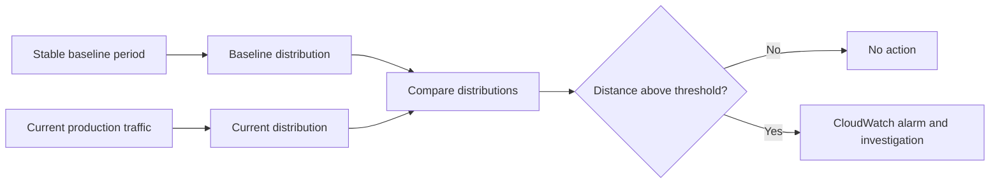
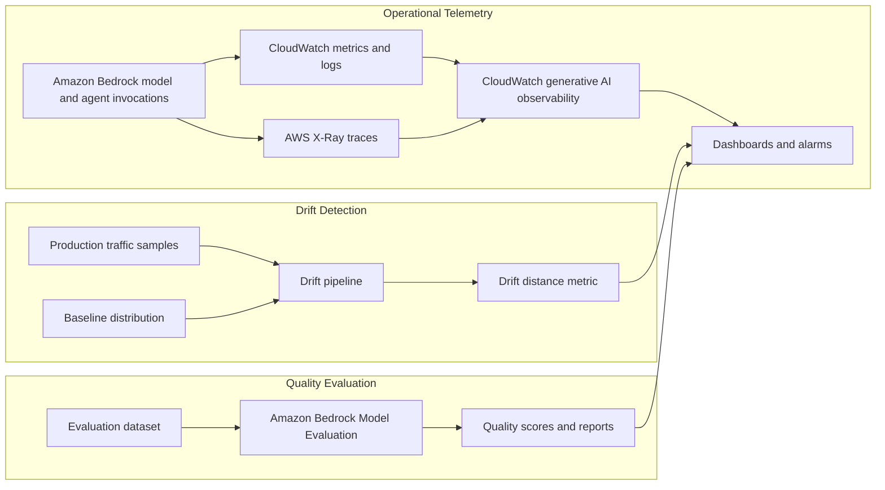

# Task 4.1: Operating, Monitoring, and Securing ML and AI Solutions - Monitor ML and AI model inference and performance

## Skill 4.1.1: Monitor model performance in production by using Amazon CloudWatch generative AI observability, Amazon Bedrock Model Evaluation, and drift detection pipelines

---

## 1. Skill Overview

Monitoring a production machine learning or generative AI workload requires three distinct types of signal:

| Signal type | What it answers | Primary AWS capability |
| --- | --- | --- |
| Operational performance | Is the system available, fast, and returning results? | Amazon CloudWatch generative AI observability |
| Model-quality performance | Are the generated answers still good enough? | Amazon BedRock Model Evaluation |
| Data and concept stability | Has the input data or the expected meaning changed? | Drift detection pipelines |

A strong monitoring strategy does not rely on users complaining before you notice a problem. Instead, it deliberately combines operational telemetry, periodic model-quality evaluation, and continuous distribution comparison.

---

## 2. Amazon CloudWatch Generative AI Observability

### 2.1 What It Is

Amazon CloudWatch generative AI observability provides pre-built dashboards and metrics for generative AI workloads on Amazon Bedrock. It gives a consolidated view of model invocations, token usage, latency, error rates, and throttling.

It also supports end-to-end prompt tracing for agent-based workloads. For Amazon Bedrock AgentCore agents, observability includes OpenTelemetry-compatible instrumentation covering:

- Model inference calls
- Tool invocations
- Memory operations
- Coordination steps

### 2.2 Key Metrics to Know

| Metric area | What it tells you |
| --- | --- |
| Invocations | Volume of model or agent calls |
| Latency | Time taken to respond |
| Token usage | Prompt and completion token counts |
| Error rates | Client and server errors |
| Throttling | Requests rejected due to rate limits |
| Trace spans | End-to-end path through model, tools, and memory |

### 2.3 How It Fits into Monitoring

CloudWatch generative AI observability is the operational monitoring layer. It tells you:

- Whether the model endpoint is healthy.
- Whether users are experiencing errors or throttling.
- Whether latency is increasing.
- Whether token consumption is rising unexpectedly.
- Where an agentic workflow failed or slowed down.

It does **not** directly tell you whether the answers are factually correct or useful. That is where Amazon Bedrock Model Evaluation and quality monitoring come in.

---

## 3. Amazon Bedrock Model Evaluation

### 3.1 What It Is

Amazon BedRock Model Evaluation runs evaluation jobs that score model responses or knowledge base responses. It is used to judge quality, compare candidate models, test prompt changes, and track quality over time.

### 3.2 Evaluation Methods

| Method | How it works | Best for | Limitations |
| --- | --- | --- | --- |
| Automatic evaluation | Uses predefined metrics and no human judge | Fast, repeatable quality scoring | May miss nuance; metric definitions matter |
| LLM-as-judge | A judge model scores responses and explains each score | Qualitative criteria such as helpfulness, relevance, correctness | Judge model can be imperfect; requires calibration |
| Human evaluation | Human reviewers rate or compare responses | Authoritative subjective judgment | Slow, costly, harder to scale |

### 3.3 What BedRock Model Evaluation Can Measure

Common evaluation dimensions include:

- Helpfulness
- Correctness
- Faithfulness
- Relevance
- Coherence
- Style
- Toxicity and harmfulness

For Retrieval-Augmented Generation (RAG) systems, you typically focus on:

- Faithfulness to the retrieved source
- Answer relevance
- Context relevance

### 3.4 How It Fits into Monitoring

Amazon Bedrock Model Evaluation is not a live monitoring dashboard. It is an evaluation job that produces a quality report. In production monitoring, you use it:

- Before deploying a new model version.
- After changing prompts or retrieval settings.
- On a scheduled basis to measure quality scores over time.
- To compare a challenger model against a champion model.

It should be paired with CloudWatch monitoring for operational health and with drift detection for distribution shifts.

---

## 4. Drift Detection Pipelines

### 4.1 Why Drift Matters

A model can be operationally healthy while still becoming worse because the data it receives has changed. Drift detection identifies that change before downstream business metrics fail.

### 4.2 The Four Core Parts of a Drift Detection Pipeline

| Component | Purpose |
| --- | --- |
| Baseline | A recorded distribution or statistic from a known stable period |
| Current traffic sample | The same measurement taken from live production traffic |
| Comparison statistic | A distance or statistical test that compares the two distributions |
| Threshold and alert | A pre-agreed limit that triggers investigation or retraining |

### 4.3 Data Drift vs Concept Drift

| Drift type | What changes | Example | Detection approach |
| --- | --- | --- | --- |
| Data drift / covariate shift | Input distribution P(X) changes | Users suddenly ask about a new topic | Compare input embeddings or feature statistics |
| Concept drift | Relationship P(Y\|X) changes | Same prompts, but accepted answers changed | Downstream feedback, business metrics, or periodic model evaluation |

A drift detection pipeline that only watches input embeddings finds data drift. It will not necessarily catch concept drift because the prompts may look identical even as user expectations change.

### 4.4 Drift Detection in Generative AI Workloads

For generative AI applications, a common pattern is:

1. Capture prompt embeddings from a stable baseline period.
2. Capture prompt embeddings from current traffic.
3. Compare the two embedding distributions using a multivariate distance suitable for high-dimensional data.
4. Alert when the distance crosses a pre-agreed threshold.

For structured and tabular ML workloads, Amazon SageMaker Model Monitor can automate baseline creation, constraint checking, and drift metrics.

---

## 5. How These Components Work Together

The unified monitoring mindset is:

- CloudWatch generative AI observability says **whether the system is working**.
- Amazon BedRock Model Evaluation says **whether the output is still good**.
- Drift detection says **whether the input world is changing**.

A monitoring gap is usually caused by missing one of these three jobs rather than by missing another dashboard.

---

## 6. Scenario-Based Exam Examples

### Scenario 1

A machine learning engineering team has deployed a Bedrock agent that calls multiple tools. The team needs a single place that shows token usage, invocation latency, error rates, throttling, and end-to-end prompt traces for model calls and tool invocations.

Which option provides this view?

- **A.** AWS CloudTrail
- **B.** AWS Config
- **C.** Amazon CloudWatch generative AI observability
- **D.** AWS Cost Explorer

**Answer:** C

**Explanation:** Amazon CloudWatch generative AI observability provides pre-built dashboards and prompt-level tracing for Bedrock model and agent workloads. CloudTrail is for API audit logs. AWS Config is for resource configuration compliance. Cost Explorer is for cost reporting.

---

### Scenario 2

A production assistant receives prompts that are statistically close to the recorded baseline. However, the answers that users accept have changed over time.

Which condition does this describe?

- **A.** Data drift
- **B.** Concept drift
- **C.** A throttle limit
- **D.** A tool failure

**Answer:** B

**Explanation:** Concept drift occurs when the relationship between inputs and expected outputs changes, even if the input distribution remains stable. Data drift would show a change in prompt distribution P(X). Throttling and tool failures are operational failures, not gradual changes in user expectations.

---

### Scenario 3

A scheduled data processing job exits successfully. Soon afterward, model invocation errors increase significantly. The job output is later found to contain empty partitions.

Which monitoring gap does this pattern reveal?

- **A.** Too few production variants behind the endpoint
- **B.** Monitoring job completion without validating the output
- **C.** Missing cost allocation tags
- **D.** Using a judge model instead of human reviewers

**Answer:** B

**Explanation:** A successful exit code does not guarantee valid output. The pipeline should monitor data quality metrics such as record counts, schema integrity, null rates, and partition sizes after the job finishes. Operational errors at inference are often caused by upstream data handoff problems.

---

### Scenario 4

A team wants to compare two candidate Bedrock models on helpfulness, relevance, and response style before promoting one to production. They want automated scoring with explanations for each score.

Which approach should they use?

- **A.** CloudWatch generative AI observability
- **B.** Amazon Bedrock Model Evaluation with LLM-as-judge
- **C.** AWS X-Ray alone
- **D.** AWS Config rules

**Answer:** B

**Explanation:** Amazon Bedrock Model Evaluation with an LLM-as-judge scores model responses against evaluation criteria and provides explanations. CloudWatch generative AI observability provides operational telemetry, not qualitative quality scoring. X-Ray provides traces, and AWS Config tracks resource compliance.

---

## 7. Exam Tips and Traps

### 7.1 Important Exam Tips

- Remember that **CloudWatch generative AI observability** is for operational telemetry, token usage, latency, errors, and agent traces.
- Remember that **Amazon BedRock Model Evaluation** is for model-quality scoring, not live infrastructure monitoring.
- Remember that **drift detection pipelines** require a baseline, a current sample, a comparison statistic, and a threshold.
- Data drift means P(X) changed. Concept drift means P(Y|X) changed.
- Successful jobs must be monitored by output quality, not only completion status.
- Set alarms on both high error rates and flat-line invocation counts. A sudden drop to zero is also a problem.
- For generative AI, drift detection often uses prompt embeddings and a multivariate distance measure.

### 7.2 Common Traps

- **Choosing CloudTrail or AWS Config for operational monitoring.** CloudTrail is for API audit and governance. AWS Config is for configuration compliance and resource history.
- **Treating Amazon Bedrock Model Evaluation as continuous monitoring.** It is run as a job. It must be combined with CloudWatch and drift monitoring for continuous coverage.
- **Assuming low error rate means good model quality.** The model can be fast and available while producing useless or outdated answers.
- **Confusing data drift with concept drift.** If prompts look the same but expected answers changed, that is concept drift.
- **Monitoring only spikes, not zero values.** A pipeline that stops invoking entirely is a major failure that an upper-threshold-only alarm will miss.
- **Relying only on job exit codes.** A job can report success while writing invalid, empty, or truncated data.
- **Believing LLM-as-judge is equivalent to human evaluation.** It is automated and scalable but requires calibration and human checks for high-stakes decisions.

---

## 8. Quick Reference Summary

| Monitoring need | AWS service or approach | Primary output |
| --- | --- | --- |
| Token usage, latency, model errors, throttling | CloudWatch generative AI observability | Operational dashboards and alarms |
| Agent tool calls, memory operations, trace spans | Amazon Bedrock AgentCore Observability / X-Ray | End-to-end prompt traces |
| Model quality scoring | Amazon Bedrock Model Evaluation | Scores, explanations, reports |
| Input distribution stability | Drift detection pipeline | Drift distance metric and alarms |
| Structured ML data quality and drift | Amazon SageMaker Model Monitor | Baseline statistics, constraints, violations |
| Notification and threshold crossing | Amazon CloudWatch Alarms | SNS notifications or other actions |

---

## 9. Key Takeaways

- Monitor generative AI workloads across three dimensions: operational health, output quality, and data distribution.
- Amazon CloudWatch generative AI observability is the central operational view for Bedrock models and agents.
- Amazon Bedrock Model Evaluation scores quality using automatic metrics, LLM-as-judge, or human reviewers.
- Drift detection is a pipeline: baseline, current sample, comparison, threshold.
- Data drift and concept drift are different and require different detection signals.
- A strong monitoring design catches upstream data problems and agent coordination failures before users notice.