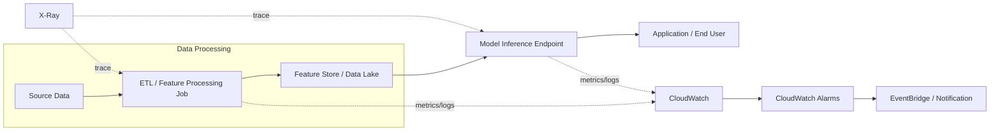
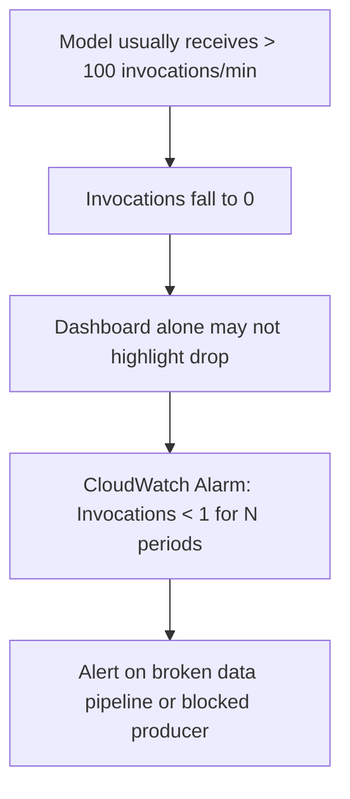

# Task 4.1: Operating, Monitoring, and Securing ML and AI Solutions - Monitor ML and AI model inference and performance.

## Skill 4.1.2: Monitor workflows to detect anomalies or errors in data processing or model inference.

### Purpose of This Skill

This skill focuses on **detecting failures and anomalous behavior across the entire ML/AI workflow**, not only inside the model endpoint. A deployed model can be healthy while the workflow around it fails: a feature job writes an empty partition, a schema change silently nulls a column, a queue backs up, an agent tool call fails, or an endpoint suddenly receives no traffic at all.

For the exam, you must be able to:

- Identify which workflow stage is failing based on the observed symptom.
- Recognize that a successful job exit code does not mean useful output was produced.
- Distinguish between client errors, server errors, throttles, latency issues, and data quality anomalies.
- Select the correct AWS monitoring tool for anomalies in data processing or model inference.
- Understand both high-threshold alarms and low/flatline alarms.

---

### What Is a Workflow in ML/AI Inference?

An ML/AI inference workflow involves multiple stages before and after the model call:

If monitoring only checks the model endpoint, failures upstream can be missed until users complain. The key idea is that **symptoms often appear at inference time, but the root cause is often upstream**.

---

### Key Monitoring Layers

| Layer | What Can Go Wrong | Example Symptom |
|---|---|---|
| Data ingestion | Stale or missing source data | Job runs successfully but reads zero new records |
| Data processing / feature engineering | Empty partitions, duplicate records, schema mismatch, null columns | Model errors increase after deployment of new feature job |
| Data validation | Invalid feature values, out-of-range values, class imbalance | Poor model output quality without an obvious error |
| Model invocation | Malformed payload, wrong input shape, missing features | HTTP 4XX client errors |
| Model serving | Container crash, dependency failure, memory exhaustion | HTTP 5XX server errors |
| Workflow orchestration | Job timeouts, retries, stuck executions, dead-letter queue backlog | Downstream latency grows or invocations stop |
| Agent / LLM workflows | Tool failures, truncated streaming, repeated coordination loops | Agent returns fallback messages or stops mid-response |
| Capacity / limits | Too many concurrent requests | Invocation throttling increases |

---

### Important CloudWatch Metrics for Workflow Anomalies

#### Amazon SageMaker AI Endpoint Metrics

| Metric | Meaning | Anomaly Interpretation |
|---|---|---|
| `Invocations` | Number of inference requests | Drop to zero suggests upstream failure or broken producer |
| `Invocation4XXErrors` | Client-side errors | Invalid payload, missing fields, too-large input |
| `Invocation5XXErrors` | Server-side errors | Model container failing, bad model artifact, downstream dependency issue |
| `InvocationModelErrors` | Model-specific errors | Model cannot process input; often caused by data processing/payload mismatch |
| `ModelLatency` | Time inside model | Sudden increase can indicate larger input, model degradation, or resource pressure |
| `OverheadLatency` | Serving overhead | Timed-out requests or slow container behavior |
| `CPUUtilization`, `MemoryUtilization`, `GPUUtilization` | Resource usage | Resource saturation can cause throttles and high latency |
| `InvocationThrottles` | Requests rejected due to concurrency limits | Traffic spike, insufficient endpoint capacity |

#### Amazon Bedrock Metrics

| Metric | What It Detects |
|---|---|
| `Invocations` | Total calls to the foundation model |
| `InvocationClientErrors` | Malformed requests, invalid parameters |
| `InvocationServerErrors` | Internal service/model errors |
| `InvocationThrottles` | Throttling due to service or account limits |
| `InputTokenCount`, `OutputTokenCount` | Token usage anomalies |
| `InvocationLatency` | End-to-end model call latency |

#### Generative AI and Agent Workflows

For LLM-based or agent workflows, monitor:

- Tool invocation failures.
- Truncated streaming responses.
- Coordination failures where an agent loops between tools without completing.
- Token usage anomalies.
- High latency in multi-step reasoning.
- Guardrail interventions or blocked outputs.

AWS services for this include:

- **Amazon CloudWatch generative AI observability**: pre-built dashboards for model invocations and Amazon Bedrock AgentCore agents.
- **Amazon Bedrock AgentCore Observability**: default OpenTelemetry-compatible instrumentation for agents, capturing model calls, tool calls, and memory operations.
- **AWS X-Ray**: distributed tracing for full end-to-end workflows.

---

### Core Monitoring Concept: Completion Does Not Equal Correct Output

One of the most exam-relevant patterns is:

> A scheduled data processing job reports **SUCCESS**, but model invocation errors or poor predictions follow shortly after.

This indicates that the workflow monitored **job completion** but did not validate the **output** it produced.

Examples of successful but invalid job output:

- Empty S3 partition.
- Schema change causing a column to become null.
- Duplicate records from a retry.
- Wrong delimiter or encoding.
- Truncated write due to disk pressure.

To detect this, monitor output-level signals:

| Output Signal | What It Detects |
|---|---|
| Record count or file count | Empty partitions, missing data |
| Null ratio per column | Silent schema change or parser mismatch |
| Duplicate key count | Retry or fan-out duplication |
| Min/max/mean of numeric features | Out-of-range or corrupted values |
| Cardinality of categorical features | New categories, drift, or invalid encoding |
| Output size in bytes | Truncated or bloated output |

---

### Anomaly Detection Approaches

#### CloudWatch Anomaly Detection

CloudWatch Anomaly Detection learns a metric's expected range based on historical behavior and creates an **anomaly band**. It can alarm when actual values fall outside that band.

Use CloudWatch Anomaly Detection for:

- Invocation latency that changes relative to its expected pattern.
- Error rates that rise outside normal weekly seasonality.
- Token usage that deviates from baseline.
- Data processing job run times.

This is useful when you do **not** know the exact threshold in advance.

#### Rule-Based Threshold Alarms

Use CloudWatch Alarms with static thresholds when the expected behavior is known:

- Alarm if `Invocations < 1` for 3 consecutive 5-minute periods.
- Alarm if `Invocation5XXErrors` > 0 for any period.
- Alarm if job retry count > 3.
- Alarm if output file count = 0.

#### Low/Flatline Alarms

A common exam trap is monitoring only high values. If an invocation count drops to **zero**, that is a broken pipeline even though it is not a spike.

---

### AWS Tools for Workflow Anomaly Detection

| Tool | Primary Monitoring Role |
|---|---|
| **Amazon CloudWatch** | Metrics, logs, dashboards, alarms, anomaly detection |
| **Amazon CloudWatch Logs Insights** | Query application logs for errors and patterns |
| **AWS X-Ray** | Distributed tracing to identify failing component or segment |
| **Amazon SageMaker Model Monitor** | Data quality, model quality, bias drift, feature attribution drift |
| **AWS Step Functions** | Orchestration state, failed executions, timeouts, retries |
| **Amazon EventBridge** | React to job state changes or alarm events |
| **Amazon SQS / DLQ metrics** | Queue depth, message age, poison message failures |
| **CloudWatch generative AI observability** | LLM token usage, latency, errors, throttles, agent prompt traces |
| **Amazon Bedrock AgentCore Observability** | Agent-specific instrumentation for model calls, tool calls, and memory operations |

---

### SageMaker Model Monitor for Data Anomalies

Amazon SageMaker Model Monitor can continuously monitor the data being sent to a model endpoint. It captures a **baseline** of training/validation data statistics and compares incoming traffic to that baseline.

It can detect:

- Data quality violations, such as null values, type mismatches, or out-of-range values.
- Feature drift over time.
- Model prediction label drift.
- Bias drift.

When scheduled, Model Monitor jobs emit CloudWatch metrics. You can configure alarms based on violation thresholds.

Use Model Monitor when the question mentions:

- Monitoring incoming inference data for anomalies.
- Comparing live data against a baseline.
- Detecting data drift or schema changes automatically.
- Triggering alerts when data quality violates constraints.

---

### Agent and Generative AI Workflow Errors

Agent-based workflows fail differently from traditional APIs. You need monitoring for:

| Agent Failure Mode | What to Monitor |
|---|---|
| Tool call failure | Tool invocation error count, exception spans |
| Truncated streaming | Incomplete output length, stop reason = `length` |
| Coordination failure | Repeated tool calls without completion, excessive loops |
| Model hallucination / refusal | Escalation rate, guardrail interventions |
| Token cost explosion | `OutputTokenCount` anomalies |
| Multi-step latency buildup | Trace duration per step |

#### CloudWatch Generative AI Observability

This service provides pre-built views over generative AI workloads and Amazon Bedrock AgentCore agents. It includes:

- Token usage.
- Latency.
- Error and throttling measures.
- End-to-end prompt tracing.

Use this for **one consolidated view** of an agent that calls tools and foundation models.

#### AWS X-Ray

Use X-Ray when:

- A request crosses multiple AWS services.
- You need to attribute latency or errors to one component.
- You want end-to-end trace segments for data processing, API, model, and tool calls.

---

### Scenario-Based Exam Examples

#### Scenario 1

A nightly SageMaker Processing job has been completing with the status **SUCCEEDED**. The downstream model endpoint starts returning HTTP 5XX errors every morning. The team investigates and finds that the feature file produced by the job has zero rows.

**Which monitoring gap is most likely?**

| Option | Evaluation |
|---|---|
| A. The endpoint has too few production variants | Incorrect; feature job output is the issue |
| B. The workflow checks job completion but does not validate output row count | Correct |
| C. The model has concept drift | Incorrect; concept drift is about changing relationship between inputs and outputs |
| D. The account lacks cost allocation tags | Incorrect; unrelated to runtime failure |

**Correct answer:** B.

---

#### Scenario 2

An inference endpoint normally receives about 200 requests per minute. After a weekend maintenance change, the endpoint receives **zero requests** for several hours. No alarm fires because the team only created an alarm for error rates greater than 5%.

**What type of alarm should be added?**

- A low-count or flatline alarm on `Invocations`.
- For example: Alarm if `Invocations < 1` for 3 consecutive 5-minute periods.
- Also consider alarms on the upstream scheduler or producer if invocations are expected.

Exam tip: A flatline is just as important as a spike.

---

#### Scenario 3

A generative AI application uses an agent that calls a third-party inventory tool. Users sometimes receive fallback responses, but no model invocation errors are recorded. The model endpoint appears healthy.

**What is the best way to identify the failing step?**

- Use **AWS X-Ray traces** or **CloudWatch generative AI observability** to inspect tool invocation spans.
- Look for tool call error spans or unsuccessful tool responses.
- Set an alarm on tool invocation failure metrics.

Explanation: The model call itself may succeed while a tool call fails. You must monitor the agent workflow, not just the model endpoint.

---

#### Scenario 4

A data processing job's duration has increased from 10 minutes to over 50 minutes across several days. Downstream model latency has also increased. The team does not know the exact expected duration threshold.

**Which monitoring approach most directly detects this anomaly?**

- Use **CloudWatch Anomaly Detection** on job duration.
- It learns the expected band and alarms when duration falls outside it.
- Then correlate with downstream model latency.

---

### Exam Tips and Traps

| Tip / Trap | Guidance |
|---|---|
| **Trap: “Job succeeded” means nothing by itself** | Always look for output validation: row counts, null ratios, file sizes, schema checks. |
| **Tip: Distinguish 4XX vs 5XX** | 4XX is usually client-side/malformed input; 5XX is server-side/container or model failure. |
| **Trap: Monitoring only high error thresholds** | A zero invocation count or a job with no output is also a failure. |
| **Tip: Use CloudWatch Anomaly Detection when thresholds are unknown** | This is better than guessing static thresholds for seasonal or irregular workloads. |
| **Trap: Confusing CloudTrail with CloudWatch** | CloudTrail records API activity for audit, not operational anomaly detection. |
| **Trap: Confusing AWS Config with monitoring** | AWS Config tracks configuration compliance, not data processing or model inference errors. |
| **Tip: For LLM/agent workflows, choose generative AI observability** | It provides token, latency, error, throttle, and end-to-end prompt trace views. |
| **Tip: For tracing a request across components, choose AWS X-Ray** | X-Ray identifies the particular component that failed or added latency. |
| **Tip: For continuous data quality monitoring, choose SageMaker Model Monitor** | It compares incoming inference data against a statistical baseline. |
| **Trap: Data drift vs concept drift** | Data drift: input distribution changes. Concept drift: input distribution is stable but the correct answer changes. |
| **Tip: Multi-component failures often need tracing** | If symptom is at the endpoint but cause is upstream, look for handoff failure. |
| **Trap: Metrics alone may not show root cause** | Pair metrics with logs and traces to find the broken stage. |

---

### Summary

For Skill 4.1.2, remember:

- Monitor the full workflow: data ingestion, processing, validation, inference, orchestration, and agent tool calls.
- Do not treat a successful job status as proof of valid output.
- Use output data checks such as row count, schema, null ratio, duplicate keys, and file size.
- Use CloudWatch Alarms for both spikes and flatlines.
- Use CloudWatch Anomaly Detection when expected behavior is not a fixed threshold.
- Use SageMaker Model Monitor for data quality and drift detection at inference time.
- Use AWS X-Ray for distributed tracing across components.
- Use CloudWatch generative AI observability for LLM token, latency, error, throttling, and agent trace monitoring.
- Recognize that symptoms may appear at inference time while the root cause is upstream in the data processing workflow.