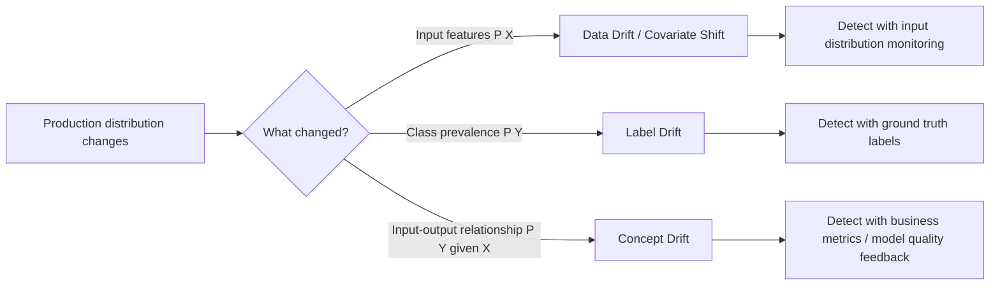
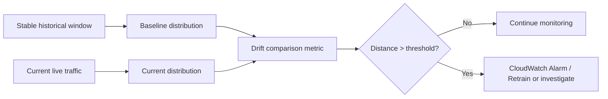

# Task 4.1: Operating, Monitoring, and Securing ML and AI Solutions - Monitor ML and AI model inference and performance

## Skill 4.1.3: Detect changes in data distribution that can affect model performance

---

### Overview

A model that performed well during training can degrade quietly in production because the data it receives no longer matches the data it learned from. Detecting changes in data distribution is one of the most important operational responsibilities of an ML engineer.

This skill focuses on:

- Understanding the difference between data drift, label drift, and concept drift.
- Building a repeatable drift detection pipeline rather than looking at dashboards manually.
- Selecting the right statistical or distance-based comparison for the data type.
- Using AWS services such as Amazon SageMaker Model Monitor, Amazon CloudWatch, EventBridge, and observability tooling to detect and alert on drift.
- Knowing what drift detection cannot tell you, especially when the meaning of the correct answer has changed.

---

### Why Data Distribution Drift Matters

ML models learn an approximation of a relationship between inputs and outputs from historical data. In production, the input data is rarely static:

- Customer behavior changes over time.
- New products, features, or customer segments appear.
- Upstream data pipelines change schemas, fill rates, or defaults.
- Seasonal effects or external events alter the mix of requests.
- A generative AI assistant may start receiving new types of prompts.

When the distribution of inputs changes enough, model performance can degrade without any code change or infrastructure failure. This is often called silent degradation because there is no exception or error message.

Detecting drift lets the ML team:

- Investigate the cause before business metrics fail.
- Decide whether to retrain, reweight, rebuild features, or fix an upstream pipeline.
- Create alarms instead of relying on human observation.
- Distinguish an actual model problem from a data pipeline problem.

---

### Key Drift Terminology

| Term | What Changes | Common Detection Signal | Example |
| --- | --- | --- | --- |
| **Data drift / covariate shift** | Input distribution \(P(X)\) changes | Input feature distribution comparison against baseline | Customer ages in a credit model shift because a new marketing campaign targets a different demographic |
| **Label drift / prior probability shift** | Output distribution \(P(Y)\) changes while \(P(X|Y)\) stays stable | Ground truth label distribution changes over time | Fraud rate rises from 1% to 5% because of new fraud methods |
| **Concept drift** | Relationship \(P(Y|X)\) changes even if \(P(X)\) stays stable | Production labels, user acceptance, business outcomes shift | The same transaction amount and merchant category is now more likely to be fraud than before |
| **Feature attribution drift** | Contribution or importance of features changes | Model explainability metrics change | A model previously relying on age now relies more on transaction location |
| **Upstream data drift** | Data changes before reaching the model | Pipeline output counts, schema checks, value distributions change | A feature job starts writing empty partitions or nulling a column |

The most important exam distinction is:

- **Data drift** is about the input data looking different.
- **Concept drift** is about the correct answer changing even when inputs look the same.
- **Data drift does not always cause model performance degradation.**
- **Concept drift usually does.**

---

### Types of Distribution Change

A drift detection pipeline that only monitors incoming features can detect **data drift** but cannot detect **concept drift** if prompts or features remain statistically close to baseline.

---

### A Standard Drift Detection Pipeline

A robust drift detection pipeline has four parts:

1. **Capture a baseline** from a period that the team agrees was stable.
2. **Capture the same measurement** from current production traffic.
3. **Compare the two distributions** with a statistic or distance suited to the data type.
4. **Alert when the distance exceeds a threshold agreed in advance.**

Do not wait for an inference error. The first sign of drift is often a distribution change, not a failed request.

---

### Selecting the Right Drift Detection Metric

The correct drift statistic depends on whether the data is tabular, high-dimensional, categorical, numeric, or unstructured.

#### For Tabular and Structured Data

| Data Type | Common Drift Detection Approach | Notes |
| --- | --- | --- |
| Numeric features | Kolmogorov-Smirnov test | Nonparametric; compares cumulative distributions |
| Numeric features | Population Stability Index | Common in risk models; based on binned distributions |
| Numeric features | Wasserstein distance | Measures how much one distribution must move to match another |
| Numeric features | Jensen-Shannon divergence | Symmetric measure between probability distributions |
| Categorical features | Population Stability Index | Works well for binned categories |
| Categorical features | Chi-square test | Detects dependence between category and time window |
| Categorical features | Hellinger distance | Often used for categorical distribution shift |
| Multiple features together | Multivariate distribution comparison | Avoids missing interactions between features |

#### For Unstructured Data and Embeddings

For text, images, audio, or other high-dimensional inputs:

- Do not compare raw tokens or pixels directly.
- Use model embeddings to represent each input.
- Compare the distribution of embeddings between baseline and current traffic.
- Suitable methods include mean embedding cosine distance, maximum mean discrepancy, or Wasserstein/Sinkhorn distance.
- Many traditional statistical tests become unreliable in high dimensions because p-values can be too sensitive.

#### Rule of Thumb for PSI

| PSI Value | Common Interpretation |
| --- | --- |
| Less than 0.1 | No significant drift |
| 0.1 to 0.25 | Moderate drift; investigate |
| Greater than 0.25 | Strong drift; likely needs action |

Thresholds should be set based on the business impact and the cost of false alarms.

---

### AWS Services for Detecting Data Distribution Drift

| AWS Service | Role in Drift Detection |
| --- | --- |
| **Amazon SageMaker Model Monitor** | Captures baseline statistics, schedules monitoring jobs, compares current inference input/output data against baseline, and emits drift metrics |
| **Amazon CloudWatch** | Stores drift metrics, creates alarms, and displays dashboards |
| **Amazon EventBridge Scheduler** | Triggers monitoring jobs on a schedule |
| **Amazon S3** | Stores captured inference data, baseline statistics, and constraint files |
| **Amazon CloudWatch generative AI observability** | Provides prebuilt views for token usage, latency, errors, and end-to-end prompt tracing for generative AI workloads; helps monitor overall inference health but is not a dedicated drift detector |
| **Amazon Bedrock Model Evaluation** | Scores model outputs over time using automatic or human evaluation; useful for catching performance changes, including concept drift symptoms |
| **AWS Glue / AWS Glue DataBrew** | Can be used in a data pipeline to compute distribution summaries or validate data quality before inference |

#### Amazon SageMaker Model Monitor

SageMaker Model Monitor is the primary AWS service for automated data drift detection on SageMaker endpoints and batch transform jobs.

Key concepts:

- **Data capture** must be enabled on the endpoint to collect input/output samples into S3.
- A **baseline** is generated from a stable training or production dataset.
- **Constraints and statistics** define the expected values, distributions, and ranges.
- A **monitoring job** compares the current captured data to the baseline.
- Violations are emitted as CloudWatch metrics.
- CloudWatch alarms can notify the team or trigger automated actions.

Model Monitor supports several drift types:

| Monitor Type | What It Detects |
| --- | --- |
| **Data quality** | Changes in feature distributions, missing values, outliers, and data type issues |
| **Model quality** | Prediction performance drift when ground truth labels are available |
| **Bias drift** | Changes in bias metrics across monitored groups |
| **Feature attribution drift** | Changes in feature importance over time |

---

### Applying Drift Detection to Generative AI and Agents

For generative AI applications, such as Amazon Bedrock assistants or agents that call tools:

- The measure is often the distribution of input prompt embeddings.
- The comparison needs a statistic that behaves well in many dimensions.
- Traditional p-value-based statistical tests may be too sensitive or fail in high-dimensional embedding space.
- Drift detection pipelines find **data drift** in prompts.
- They do **not** find concept drift, where prompts look similar but user expectations have changed.

For agent-based systems, distribution shift can also occur in:

- The types of tool calls being made.
- The structure of agent responses.
- The length of prompts or conversation turns.
- User acceptance and feedback signals.

Concept drift in generative AI typically shows up in:

- Business outcomes such as lower acceptance rates.
- More negative user feedback.
- Increased human intervention.
- Reduced task completion rates.
- Deteriorating judge-model scores in Amazon Bedrock Model Evaluation.

---

### Drift Detection vs. Upstream Pipeline Monitoring

Many production surprises appear as model drift, but the actual cause is a broken data pipeline.

Watch for:

- A scheduled feature job reports success but writes an empty partition.
- A schema change silently nulls a column.
- A retry writes duplicate records.
- A new data source changes units or encoding.
- A streaming producer stalls, so the model sees partial or stale data.

This means drift detection must sit upstream of inference and check **output data quality**, not only the job completion status.

---

### Scenario-Based Exam-Style Examples

#### Scenario 1

A retail demand forecasting model has been running for six months. The company launches a new product line and begins marketing heavily to a younger customer segment. The distribution of customer ages, order sizes, and product categories in production begins to differ from the training data, but the relationship between features and demand has not changed.

**Question:** What type of drift has occurred?

**Answer:** Data drift, also called covariate shift. The input distribution \(P(X)\) has changed, while the conditional relationship \(P(Y|X)\) remains stable.

---

#### Scenario 2

A fraud detection model receives the same types of transaction features as always. However, fraudsters have changed their behavior. Some transaction patterns that were previously low risk are now high risk, while the overall feature distribution remains stable.

**Question:** What condition does this describe?

**Answer:** Concept drift. The input distribution \(P(X)\) has not changed significantly, but the relationship \(P(Y|X)\) has changed.

---

#### Scenario 3

A company monitors its model by running a scheduled SageMaker Model Monitor data quality job. The job reports a high PSI value for one feature. The team investigates and finds that a new feature extraction process is using Celsius instead of Fahrenheit for temperature values.

**Question:** What is the likely result of the Model Monitor job?

**Answer:** A data drift violation occurs because the feature distribution changed. The fix is to correct the upstream feature pipeline rather than retrain the model.

---

#### Scenario 4

A financial services model uses transaction amount, merchant category, and customer age as features. The team wants to detect gradual changes in input distribution automatically and receive an alarm if drift becomes significant.

**Question:** Which AWS configuration supports this?

**Answer:** Enable SageMaker Model Monitor data capture on the endpoint, generate a baseline from stable data, schedule a data quality monitoring job, and configure a CloudWatch alarm on the drift metric.

---

#### Scenario 5

A generative AI assistant continues to receive similar prompt topics. The embeddings of current prompts remain close to the recorded baseline, but users are accepting far fewer suggestions.

**Question:** What does this indicate?

**Answer:** This indicates possible concept drift or a change in user expectations. The issue is not input data drift. The team should examine business feedback, user acceptance rates, and possibly run Amazon Bedrock Model Evaluation with recent prompts.

---

### Exam Tips and Common Traps

- **Do not confuse data drift with concept drift.**  
  Data drift is \(P(X)\) changing. Concept drift is \(P(Y|X)\) changing. A question may describe stable inputs but worsening outputs to test this difference.

- **Drift detection does not replace performance monitoring.**  
  A distribution can change without harming performance. A model can also degrade while inputs remain unchanged. Use drift detection alongside model quality monitoring.

- **A successful pipeline job is not proof that the data is usable.**  
  A job can exit successfully while writing empty, malformed, or duplicate output. Drift detection should validate the content, not just the completion status.

- **For high-dimensional data, use embeddings and distance-based methods.**  
  Avoid treating raw text tokens or individual pixels as features for drift detection. Use embeddings and compare distributions in embedding space.

- **Choose the statistic based on the data type.**  
  KS and PSI are common for tabular data. They are often not appropriate for raw high-dimensional generative AI inputs.

- **Set thresholds before an incident occurs.**  
  Decide what distance value constitutes drift before monitoring begins. This avoids hindsight bias and alarm threshold tuning after the fact.

- **A data drift alarm is a signal to investigate, not necessarily to retrain.**  
  The cause may be an upstream data bug, a new product, a seasonal change, or a changed business process.

- **Concept drift requires labels or business feedback.**  
  If the correct answer changes but inputs remain the same, input distribution monitoring will not catch it. Use model quality monitoring, human review, user acceptance signals, or evaluation jobs.

- **Amazon SageMaker Model Monitor emits metrics to CloudWatch, but alarms do not exist by default.**  
  Make sure to configure CloudWatch alarms for drift violations.

- **Watch for flat lines as well as spikes.**  
  A sudden drop in invocation counts can indicate a broken pipeline, data not flowing, or a failed producer. Alarms based only on high thresholds will miss this.

---

### Summary Checklist

- [ ] Understand the difference between data drift, label drift, and concept drift.
- [ ] Know how to build a drift detection pipeline: baseline, current data, comparison, alert.
- [ ] Select appropriate metrics: PSI, KS, chi-square, Wasserstein, or embedding distance.
- [ ] Know the role of Amazon SageMaker Model Monitor in automating drift detection.
- [ ] Know that CloudWatch stores metrics and raises alarms.
- [ ] Recognize that upstream data pipeline failures can look like model drift.
- [ ] Know when to monitor embeddings instead of raw features.
- [ ] Understand what drift detection cannot detect, especially concept drift.
- [ ] Be able to choose between retraining, fixing data, or investigating further when drift is detected.

---

### Final Thought

Detecting changes in data distribution is not just about calculating a statistic. It is about designing a monitoring system that catches silent model degradation before customers or business metrics reveal it. The exam will test whether you can choose the correct detection approach, identify the type of drift from a scenario, and select the right AWS services to automate the detection and alerting.