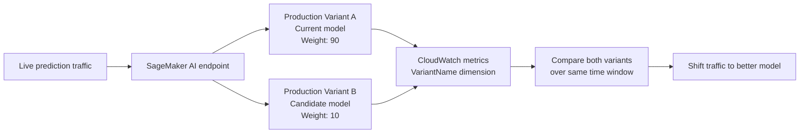
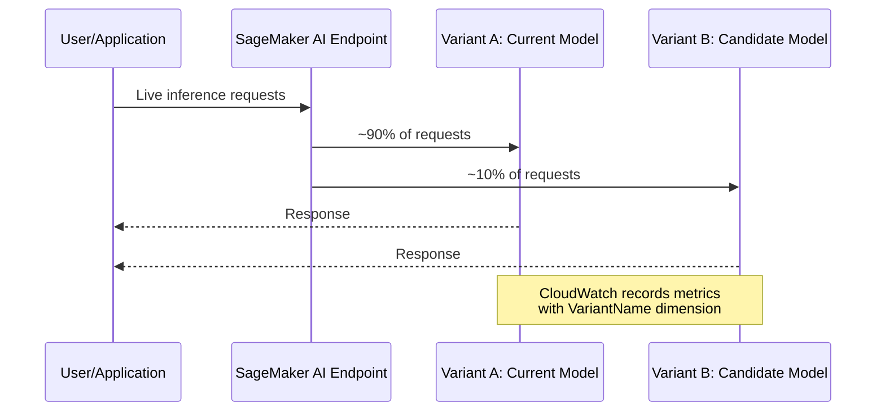
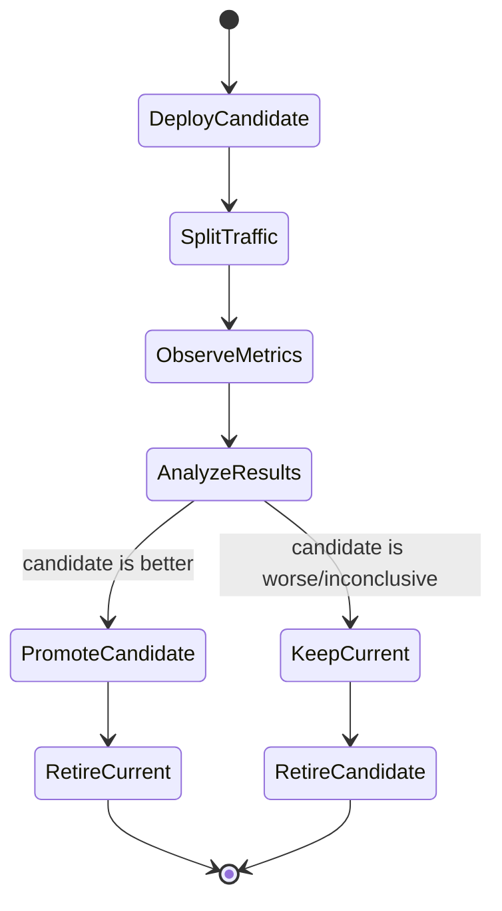

# Task 4.1: Operating, Monitoring, and Securing ML and AI Solutions - Monitor ML and AI model inference and performance

## Skill 4.1.4: Monitor model performance in production by using A/B testing

### 1. What This Skill Covers

A/B testing for ML models is the process of running two or more model versions behind a single inference endpoint, sending each version a controlled portion of live production traffic, and comparing their performance using the same metrics over the same time window.

This skill is especially important because offline evaluation metrics do not guarantee that a model will perform well on real users. A/B testing lets you:

- Compare a candidate model against a current production model.
- Measure real-world latency, error rates, and business outcomes.
- Limit risk by exposing only a small share of traffic to the new model.
- Make data-driven rollout decisions.

---

### 2. Core Concept: Production Variants and Traffic Weights

In Amazon SageMaker AI, an endpoint can host multiple **production variants**. Each variant is a combination of a model, instance type, instance count, and initial traffic weight.

Traffic is distributed according to each variant's weight relative to the sum of all weights.

```text
Traffic share for variant = variant weight / sum of all variant weights
```

Example:

| Variant | Role | Weight | Traffic Share |
|---|---:|---:|---:|
| Current model | Champion/control | 90 | 90% |
| Candidate model | Challenger/treatment | 10 | 10% |

Weights do not need to sum to 100. For example, weights of 2 and 3 would result in 40% and 60% traffic shares.



---

### 3. How A/B Testing Works in Amazon SageMaker AI

The standard A/B testing pattern on SageMaker AI is:

1. Deploy the current model as one production variant.
2. Deploy the candidate model as another production variant on the same endpoint.
3. Assign the candidate a small weight, such as 5–10%.
4. Send live traffic to the endpoint without specifying a target variant.
5. SageMaker AI distributes traffic based on the configured weights.
6. CloudWatch metrics are emitted with a `VariantName` dimension, which allows you to compare metrics per model version.
7. After enough data is collected, shift weight to the better-performing variant.



---

### 4. Metrics to Monitor During an A/B Test

You should compare the same set of metrics for both variants over the same window. The comparison is only valid if the two variants are measured under the same production conditions.

| Metric Category | Example Metrics | Why It Matters |
|---|---|---|
| Operational health | Invocation count, model latency, error rate, throttling rate | Ensures the candidate model does not degrade the serving stack |
| Infrastructure health | CPU utilization, GPU utilization, memory utilization | Detects whether the candidate model requires more compute |
| Business/model quality | Click-through rate, conversion rate, purchase rate, user ratings, task success rate | Measures whether the candidate model actually produces better outcomes |
| Cost efficiency | Instance count, tokens per request, cost per successful inference | Ensures the candidate model is not only better but operationally economical |

For SageMaker AI endpoints, CloudWatch provides built-in metrics such as:

- `Invocations`
- `InvocationModelErrors`
- `ModelLatency`
- `OverheadLatency`
- `InvocationsPerInstance`

These metrics include a `VariantName` dimension, which is the key to comparing A/B variants.

---

### 5. A/B Test Lifecycle



Key points in the lifecycle:

- Start with a small traffic share for the candidate.
- Define success criteria and sample size in advance.
- Compare both variants during the same time window.
- Watch for operational regressions, not only model quality improvements.
- Gradually increase traffic to the candidate as confidence grows.
- Promote the winner to 100% and reduce the loser to 0%.

---

### 6. A/B Testing vs Shadow Testing vs Canary Rollout

These patterns are related but have different goals. The exam may test whether you can distinguish them.

| Pattern | Main Goal | User Exposure | Response Returned to User | Typical Use Case |
|---|---|---|---|---|
| A/B testing | Compare model performance statistically | Small share | Yes | Decide which model version is better |
| Canary rollout | Detect operational failures before broad rollout | Small share | Yes | Safely deploy a new model into production |
| Shadow testing | Validate a model on production traffic without user impact | None | No; responses are logged | Test a high-risk candidate model or serving stack |

A shadow variant receives a copy of production traffic, but its responses are not returned to the user. This is useful when the candidate model is too risky to serve any real responses.

---

### 7. Scenario-Based Exam Examples

#### Scenario 1

An e-commerce company has a product recommendation model running on a SageMaker AI endpoint. A data scientist has trained a new model that appears better in offline evaluation. The ML engineer needs to compare it with the current model on live traffic while limiting risk.

Which approach should the ML engineer use?

**Correct approach:**  
Deploy the new model as a second production variant on the same endpoint. Assign the current model a high weight and the new model a low weight. Compare both variants using CloudWatch metrics with the `VariantName` dimension over the same time period.

**Why:**  
This is the standard SageMaker AI A/B testing pattern. It exposes the candidate to a small share of real traffic while allowing a direct comparison.

---

#### Scenario 2

An ML engineer has two production variants on one endpoint. The current model has a weight of 95 and the candidate model has a weight of 5. The candidate model shows lower average latency after the first 15 minutes.

Should the engineer immediately route all traffic to the candidate?

**Correct answer:**  
No. The observation window is too short, and the sample size is likely too small for a statistically meaningful conclusion. The engineer should continue to collect metrics over a pre-defined period and compare both models on the same metrics before shifting traffic.

**Why:**  
A/B testing requires enough data and a controlled comparison. Early random fluctuations can be misleading.

---

#### Scenario 3

A financial services company wants to test a new fraud detection model on production traffic, but it cannot risk returning incorrect model responses to real users. The company still wants to measure latency, errors, and serving performance under real request patterns.

Which deployment pattern should the company use?

**Correct answer:**  
A shadow variant that receives a copy of production traffic but does not return responses to users.

**Why:**  
Shadow testing allows the team to validate the candidate model and serving stack under real traffic conditions without impacting users.

---

### 8. Exam Tips and Common Traps

| Tip or Trap | Explanation |
|---|---|
| Use the same endpoint for A/B testing | SageMaker AI A/B testing is based on multiple production variants behind one endpoint. Comparing two separate endpoints over different time periods is often invalid. |
| Compare with the same metrics and same window | If one model is measured during a sale and another after the sale, differences may come from the event, not the model. |
| Weights determine relative traffic share | Traffic share equals a variant's weight divided by the sum of all weights. Weight 1 vs weight 9 means 10% and 90%, not 1% and 99%. |
| Do not overreact to early results | A small number of requests can produce misleading metric differences. Define sample size and success criteria in advance. |
| Track operational metrics, not only business metrics | A candidate model may improve click-through rate but also increase latency or error rate. Both matter for production. |
| CloudWatch `VariantName` dimension is key | Use this dimension to separate metrics for each variant on the same endpoint. |
| Specify a target variant only for testing | If you always call the endpoint with a specific target variant, traffic distribution weights are ignored. Use this only for debug or controlled checks. |
| Shadow is not A/B | Shadow variants receive copied traffic and do not return responses. A/B variants return responses to users. |
| A/B testing does not detect data drift | A/B testing compares model versions. It does not automatically detect changes in input data distribution. |
| Weight 0 means no traffic | A production variant with weight 0 receives no live traffic under normal traffic distribution. |

---

### 9. Summary

A/B testing in production is about controlled comparison, not just running two models. The key pattern is:

1. Deploy multiple production variants on one SageMaker AI endpoint.
2. Assign traffic weights to control risk.
3. Compare both variants using CloudWatch metrics by `VariantName`.
4. Use the same metrics and the same window.
5. Promote the winning model gradually.

The exam will likely test your ability to choose the right deployment pattern, interpret traffic weights, compare metrics correctly, and avoid confusing A/B testing with shadow testing or canary rollout.