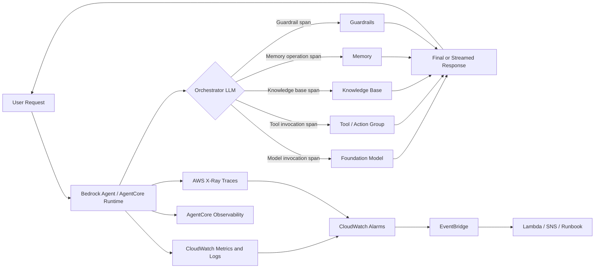
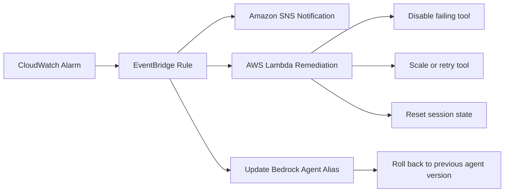

# Task 4.1: Operating, Monitoring, and Securing ML and AI Solutions - Monitor ML and AI model inference and performance

## Skill 4.1.5: Monitor and automate the management of agent performance and coordination (for example, coordination failure detection, truncated streaming, tool failures)

### Skill Overview

Agentic workloads introduce failure modes beyond static model inference. The model may make planning or sequencing mistakes, streaming responses can stop before completion, and tools the agent calls can fail individually. Monitoring agent performance requires observing each orchestration step—model invocation, tool call, knowledge base retrieval, memory operation, and guardrail intervention—not only the final answer.

For the exam, understand:

- How to detect coordination failures, such as loops or incorrect tool selection.
- How to identify truncated streaming and distinguish it from other failures.
- How to track tool failures and automate response actions.
- Which AWS services provide the required telemetry, especially CloudWatch generative AI observability, Bedrock AgentCore Observability, and AWS X-Ray.

---

### Key Agent Concepts

| Concept | Definition |
| --- | --- |
| **Agent** | An LLM-based application that determines its own sequence of model calls, tool calls, and retrievals to complete a task. |
| **Orchestration** | The process of selecting and executing tools, knowledge bases, memory, and model calls in an appropriate order. |
| **Coordination** | The agent’s ability to manage multiple steps, tools, or sub-agents correctly and without unnecessary repetition. |
| **Tool** | A function or API the agent can invoke, such as a Lambda function, external API, or custom action group. |
| **Trace** | An end-to-end record of one request across all components involved. |
| **Span** | A single unit of work inside a trace, such as a model call or tool invocation. |
| **Stop reason** | Metadata describing why a model stopped generating. Common values include `end_turn`, `stop`, `length`, `max_tokens`, `content_filtered`, and `tool_use`. |
| **Truncated streaming** | A response that ends before the intended completion because of token limits, timeouts, service limits, client disconnects, or model interruption. |

---

### Agent Execution and Observability Flow

The important idea is that one user request produces several spans. A problem in any span can produce a poor final result even when the model itself succeeds.

---

### Failure Modes and How to Detect Them

#### 1. Coordination Failure Detection

Coordination failures occur when the agent’s planning and sequencing are incorrect.

| Symptom | What it looks like in telemetry | Typical detection |
| --- | --- | --- |
| Agent repeats the same tool call | Multiple spans with the same tool name and similar input in one trace | High tool-call count per invocation; trace inspection |
| Agent calls the wrong tool | Trace shows irrelevant action group or function for the request | Trace map review; semantic evaluation |
| Agent skips required step | Expected tool span is missing; answer lacks required data | Trace sequence analysis |
| Agent exceeds maximum turns | Long duration; many model and tool spans; final status indicates limit reached | Turn count metric; timeout alarms |
| Multi-agent handoff fails | Sub-agent span fails or never starts; orchestrator stalls | Trace map; coordination error rate |
| Agent becomes stuck in planning | High model invocation count with no successful tool execution | Duration anomaly; model-only spans |

A key exam point: coordination failure is not always an exception. Every individual step may return success, but the overall request still fails because the agent loops or chooses the wrong tool.

#### 2. Truncated Streaming

Truncated streaming means the agent begins returning tokens to the user but stops before the intended end.

| Cause | Evidence |
| --- | --- |
| Output token limit reached | Stop reason is `length` or `max_tokens`; completion token count hits the model limit |
| Timeout | Model or agent invocation exceeds maximum duration |
| Client disconnect | Client closes connection before completion |
| Service interruption | Streaming span ends without a terminal success event |
| Content filter or guardrail | Stop reason is `content_filtered` or guardrail intervention occurs |

Monitoring for truncation should consider:

- Proportion of requests whose stop reason is `length` or `max_tokens`.
- Completion token usage close to configured limits.
- Streaming duration and whether a terminal stream event was emitted.
- Guardrail intervention counts.
- User-facing error rates or client disconnect rates.

#### 3. Tool Failures

Tool failures occur when a tool cannot execute or returns an invalid result.

| Failure type | Detection signal |
| --- | --- |
| Tool function raises exception | Error status on tool span; Lambda `Errors` metric |
| Tool times out | High duration; timeout signal; Lambda `Duration` and timeout logs |
| Tool returns malformed output | Agent cannot parse result; downstream parse failure span; no successful next step |
| Missing required parameter | Schema validation error in tool trace |
| Throttling | Tool span returns throttling status; Lambda `Throttles` metric |
| External API failure | Tool span error or non-successful HTTP status |
| Permission failure | IAM error in tool trace or Lambda error |

Important distinction: a Lambda function may complete successfully but still return the wrong result or an unusable schema to the agent. Successful function completion is not the same as successful tool use.

---

### AWS Services for Agent Observability

| AWS Service | Role in Agent Monitoring |
| --- | --- |
| **Amazon CloudWatch** | Stores metrics and logs, displays dashboards, raises alarms on agent-specific measures. |
| **Amazon CloudWatch generative AI observability** | Pre-built agent and model views covering token usage, latency, errors, throttling, tool calls, and prompt traces. |
| **Amazon Bedrock AgentCore Observability** | Default OpenTelemetry-compatible telemetry for agents running on AgentCore Runtime; captures model inference, tool invocations, and memory operations. |
| **AWS X-Ray** | Distributed tracing for requests across multiple components; trace map shows where a failure or slowdown occurred. |
| **Amazon EventBridge** | Routes alarm state changes or events to automated remediation targets. |
| **Amazon SNS** | Sends alerts to operators. |
| **AWS Lambda** | Executes automated remediation actions, such as disabling a failing tool, updating an alias, or running a runbook. |
| **Amazon Bedrock Agent Aliases** | Provide versioned deployments that can be rolled back if a new agent version performs worse. |

Use CloudWatch generative AI observability when the question asks for a single place to view agent metrics and traces. Use X-Ray when the focus is on distributed tracing across a complex application. Use CloudTrail for API audit history, not for real-time monitoring.

---

### Recommended Metrics and Alarms

| Monitoring area | Useful metric or signal | Alarm example |
| --- | --- | --- |
| Tool failure rate | Errors per tool invocation; error rate by tool name | Alert when tool error rate exceeds 5% over 5 minutes |
| Coordination loop | Number of tool calls per request; max tool calls per trace | Alert when average tool calls per request exceeds expected threshold |
| Request latency | Invocation duration | Alert on sustained latency increase using anomaly detection |
| Truncated streaming | Percentage of streams ending with `length` or `max_tokens` | Alert when truncation rate exceeds 2% |
| Throttling | Throttle count or throttle rate | Alert when throttle rate rises above baseline |
| Guardrail interventions | Guardrail intervention count | Alert if intervention rate changes unexpectedly |
| Invocation volume | Invocation count | Alert on sudden drop to zero, indicating a broken upstream pipeline |
| Token usage | Input and output token counts | Monitor unusual token consumption for performance and cost |

A threshold that fires only on high values can miss a flat line. An invocation count dropping to zero is also an alarm condition, because it often signals a broken pipeline or disabled component.

---

### Automation Patterns

Monitoring should lead to automation, not only notification.

Automation examples:

- When a specific tool’s error rate exceeds threshold, trigger a Lambda function that disables that tool or routes requests to a fallback.
- When a coordination loop is detected, clear conversation memory or force a fresh planner state.
- When truncation rate rises, reduce default output token limits, adjust guardrails, or move to a different model.
- When a new agent version performs worse, roll back the Bedrock agent alias to the prior stable version.
- When tool latency grows, trigger a runbook that checks external API health or increases timeout limits.

Use composite alarms to reduce false positives. For example, alarm only when both error rate is high and invocation count is sufficiently large.

---

### Scenario-Based Exam Examples

#### Scenario 1: Repeated Tool Calls

> A support agent calls the same product-search tool multiple times before returning an answer. Individual calls appear successful, but users report slow responses and high cost.

**Answer focus:** Use traces from AWS X-Ray or CloudWatch generative AI observability to inspect the trace map and detect repeated tool spans. Monitor the number of tool invocations per agent invocation. Alarms on tool-call count per request can identify coordination loops even when ecalls succeed.

#### Scenario 2: Streaming Responses Stop Mid-Sentence

> Users sometimes receive answers that end abruptly. The backend reports no errors.

**Answer focus:** Check the model stop reason. If the stop reason is `length` or `max_tokens`, the model reached the output token limit. Monitor the percentage of streams ending with this reason and alarm when it exceeds a threshold. Remediate by increasing max tokens, reducing prompt length, or using a different model.

#### Scenario 3: Tool Failure Without Lambda Error

> An agent calls a Lambda tool. The Lambda function completes successfully, but the agent cannot parse the returned data.

**Answer focus:** Monitoring only Lambda `Errors` misses this. The pipeline appears healthy. Inspect the tool invocation span and the output schema returned by the tool. Add semantic validation on tool output. Monitor parse failures after tool returns, not only function exceptions.

#### Scenario 4: Multi-Agent Handoff Failure

> A supervisor agent hands work to a sub-agent. Some requests stall after the handoff.

**Answer focus:** Use the X-Ray trace map to identify the failed sub-agent span. Monitor the trace for handoff spans that never complete or return an error. Use AgentCore Observability to see sub-agent model calls and tool invocations as spans.

---

### Exam Tips and Traps

- **Do not treat a successful tool invocation as a correct tool invocation.** Monitor output validity and downstream parse success.
- **Coordination loops are subtle.** An agent can fail without any error metric. High call counts, long duration, or repeated spans are often the only signal.
- **Truncated streaming is often token-bound.** Look for `stopReason = length` or `max_tokens`, not only service exceptions.
- **Use CloudWatch generative AI observability for pre-built agent analytics.** It ties together token usage, latency, errors, throttling, and trace data in one view.
- **Use X-Ray for distributed cause isolation.** If the symptom appears in the final answer but the cause is one tool or sub-agent, tracing shows where the problem is.
- **CloudTrail is not the monitoring answer.** CloudTrail records API activity for audit and governance, not agent orchestration performance.
- **Amazon Bedrock Model Evaluation is for offline quality judgement.** It is not a real-time monitoring or remediation tool.
- **Alert on rate and context, not raw counts alone.** Composite alarms reduce noise and prevent false positives.
- **A drop to zero traffic is a failure signal.** An alarm that watches only spikes misses a broken upstream pipeline.
- **Rolling back an agent alias is a valid automated remediation.** Bedrock agent versions and aliases allow operational rollback.
- **Guardrails can terminate or modify outputs.** Include guardrail intervention metrics in agent monitoring.
- **AgentCore Observability is OpenTelemetry-compatible.** This allows consistent instrumentation without custom manual spans for each agent action.

---

### Key Takeaways

1. Monitor the full agent trace: model calls, tool calls, knowledge base retrievals, memory operations, and guardrails.
2. Detect coordination failures by examining sequence patterns, not only individual errors.
3. Identify truncated streaming through stop reasons and token-limit metrics.
4. Track tool failures separately from overall agent failures.
5. Use CloudWatch generative AI observability for purpose-built dashboards and alarm integration.
6. Automate remediation with EventBridge, Lambda, SNS, and Bedrock agent alias rollback.
7. Design alarms for both spikes and flat lines, and prefer composite alarms for production reliability.