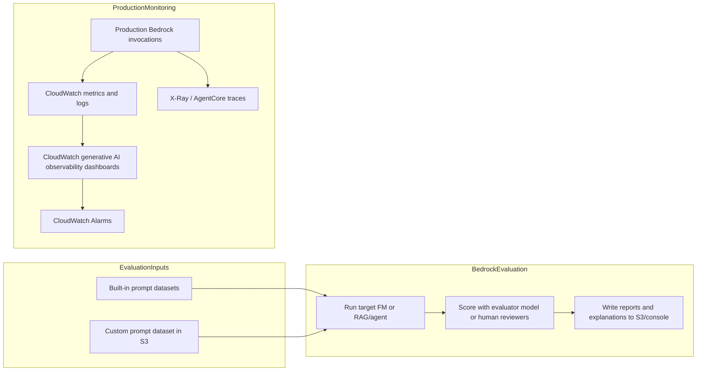

# Task 4.1: Operating, Monitoring, and Securing ML and AI Solutions - Monitor ML and AI model inference and performance

## Skill 4.1.6: Configure AI-specific performance monitoring for foundation models (FMs), such as Amazon Bedrock evaluations

### Purpose of this skill

Monitoring foundation model (FM) applications is different from monitoring traditional ML models. A traditional model often has a clear numerical prediction and a known label. A foundation model can generate long, open-ended, subjective, or safety-sensitive text. You need two complementary types of monitoring:

1. **Operational performance monitoring** — Is the model available, fast, reliable, and within token/cost expectations?
2. **Quality and safety monitoring** — Are the outputs helpful, correct, faithful, relevant, and safe?

For AWS, operational monitoring is typically done with **Amazon CloudWatch generative AI observability**. Quality and safety monitoring is often performed with **Amazon Bedrock Model Evaluation**.

---

### 1. Monitoring layers for foundation models

| Monitoring layer | AWS tool or service | What it answers |
|---|---|---|
| Invocation health | Amazon CloudWatch, Amazon Bedrock runtime metrics | Did the call succeed? Was it throttled? How long did it take? |
| Token and cost health | CloudWatch metrics for input/output token counts | Are we using more tokens than expected? Is cost increasing? |
| Output quality | Amazon Bedrock Model Evaluation | Are responses helpful, correct, faithful, relevant, safe? |
| Agent/tool behavior | CloudWatch generative AI observability, X-Ray, AgentCore Observability | Did the agent call the right tool? Did it fail or stop early? |
| Drift and distribution changes | Drift detection pipelines, embedding-based monitoring | Have prompt patterns changed over time? |

A complete monitoring strategy for an FM application usually combines several of these layers.

---

### 2. Amazon Bedrock Model Evaluation

**Amazon Bedrock Model Evaluation** is a managed service for evaluating foundation models and generative AI applications. It runs asynchronous evaluation jobs that score model responses.

You can use it to:

- Compare foundation models before selecting one for production.
- Monitor a production FM or RAG application over time.
- Check a knowledge base or agent application for quality issues.
- Build human review workflows for high-stakes or compliance-sensitive use cases.

Bedrock Model Evaluation works by sending prompts to a model, collecting the responses, and then scoring those responses using either:

- An evaluator/judge model
- Human reviewers
- A combination of both

#### Evaluation types

| Evaluation type | How it works | Best use case |
|---|---|---|
| **Automatic model evaluation** | Uses an evaluator FM to score responses against predefined or custom metrics. Can use built-in prompt datasets or your own prompt dataset in Amazon S3. | Ongoing quality monitoring, model regression checks, model comparison, scalability |
| **Human model evaluation** | Uses human reviewers to rate responses. You can use an AWS managed team or your own workforce. | Subjective quality, compliance/legal review, final pre-launch validation |
| **RAG/Agent evaluation** | Evaluates a full retrieval-augmented generation or agent workflow, not just the FM. Uses LLM-as-judge metrics for retrieval and final answer quality. | Monitoring knowledge-base answers, grounding, hallucination, agent performance |

#### Common Bedrock evaluation metrics

| Metric | What it measures | Important for |
|---|---|---|
| **Helpfulness** | Whether the response is useful and complete for the user. | General assistant quality |
| **Correctness** | Whether the response is factually correct. | Knowledge-based use cases |
| **Faithfulness** | Whether the response is grounded in the provided context or source. | RAG applications, hallucination detection |
| **Relevance** | Whether the response stays on topic for the prompt. | General quality |
| **Harmfulness** | Whether the response contains harmful content. | Safety and compliance |
| **Toxicity** | Offensive, abusive, or inappropriate language. | Brand safety |
| **Robustness** | Model stability under perturbed or slightly changed prompts. | Production reliability |
| **Accuracy** | Correctness for classification or structured prediction tasks. | Task-specific evaluation |
| **Answer relevancy** | How relevant the final answer is to the user query in a RAG system. | RAG evaluation |
| **Context relevance** | Whether retrieved passages are relevant to the query. | RAG retrieval quality |
| **Coverage** | How well the answer covers the important information from the context. | RAG completeness |

#### Important characteristics of Bedrock Model Evaluation

- It is **asynchronous**, not real-time. You create an evaluation job, it runs, and results are written to an Amazon S3 bucket or shown in the console.
- Automatic evaluation can produce **explanations** for each score when using an evaluator model.
- You can use **built-in prompt datasets** or **bring your own prompt dataset in Amazon S3**.
- Evaluation jobs can be used for **model selection**, **regression testing**, and **continuous monitoring**.
- For RAG evaluation, you can evaluate not just the final answer, but also whether the right context was retrieved.

---

### 3. Operational monitoring with CloudWatch generative AI observability

Amazon Bedrock already emits runtime metrics to **Amazon CloudWatch**. CloudWatch generative AI observability provides pre-built dashboards and tracing views for generative AI workloads.

Common signals to monitor for Bedrock FMs include:

| CloudWatch metric | What it indicates |
|---|---|
| **Invocations** | Total request volume. A sudden drop can indicate an application failure. |
| **InvocationLatency** | End-to-end model latency. Rising latency may indicate capacity issues or longer prompts. |
| **InputTokenCount** | Tokens sent to the model. Useful for cost and usage monitoring. |
| **OutputTokenCount** | Tokens generated by the model. Useful for cost and behavior monitoring. |
| **InvocationClientErrors** | Client-side errors, often invalid requests or permissions. |
| **InvocationServerErrors** | AWS/service-side errors. |
| **InvocationThrottles** | Requests rejected because account or model throttling limits were exceeded. |
| **GuardrailIntervened** | Number of invocations where Amazon Bedrock Guardrails took action. |

Use CloudWatch Alarms to alert on:

- High invocation error rate
- High throttling rate
- High latency percentiles
- Unusual token usage
- Guardrail intervention spikes

A healthy operational dashboard shows both **volume and failure signals**, not just uptime.

---

### 4. Monitoring agent and multi-step FM workflows

When an FM is part of an agent that calls tools, retrieves documents, or coordinates multiple steps, you must monitor more than the final answer.

AWS provides:

- **Amazon Bedrock AgentCore Observability** — default telemetry for agents running on AgentCore Runtime. It captures model inference calls, tool invocations, and memory operations.
- **AWS X-Ray** — traces a request across multiple components. This helps you identify whether the model, a tool, or a retrieval step caused a failure.
- **CloudWatch generative AI observability** — provides end-to-end prompt tracing, token usage, latency, and error metrics.

Signals to monitor for agent workloads include:

| Agent issue | Monitoring signal |
|---|---|
| Tool call failures | Tool invocation errors, failed spans, tool error metrics |
| Truncated streaming | Streaming response ended before expected completion |
| Coordination failure | Agent repeats the same step, never reaches final answer, or exceeds step limits |
| Memory retrieval failures | Errors in memory operations or missing context |
| End-to-end latency | Trace duration across model, retrieval, and tool calls |

A model can return a valid-looking response while the agent workflow itself is failing. That is why tracing is important.

---

### 5. Monitoring architecture diagram

---

### 6. Scenario-based examples

#### Scenario 1: Monitoring a production Claude-based assistant

A company runs a customer service assistant on Amazon Bedrock. The ML team wants to know:

- Whether the assistant is available and fast.
- Whether responses are becoming less helpful over time.
- Whether token usage is growing unexpectedly.

**Solution:**

- Use **CloudWatch generative AI observability** for real-time operational metrics: invocation count, latency, errors, throttles, and token counts.
- Use **Amazon Bedrock Model Evaluation** with an automatic evaluation job and a custom prompt dataset from Amazon S3. Evaluate for **helpfulness**, **correctness**, and **harmfulness** on a scheduled basis.
- Set CloudWatch Alarms on high latency, high error rate, and token count anomalies.

---

#### Scenario 2: Evaluating a RAG knowledge base for hallucinations

A legal research application uses Amazon Bedrock Knowledge Bases for retrieval-augmented generation. The team is worried that the final answer might sound confident but not be grounded in the retrieved documents.

**Solution:**

- Configure **RAG evaluation** in Amazon Bedrock Model Evaluation.
- Use an LLM-as-judge evaluator.
- Monitor metrics such as **faithfulness**, **context relevance**, and **answer relevancy**.
- Review the evaluation explanations in Amazon S3 or the Bedrock console.
- Use CloudWatch to monitor the underlying Bedrock invocation health and token counts.

---

#### Scenario 3: Pre-launch human review for a medical summarization use case

A healthcare company must validate that a new FM-based summarization tool meets strict safety standards before launch.

**Solution:**

- Use **human-based model evaluation** in Amazon Bedrock.
- Provide a curated prompt dataset in Amazon S3.
- Define evaluation metrics such as **harmfulness**, **correctness**, and **helpfulness**.
- Use an AWS managed review team or the company's own reviewers.
- Combine human evaluation results with operational CloudWatch monitoring after launch.

---

### 7. Exam tips and traps

- **Do not confuse operational monitoring with quality evaluation.** CloudWatch tells you whether the model responded quickly and successfully. Bedrock Model Evaluation tells you whether the response was good.

- **Bedrock Model Evaluation is asynchronous.** It is not a real-time guardrail or validator. For real-time enforcement, use Amazon Bedrock Guardrails.

- **Automatic evaluation uses an evaluator/judge model.** Human-based evaluation uses human reviewers. The exam may ask you to choose between them based on the use case.

- **CloudWatch generative AI observability is not the same as standard CloudWatch dashboards.** It is a specialized view for token usage, latency, errors, throttles, and prompt tracing.

- **Token count is an operational and cost signal, not a quality signal.** A low-latency, low-token response can still be wrong or harmful.

- **For RAG systems, monitor both retrieval and generation.** Metrics such as faithfulness and context relevance are more important than generic correctness alone.

- **For agent workloads, use tracing.** X-Ray and AgentCore Observability help identify tool failures, truncated streaming, and coordination failures that aggregate metrics may hide.

- **A common exam trap is choosing CloudWatch Logs or CloudTrail for output quality monitoring.** CloudTrail records API activity, not model quality. CloudWatch Logs can contain invocation logs, but it does not score quality.

- **A common trap is confusing drift detection with Bedrock Model Evaluation.** Drift detection identifies changes in prompt or data distributions over time. Bedrock Model Evaluation scores output quality against a prompt dataset.

- **When selecting a monitoring approach, first identify what you are monitoring:** the model's runtime, the model's output quality, the retrieval context, or the agent's multi-step behavior.

- **Amazon Bedrock Model Evaluation results can be written to Amazon S3.** Ensure you know where the evaluation report goes. The exam may test your understanding of the job being asynchronous and the output location.

- **Use CloudWatch Alarms for proactive notification.** A dashboard alone does not alert you. An alarm on flat-line invocation count can catch a broken pipeline just as well as a spike alarm.