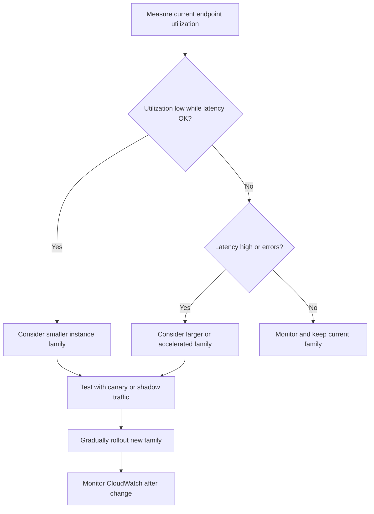

# Task 4.2: Operating, Monitoring, and Securing ML and AI Solutions - Optimize and manage ML and AI infrastructure costs and performance

## Skill 4.2.1: Select inference instance families to optimize performance and cost

This skill focuses on choosing the right Amazon SageMaker AI inference instance family for a hosted model. The goal is to balance **performance**, **latency**, **throughput**, **memory**, **hardware acceleration**, and **cost** based on the actual workload—not on assumptions.

---

### 1. Core Idea

For hosted ML inference, you are paying for **provisioned compute capacity**. The central question is:

> What does this model actually need to serve traffic within the required latency and throughput?

Instance family selection is not about choosing “the best” instance type. It is about choosing the **smallest or most cost-effective instance family that still meets your reliability and performance requirements**.

AWS expresses this as **right-sizing**.

---

### 2. Inference hosting options first

Before selecting an instance family, clarify which SageMaker inference option matches the access pattern.

| Inference option | Typical use case | Instance family selection impact |
| --- | --- | --- |
| **Real-time inference endpoint** | Steady, interactive traffic with low-latency expectations | You select and manage a specific instance family |
| **Serverless inference** | Intermittent or unpredictable traffic; small models | No instance family selection; capacity is abstracted |
| **Asynchronous inference** | Large payloads, long processing time, queued requests | You select instance family, often memory or GPU optimized |
| **Batch Transform** | Large offline scoring jobs | You select instance family based on batch throughput need |
| **Multi-model endpoint (MME)** | Many small or intermittently used models | One shared instance family serves many models |

For the exam, assume that **real-time endpoint** and **batch/async** scenarios are where explicit instance family selection matters most.

---

### 3. Main SageMaker inference instance family categories

| Instance family category | Example SageMaker types | Strengths | Best use cases | Cost profile |
| --- | --- | --- | --- | --- |
| **General purpose CPU** | `ml.m5`, `ml.m6i`, `ml.m7i`, `ml.m6g` | Balanced compute, memory, network | Traditional ML models, smaller deep learning models, moderate QPS | Lower cost than GPU |
| **Compute optimized CPU** | `ml.c5`, `ml.c6i`, `ml.c7i` | High CPU compute per core | CPU-heavy preprocessing, shallow models, high CPU throughput | Low-to-moderate cost |
| **Memory optimized CPU** | `ml.r5`, `ml.r6i`, `ml.r7i` | High memory-to-CPU ratio | Large feature vectors, embedding services, in-memory feature stores | Moderate cost |
| **GPU accelerated** | `ml.g4dn`, `ml.g5`, `ml.g6`, `ml.p3`, `ml.p4d`, `ml.p5` | High parallel floating-point performance | Deep learning inference, computer vision, large transformers, high-throughput models | Higher cost |
| **AWS Inferentia** | `ml.inf1`, `ml.inf2` | Purpose-built for low-cost, high-throughput deep learning inference | Inference for models compiled with AWS Neuron; strong cost-per-inference | Usually lower cost than GPU for supported models |

---

### 4. Decision factors for selecting an inference instance family

| Workload signal | Likely selection | Reasoning |
| --- | --- | --- |
| Small tabular or classical model | `ml.c5` / `ml.m5` | CPU is sufficient; GPU overhead is unnecessary |
| Deep learning model with strict latency | `ml.g5` / `ml.g4dn` or `ml.inf2` | Hardware acceleration improves throughput and latency |
| Large transformer model that does not fit on a single mid-size GPU | `ml.p4d` / `ml.p5` or high-memory GPU | Requires larger GPU memory |
| High QPS, cost-sensitive model already supported by Neuron | `ml.inf2` | AWS Inferentia can reduce cost per inference |
| Model is mostly memory-bound due to large embeddings | `ml.r5` / `ml.r6i` | More memory per vCPU |
| CPU-heavy feature engineering before scoring | `ml.c5` / `ml.c6i` | Compute optimized CPU |
| Model is small and called infrequently | SageMaker Serverless Inference | Avoid paying idle instance cost |
| Hundreds of small models called intermittently | Multi-model endpoint on a shared instance family | Consolidate models onto one instance pool |

---

### 5. Right-sizing process

Instance family selection should start from evidence, not instinct.

Use CloudWatch metrics such as:

- `CPUUtilization`
- `MemoryUtilization`
- `GPUUtilization`
- `InvocationsPerInstance`
- `ModelLatency`
- `OverheadLatency`
- `InvocationModelErrors`

AWS Compute Optimizer can also recommend a better instance type based on observed utilization history.

---

### 6. GPU vs CPU vs Inferentia

A common misconception is that every ML inference workload requires a GPU.

| Hardware choice | When it makes sense | When to avoid |
| --- | --- | --- |
| **CPU** | Small models, lower concurrency, shallow ML models, strict cost limits | Large deep learning models or high-throughput inference |
| **GPU** | Deep learning, computer vision, NLP, high concurrency, large models | Tiny models that cannot saturate GPU capacity |
| **AWS Inferentia** | Supported models, high throughput, cost-sensitive deep learning inference | Unsupported model operators or teams without Neuron optimization capacity |

---

### 7. Scaling vs changing instance family

These are not interchangeable.

| Problem | Fix |
| --- | --- |
| Instance is correctly sized for peak traffic but idle overnight | Configure automatic scaling, do **not** downsize the instance family |
| Instance is oversized even at peak traffic | Change to a smaller instance family |
| Latency rises because model needs more compute or memory | Move to a larger or accelerated instance family |
| Many small models each have their own endpoint | Multi-model endpoint or serverless inference |
| Steady year-round SageMaker usage | SageMaker AI Savings Plans |

---

### 8. Scenario-based examples

#### Scenario 1: Fraud detection with gradient-boosted trees

A bank runs a fraud detection model built with XGBoost. The model receives about 100 requests per second during business hours. Feature preprocessing is lightweight. Latency is acceptable on CPU.

**Which inference instance family should the team evaluate first?**

- **A.** `ml.p4d`
- **B.** `ml.g5`
- **C.** `ml.c5` or `ml.m5`
- **D.** `ml.inf2`

**Answer:** **C. `ml.c5` or `ml.m5`**

A gradient-boosted tree model is not a deep learning workload with large matrix multiplication. CPU instances are likely sufficient and far more cost-effective than GPU instances.

---

#### Scenario 2: Real-time object detection with high QPS

A manufacturing company deploys a computer vision model for defect detection. The model must process images in real time at high throughput. A GPU endpoint meets latency requirements, but the team wants to reduce cost.

**Which option best maintains performance while reducing cost?**

- **A.** Move to a general-purpose `ml.m5`
- **B.** Move to a memory-optimized `ml.r5`
- **C.** Evaluate `ml.inf2` or a smaller GPU family such as `ml.g5`
- **D.** Disable automatic scaling

**Answer:** **C. Evaluate `ml.inf2` or a smaller GPU family**

For supported deep learning models, AWS Inferentia can lower cost per inference. Alternatively, if the current GPU is oversized, a smaller GPU family may preserve latency at lower cost. Moving a vision model to CPU would likely harm latency.

---

#### Scenario 3: Endpoint busy during the day and idle at night

A SageMaker real-time endpoint runs on `ml.g5.2xlarge`. It is appropriately sized for daytime traffic. CPU and GPU utilization are near zero overnight.

**Which action optimizes cost without harming daytime performance?**

- **A.** Move to a smaller instance family
- **B.** Configure automatic scaling based on utilization or invocations per instance
- **C.** Convert to a multi-model endpoint
- **D.** Change to `ml.p4d`

**Answer:** **B. Configure automatic scaling**

The instance family is already correct for peak traffic. The problem is idle capacity overnight. Automatic scaling releases unneeded instances when traffic drops.

---

#### Scenario 4: Many small models

A data science team has 60 small recommendation models. Each model is called a few times per hour. Each model currently has its own endpoint.

**Which approach reduces cost?**

- **A.** Increase each endpoint's instance size
- **B.** Host the models behind one multi-model endpoint on shared instances
- **C.** Move all models to `ml.p4d`
- **D.** Disable CloudWatch monitoring

**Answer:** **B. Use a multi-model endpoint**

Multi-model endpoints allow many small models to share one instance pool, reducing total provisioned capacity. They add cold-start overhead when a model is loaded on demand, so they are best for intermittent traffic.

---

### 9. Cost vs performance trade-off

When reducing cost, name the trade-off explicitly.

| Cost reduction action | Possible trade-off |
| --- | --- |
| Move from GPU to CPU | Higher latency or lower maximum throughput |
| Choose smaller GPU | Reduced batch size or model memory headroom |
| Use AWS Inferentia | Requires Neuron-compatible model and retesting |
| Use multi-model endpoint | Cold-start latency for non-resident models |
| Reduce instance count | Less headroom for unexpected spikes |

---

### 10. Exam tips

- **Interpret workload shape before choosing hardware.** A simple model does not need an expensive GPU instance.
- **AWS Inferentia is a cost-optimization answer for deep learning inference**, but only when the model is supported and compiled appropriately.
- **Graviton-based instances** such as `ml.m6g`, `ml.c7g`, and `ml.r6g` can be cost-effective for CPU inference, especially for supported frameworks.
- **Measure first.** Use CloudWatch utilization rather than choosing an instance family from memory.
- **Right-sizing is not the same as auto scaling.** Right-sizing changes instance type; auto scaling changes instance count.
- **Multi-model endpoint** is the correct cost reduction answer when many models are called intermittently.
- **SageMaker AI Savings Plans** reduce SageMaker instance cost, but they are not a replacement for correct instance family selection.
- **Serverless inference** removes instance family decisions and is often appropriate for sporadic low-traffic models.

---

### 11. Exam traps

| Trap | Why it is wrong |
| --- | --- |
| Always choose GPU for ML | Many ML models are small and run well on CPU |
| Use `ml.p4d` or `ml.p5` for any deep learning model | These large instances are expensive and often unnecessary |
| Change to a smaller instance family to fix overnight idle capacity | Idle overnight is a scaling problem, not a sizing problem |
| Use multi-model endpoint for a high-traffic latency-critical model | MMEs can add cold-start latency and resource contention |
| Treat AWS Inferentia as universally compatible | It requires Neuron SDK and supported operators |
| Select memory-optimized instances because the model is “ML” | Memory optimized instances are for memory-bound workloads, not every model |
| Ignore CloudWatch metrics and select based on model size alone | Actual utilization and traffic matter more than model file size |

---

### 12. Quick recall

- **Instance family selection = right-sizing hosted inference compute.**
- Use **CPU families** for lightweight models, **GPU families** for deep/high-throughput models, **memory optimized** for large embedding/memory-bound models, and **AWS Inferentia** for cost-efficient supported deep learning inference.
- Always start from **measured utilization**, not assumptions.
- Separate **instance family selection** from **auto scaling**.
- If traffic is intermittent or unpredictable, consider **SageMaker Serverless Inference** before choosing any instance family.
- For many small models, use a **multi-model endpoint** on shared instances.