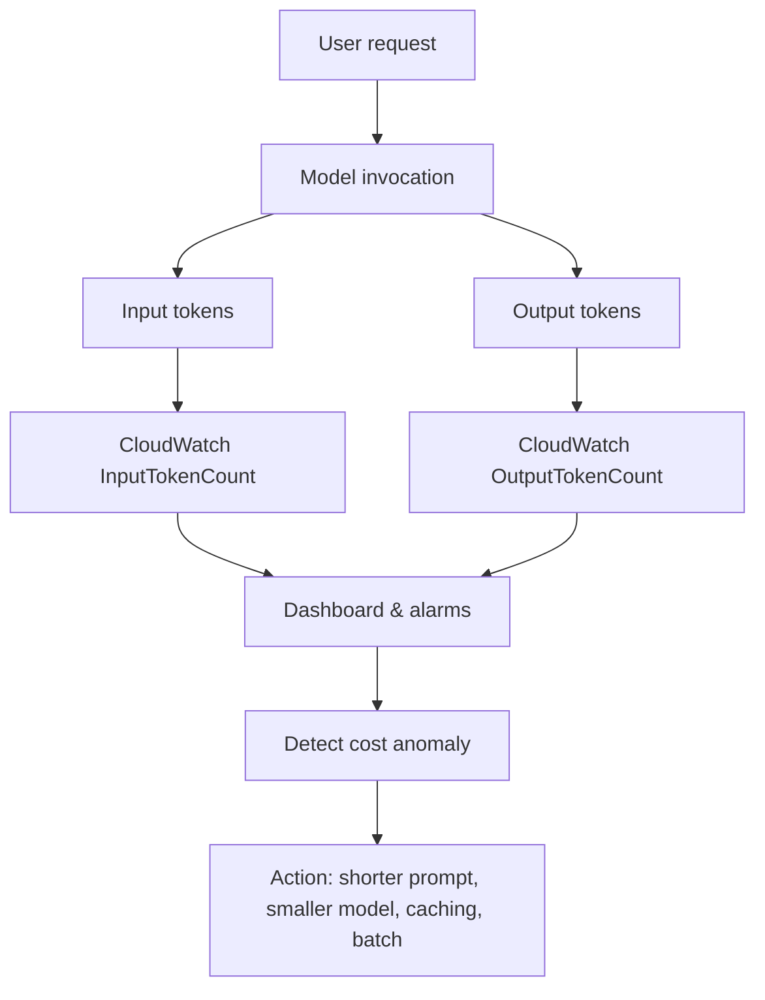
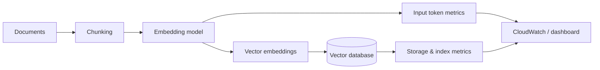

# Task 4.2: Optimize and manage ML and AI infrastructure costs and performance

## Skill 4.2.10: Monitor AI-specific cost patterns (for example, token usage optimization, embedding computation costs, vector database storage optimization)

### Why This Skill Matters

AI-specific workloads do not always follow the same cost patterns as traditional hosted inference endpoints. A SageMaker real-time endpoint is primarily billed for the **compute it holds**, while foundation model inference on Amazon Bedrock is billed for the **tokens going in and coming out**. Similarly, embedding workflows are billed for input tokens, and vector databases are billed for storage and query compute.

This means you cannot optimize an AI application by applying only instance-level or compute-level cost levers. You must monitor the cost patterns that are actually driving the bill:

- **Token usage** for generative text models.
- **Embedding computation** for retrieval-augmented generation and semantic search.
- **Vector database storage and query capacity** for the resulting indexes.

Before making any optimization decision, ask:

> **What is this workload actually being billed for?**

The answer may be compute hours, input tokens, output tokens, stored vectors, query capacity, or some combination. Your monitoring and optimization strategy must follow that answer.

---

### Core AI-Specific Cost Patterns

#### 1. Token Usage Optimization

For Amazon Bedrock on-demand foundation model inference, cost is driven by token volume:

- **Input tokens** include the prompt, system instructions, tool schemas, conversation history, and retrieved context.
- **Output tokens** are generated by the model.
- Different models charge different rates per 1,000 tokens.

A seemingly small change in prompt length can materially change cost because the input context is sent with every request.

Key monitoring metrics available in Amazon CloudWatch for Bedrock include:

| CloudWatch Metric | What It Tells You |
|---|---|
| `Invocations` | Total number of model invocations |
| `InputTokenCount` | Total input tokens processed |
| `OutputTokenCount` | Total generated tokens |
| `InvocationLatency` | How long each invocation takes |
| `InvocationClientErrors` | Client-side errors such as throttling or invalid requests |
| `InvocationServerErrors` | Service-side errors |

By correlating these metrics, you can distinguish between:

- **More traffic:** `Invocations` increases while average tokens per request stays flat.
- **Heavier prompts:** `InputTokenCount` per invocation increases.
- **Longer responses:** `OutputTokenCount` per invocation increases.
- **Model/quality changes:** cost per token changes even if token volume stays flat.

Token usage optimization levers include:

- Select the smallest model that meets the quality requirement.
- Trim system instructions and few-shot examples.
- Shorten conversation history and retrieved context.
- Cap maximum output tokens.
- Cache repeating prompt prefixes.
- Move asynchronous or batch-tolerant workloads to batch inference.
- Use provisioned throughput only for predictable, steady, high-volume baselines.

---

#### 2. Embedding Computation Costs

Embedding models convert text into dense vector representations. On Amazon Bedrock, embedding model invocations are typically billed based on **input tokens** only. For example, a Titan Text Embeddings model invocation is billed per 1,000 input tokens.

This means the cost pattern for embeddings is not about vector dimensions alone at inference time. The main cost driver is the **volume of text being embedded**.

Important patterns to monitor:

- Number of embedding invocations.
- Average input token count per embedding call.
- Total input tokens used by embedding models.
- Cache hit ratio if embeddings are cached.
- Cost per document or per newly indexed item.

Ways to reduce embedding computation costs:

- **Precompute embeddings** for static documents or knowledge bases.
- **Cache embeddings** using a content hash so a changed document does not cause all downstream vectors to be regenerated.
- **Batch embedding calls** for bulk ingestion where latency is less critical.
- **Use a smaller or more cost-effective embedding model** if retrieval quality remains acceptable.
- **Reduce chunk size or omit low-value metadata** from the embedded text.
- **Re-embed only changed passages**, not the entire corpus.

A common trap is to assume that reducing vector dimensions after the fact will lower embedding costs. Dimension reduction can reduce vector database storage and memory, but the embedding API cost is based on input tokens, not on output dimension count.

---

#### 3. Vector Database Storage Optimization

A vector database stores embeddings for semantic search or retrieval. Its cost pattern is different again: it is driven by:

- **Storage volume** — the size of the vector index and metadata.
- **Memory/compute capacity** — query time, index build time, and ongoing search workload.
- **Index type and parameters** — HNSW, IVF, quantization, and related settings affect memory and storage efficiency.

Monitoring inputs include:

- Number of stored vectors.
- Vector dimensions.
- Index size on disk or in memory.
- Storage growth rate.
- Query latency and throughput.
- CPU/GPU or memory utilization of the vector database.
- Number of idle or stale vectors if retention is not managed.

Optimization levers:

- **Apply retention policies or TTL** to remove stale vectors.
- **Reduce vector dimensions** through model selection or dimensionality reduction when semantically acceptable.
- **Use quantization** such as scalar or product quantization to reduce memory footprint.
- **Review index configuration** — selected index types trade memory, latency, and recall.
- **Separate hot and cold data** so only active vectors require high-performance storage.
- **Right-size the database instance** based on observed storage and query metrics.
- **Delete unused or duplicate vectors** from deprecated experiments and model versions.

AWS services that commonly host vector indexes include Amazon OpenSearch Serverless with vector engine, Amazon Aurora PostgreSQL with `pgvector`, Amazon RDS for PostgreSQL with `pgvector`, and Amazon MemoryDB. Each has different billing dimensions, so you must monitor the relevant dimension for your selected service.

| AI Cost Pattern | Main Billing Driver | Key Monitoring Signal | Primary Optimization Levers |
|---|---|---|---|
| Generative text inference | Input + output tokens | `InputTokenCount`, `OutputTokenCount` | Smaller model, shorter prompts, capped response length, prompt caching, batch, provisioned throughput |
| Embedding computation | Input tokens per embedding call | Embedding input tokens, number of embedding calls | Precompute, cache, batch, smaller embedding model, reduced re-embedding |
| Vector database storage | Stored vectors + query/memory capacity | Vector count, index size, memory/CPU utilization, query latency | Retention/TTL, dimension reduction, quantization, index tuning, right-sizing |

---

### Instrumenting AI-Specific Cost Monitoring

#### Amazon CloudWatch

CloudWatch is the primary tool for observing AI-specific usage.

For Amazon Bedrock, you can create dashboards that show:

- Invocation rates.
- Input and output token counts.
- Token counts per invocation.
- Error and throttling rates.
- Latency.

A well-designed AI cost dashboard should place related metrics together so the relationship is visible:

- **Token usage next to invocation count** reveals whether the bill is rising because of traffic or because each request is getting heavier.
- **Latency next to utilization** reveals whether slowness is caused by capacity.
- **Embedding input tokens next to document ingestion count** reveals whether ingestion volume or chunk size is driving embedding costs.
- **Vector count next to storage size** reveals whether storage growth is from more vectors or larger vectors.

#### AWS Cost Explorer

Cost Explorer helps identify which service, usage type, or tagged resource is driving spend.

Use it to:

- Group cost by AWS service.
- Filter by tag such as environment, team, or application.
- Compare current spend with historical periods.
- Forecast future spend.

Without cost allocation tags, Cost Explorer can show a service total but cannot easily attribute it to a specific model, application, or team.

#### AWS Budgets

AWS Budgets is used for setting thresholds and receiving alerts based on actual or forecasted cost or usage.

For AI applications, budgets can be scoped to:

- Total Amazon Bedrock spend.
- SageMaker endpoint cost.
- Vector database service spend.
- Specific tagged environments or teams.

Budgets do not reduce spend themselves, but they provide the early warning needed to react before the spend becomes a surprise.

#### Amazon Bedrock AgentCore Observability

Agent workflows amplify cost because one user request can become many model calls, tool calls, and memory operations.

AgentCore Observability captures:

- Inference calls.
- Tool invocations.
- Memory operations.
- Orchestration traces.

This makes an agent's resource consumption visible per invocation rather than only as an aggregate account total.

Monitoring agent-specific patterns matters because:

- A single agent request may produce several foundation model calls.
- A retry loop or repeated tool call may generate cost without a visible change in user traffic.
- The most useful metric is **cost per agent invocation**, not simply total token usage.

---

### Scenario-Based Examples

#### Scenario 1: Rising Bedrock Cost Without Rising Traffic

A company runs a support assistant on Amazon Bedrock. The operations team notices total spend has increased by 35% over two weeks, but the number of user conversations has stayed roughly flat.

**Question:**  
Which CloudWatch signal would most likely explain the increase?

**Options:**

A. `Invocations` has fallen sharply.  
B. `InputTokenCount` per invocation has risen because prompts now include longer retrieved context.  
C. The assistant switched from on-demand to provisioned throughput.  
D. `InvocationClientErrors` has become zero.

**Correct Answer:** **B. `InputTokenCount` per invocation has risen because prompts now include longer retrieved context.**

**Explanation:**  
When traffic stays flat but total token usage rises, the issue is likely that each request is carrying more tokens. The team should inspect the prompt structure and retrieved context length. Shortening the context, capping history, or reducing the number of retrieved documents can reduce input tokens and cost.

**Why the other options are incorrect:**

- **A:** Fewer invocations would likely reduce cost, not increase it.
- **C:** Provisioned throughput changes the billing model, but the scenario is about monitoring a spending increase, not about fixed capacity.
- **D:** Zero client errors is not a cost driver.

---

#### Scenario 2: Embedding Cost from Re-Embedding Static Content

A document search application ingests a large knowledge base into an embedding model every time a new document is uploaded. The team notices that ingestion cost is increasing linearly with the total size of the knowledge base, even though only a small number of documents are added each day.

**Question:**  
What is the most likely cost issue?

**Options:**

A. Vector database storage is too expensive.  
B. The team is re-embedding unchanged documents on every ingestion.  
C. The embedding model is billed by output tokens.  
D. The application needs a smaller embedding model only when querying.

**Correct Answer:** **B. The team is re-embedding unchanged documents on every ingestion.**

**Explanation:**  
If the entire corpus is re-embedded whenever one document changes, embedding input token volume grows with the size of the full corpus, not with the size of the change. The solution is to embed only new or changed chunks and cache existing embeddings by content hash.

**Why the other options are incorrect:**

- **A:** The rising cost pattern described is ingestion-time embedding cost, not vector database storage.
- **C:** Embedding models are billed primarily on input tokens, not generated output tokens.
- **D:** Query-time model size is not the likely cause of ingestion cost growth.

---

#### Scenario 3: Vector Database Growth

A semantic search application uses a vector database. Storage and memory utilization are increasing steadily, and query latency is also rising. The number of user queries has not increased significantly.

**Question:**  
Which approach is most likely to reduce both storage and query latency cost pressure?

**Options:**

A. Add more instances to the vector database.  
B. Remove stale or unused vectors and apply a retention policy.  
C. Increase the model response length.  
D. Use projected metrics only from AWS Trusted Advisor.

**Correct Answer:** **B. Remove stale or unused vectors and apply a retention policy.**

**Explanation:**  
Uncontrolled vector growth increases index size, memory use, and query cost. Deleting stale or outdated vectors and setting TTL or retention rules directly reduces the number of stored vectors and can improve query performance.

**Why the other options are incorrect:**

- **A:** Adding instances may improve capacity but increases cost and does not address storage growth.
- **C:** Response length affects generative output tokens, not vector database storage.
- **D:** Trusted Advisor does not provide the detailed vector usage metrics needed here.

---

### Exam Tips and Common Traps

#### Exam Tips

1. **Match the cost pattern to the billing driver.**  
   Traditional endpoints bill for compute; foundation model inference bills for tokens; embeddings bill mainly for input tokens; vector databases bill for storage and query capacity.

2. **Use CloudWatch metrics to distinguish traffic changes from prompt changes.**  
   Compare `Invocations` with `InputTokenCount` and `OutputTokenCount`. If invocations are flat but token counts rise, the prompt or response shape has changed.

3. **Remember that prompt caching is not a universal solution.**  
   A dynamic value in the prompt prefix can invalidate the cache on every request, so no savings materialize.

4. **Embedding cost is driven by input text volume.**  
   Precompute, cache, and batch embedding jobs to reduce cost.

5. **Vector database optimization is about storage and query capacity, not token output.**  
   Monitor vector count, index size, memory usage, and query performance.

6. **Use AWS Budgets for alerts and Cost Explorer for attribution.**  
   Budgets notify when spend is projected to cross a threshold. Cost Explorer identifies which tag, service, or usage type drove the change.

#### Common Traps

1. **Applying traditional endpoint optimization to token-based AI workloads.**  
   Auto scaling or changing instance families does not reduce Amazon Bedrock on-demand token cost.

2. **Assuming higher vector dimensions are the main embedding cost.**  
   The embedding API cost is based on input tokens. Vector dimensions mainly affect downstream storage and search cost.

3. **Treating a reduction in model size as automatically sufficient.**  
   A smaller model may reduce cost per token, but long prompts and unbounded output can still make total cost high.

4. **Confusing AWS Budgets with a discount mechanism.**  
   Budgets alert but do not reduce rates. Savings Plans or Provisioned Throughput can reduce rates where applicable.

5. **Overlooking agent amplification.**  
   One agent request can generate multiple model calls and tool calls. Monitor cost per invocation, not only total account-level spend.

6. **Ignoring cost allocation tags.**  
   Without tags, you cannot easily attribute Bedrock, SageMaker, or vector database spend to a specific model, team, or environment.

---

### Summary

Monitoring AI-specific cost patterns requires understanding where the cost actually originates.

| Workload | Primary Cost Driver | Key Monitoring Focus | Main Optimization Approach |
|---|---|---|---|
| Generative text on Bedrock | Input and output tokens | Token counts per invocation | Smaller model, shorter prompts, cache, cap output |
| Embedding generation | Input tokens | Embedding input token volume and call count | Precompute, cache, batch, re-embed only changed content |
| Vector database | Storage and query/memory capacity | Vector count, index size, utilization | Retention, dimension reduction, quantization, right-size |
| Agent workflows | Multiple model/tool calls per request | Cost per agent invocation | Observability, reduce tool loops, simplify orchestration |

The central discipline is to observe first, measure the correct AI-specific dimension, and then apply the corresponding cost lever.