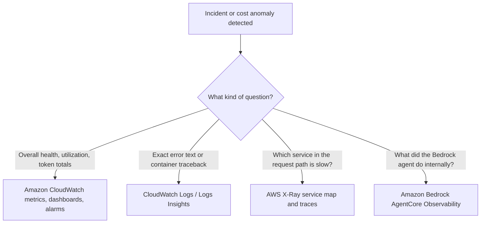
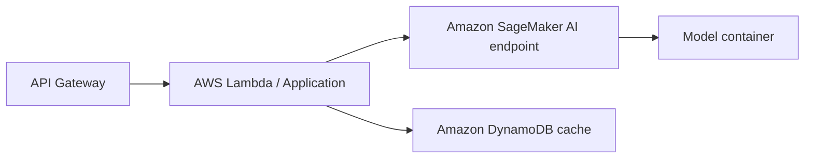
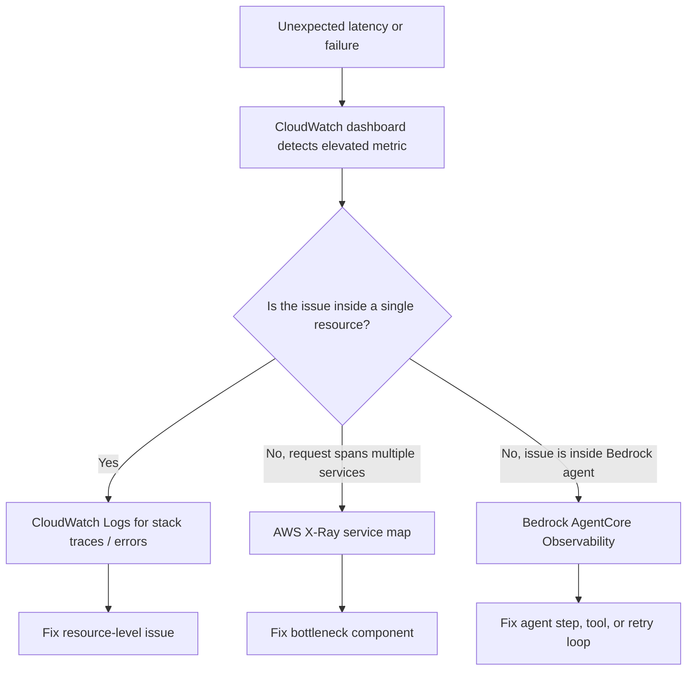

# Task 4.2: Operating, Monitoring, and Securing ML and AI Solutions - Optimize and manage ML and AI infrastructure costs and performance

## Skill 4.2.2: Configure and use tools to troubleshoot and analyze resources (for example, Amazon CloudWatch, Amazon Bedrock AgentCore Observability, AWS X-Ray)

### Purpose of this skill

Troubleshooting ML and AI workloads requires matching the right observability tool to the question being asked. A single aggregate metric can show that latency increased. A log entry can show why a model container failed. A trace can show which component in a distributed request is responsible for delay. For Bedrock agents, purpose-built observability can show the actual sequence of model calls, tool calls, and retrieval operations inside a single agent invocation.

For the MLA-C02 exam, you should know:

- What each tool captures and when to use it.
- How CloudWatch metrics, logs, dashboards, and alarms support ML operations.
- How AWS X-Ray helps isolate latency and failure in distributed ML applications.
- How Amazon Bedrock AgentCore Observability provides invocation-level visibility into agent behavior.
- How these tools work together to reduce mean time to resolution and avoid applying fixes to the wrong component.

---

### 1. Core mental model: Metrics, logs, and traces

| Telemetry type | Primary question it answers | Common AWS tool |
| --- | --- | --- |
| Metrics | Is this resource healthy, busy, erroring, or expensive? | Amazon CloudWatch |
| Logs | What exact error or event occurred inside a component? | CloudWatch Logs |
| Distributed traces | Which component in the request path caused slow or failed behavior? | AWS X-Ray |
| Agent trace | What sequence of model, tool, memory, and retrieval operations did one agent invocation perform? | Amazon Bedrock AgentCore Observability |

A complete troubleshooting approach usually moves from aggregate signal to specific evidence:

1. A CloudWatch alarm or dashboard shows a problem.
2. CloudWatch Logs explains the error from a service.
3. AWS X-Ray attributes latency across services.
4. Bedrock AgentCore Observability attributes latency and cost inside an agent invocation.

---

### 2. Amazon CloudWatch

Amazon CloudWatch is the central monitoring service for AWS resources and application telemetry. It collects, visualizes, and correlates:

- **Metrics** — time-series numerical data such as latency, error counts, throttling, and token counts.
- **Logs** — text or structured records from applications, model containers, and AWS services.
- **Dashboards** — custom views combining related operational signals.
- **Alarms** — threshold-based alerting that can notify teams or trigger automated actions.

#### 2.1 Key ML and AI metrics in CloudWatch

| Service | Important metric | What it tells you |
| --- | --- | --- |
| Amazon SageMaker AI real-time endpoint | `Invocations` | Request volume reaching the endpoint |
| Amazon SageMaker AI real-time endpoint | `ModelLatency` | Time inside the model container from request handoff to response |
| Amazon SageMaker AI real-time endpoint | `OverheadLatency` | Endpoint overhead outside the model container, such as queuing, serialization, or payload transfer |
| Amazon SageMaker AI real-time endpoint | `CPUUtilization`, `MemoryUtilization`, `GPUUtilization` | Compute resource pressure on hosted instances |
| Amazon SageMaker AI real-time endpoint | `Invocation4XXErrors`, `Invocation5XXErrors` | Client-side and server-side model invocation failures |
| Amazon SageMaker AI real-time endpoint | `Throttling` | Requests rejected because capacity is exhausted |
| Amazon Bedrock | `Invocations` | Number of model invocations |
| Amazon Bedrock | `InvocationLatency` | Model invocation duration |
| Amazon Bedrock | `InputTokenCount`, `OutputTokenCount` | Token consumption for cost and prompt/output analysis |
| Amazon Bedrock | `InvocationClientErrors`, `InvocationServerErrors`, `InvocationThrottles` | Bedrock API error categories |

For SageMaker endpoints, one useful correlation is:

- High `Invocation5XXErrors` plus high `CPUUtilization` or `MemoryUtilization` suggests capacity or resource exhaustion.
- High `OverheadLatency` with normal `ModelLatency` suggests endpoint infrastructure pressure, payload size, or insufficient instance count.
- High `InvocationThrottling` usually points to scaling policies that are too slow or instances that are too small.

For Bedrock, one useful correlation is:

- Rising `InputTokenCount` with flat `Invocations` means prompts or context are getting heavier.
- Rising `OutputTokenCount` can mean generation is longer, often because response length limits are too permissive.
- High `InvocationThrottles` may indicate account-level model quota limits.

#### 2.2 CloudWatch Logs for ML workloads

CloudWatch Logs is the primary evidence source for exact failure text.

Common use cases:

- Inspect SageMaker model container logs for Python or framework exceptions.
- Search endpoint logs during a model deployment or inference failure.
- Enable Bedrock model invocation logging to capture model inputs, outputs, and response metadata.
- Use CloudWatch Logs Insights to query structured or unstructured log data across large log groups.

For SageMaker, logs are especially helpful when an endpoint fails to start or a model container crashes. CloudWatch metrics may show `Invocation5XXErrors`, but the logs show the actual stack trace.

For Bedrock, invocation logging is optional and can be enabled to send model invocation details to CloudWatch Logs, Amazon S3, or both. This helps with security and operational troubleshooting, but it is distinct from AgentCore Observability.

#### 2.3 CloudWatch dashboards

A useful operational dashboard combines metrics that should be read together.

| Dashboard signal | Reason to include it |
| --- | --- |
| Invocation count | Shows traffic volume |
| p50, p90, p99 latency | Shows typical and worst-case performance |
| 4xx and 5xx error rates | Shows reliability degradation |
| CPU, memory, GPU utilization | Shows whether latency is capacity-driven |
| Token input/output counts | Shows AI-specific cost and prompt/response size trends |

A well-designed dashboard helps answer questions such as:

- Is latency caused by traffic, compute saturation, or model size?
- Is rising Bedrock cost caused by more users or heavier prompts?
- Is the endpoint near its scaling threshold before users notice?

#### 2.4 CloudWatch alarms

CloudWatch alarms notify operators when a metric crosses a threshold over a defined evaluation window.

Practical ML examples:

- Alert when SageMaker `Invocation5XXErrors` exceeds a threshold for 5 minutes.
- Alert when GPU utilization is below a low threshold for an extended period, indicating potentially idle expensive compute.
- Alert when Bedrock token usage is on track to exceed a budgeted level.
- Combine alarms with AWS Budgets for cost-related thresholds.

Alarms are for aggregate thresholds. They do not identify a single slow request or trace an issue across services.

---

### 3. AWS X-Ray

AWS X-Ray is a distributed tracing service. It captures request-level data across application components, AWS services, and downstream integrations.

#### 3.1 X-Ray concepts

| Concept | Meaning |
| --- | --- |
| Trace | An end-to-end record of one request across all participating components |
| Segment | A portion of a trace generated by a single component or service |
| Subsegment | A finer-grained operation inside a segment, such as a database query or downstream API call |
| Service map | Visual representation of components and their connections, latency, and fault rates |
| Annotations | Key-value metadata attached to traces for filtering and analysis |

#### 3.2 When to use X-Ray

Use X-Ray when the problem is not inside one resource but across a distributed request path.

Example ML architecture:

If end users report high latency, but SageMaker `ModelLatency` is normal, the bottleneck may be in:

- API Gateway or network overhead.
- A Lambda function doing excessive preprocessing.
- A DynamoDB cache miss.
- Endpoint overhead before model invocation.

X-Ray provides a service map and trace history that can attribute latency to a specific service or operation.

#### 3.3 Configuring X-Ray for ML workloads

At a high level, configuration includes:

- Enable active tracing on supported AWS resources such as Lambda functions, API Gateway stages, and SageMaker endpoints.
- Propagate the X-Ray trace header between upstream services and the SageMaker endpoint.
- Use AWS X-Ray sampling to balance trace coverage against cost and overhead.

For SageMaker inference, trailing upstream application flows through the endpoint becomes visible as part of the request trace. This allows a trace to show the request entering API Gateway, traversing Lambda, reaching SageMaker, and returning through the same path.

X-Ray is excellent for request-level performance analysis, but it is not a replacement for CloudWatch dashboards or CloudWatch Logs.

---

### 4. Amazon Bedrock AgentCore Observability

Amazon Bedrock AgentCore Observability is purpose-built for agentic AI workloads.

A Bedrock agent is not a single model invocation. One user request may trigger:

- Orchestration and planning model calls.
- One or more tool calls or action group invocations.
- Knowledge base retrieval operations.
- Guardrail evaluations.
- Memory operations.
- A final synthesis or response generation call.

For this reason, a simple count of model invocations is not sufficient to understand agent performance or cost. AgentCore Observability provides trace-level visibility into the inner steps of an agent invocation.

#### 4.1 What AgentCore Observability captures

| Scope | Examples |
| --- | --- |
| Agent invocation | Start and end of a user request |
| Orchestration | Planning, reasoning, and decision steps |
| Model calls | Model IDs, prompt size, latency, token counts |
| Tool and action group calls | Which tool was invoked, how long it took, whether it failed |
| Knowledge base retrieval | Retrieval latency, number of returned documents or chunks |
| Guardrails | Whether content was blocked or modified |
| Memory | Reads and writes to agent memory |
| Errors and retries | Failure reasons and repeated actions |

This allows teams to see the exact path of an individual agent invocation.

#### 4.2 When to use AgentCore Observability

Use AgentCore Observability when:

- A Bedrock agent is slow, but the primary model `InvocationLatency` appears normal.
- Token usage is increasing without a corresponding increase in end-user traffic.
- A tool or knowledge base call is failing sporadically.
- The agent appears to retry the same action repeatedly.
- You need to know how many model calls one user request actually generated.

For example, if a customer request generates a planning call, five retrieval calls, one failed tool call, one retry, and a synthesis call, the cost and latency are far higher than a single model invocation metric would suggest.

#### 4.3 Configuring AgentCore Observability

Configuration requires enabling observability on the Bedrock agent and selecting delivery to CloudWatch. An IAM role grants Bedrock permission to write telemetry to CloudWatch. Once enabled, the agent emits trace and metric data that can be analyzed per invocation in CloudWatch.

Important distinction:

- **Bedrock invocation logging** records inputs and outputs of model calls.
- **AgentCore Observability** records the multi-step execution path, including reasoning, tools, retrieval, memory, and errors.

Both are useful, but AgentCore Observability answers questions that standard Bedrock model metrics cannot.

---

### 5. Combined troubleshooting framework

The following table summarizes the practical use of each tool.

| Problem | Best first tool | Why |
| --- | --- | --- |
| SageMaker endpoint CPU is high | CloudWatch metrics | Provides aggregate utilization data over time |
| Model container has a stack trace | CloudWatch Logs | Provides exact error text |
| User request is slow across API Gateway, Lambda, and SageMaker | AWS X-Ray | Shows request-level latency by component |
| Bedrock agent is expensive but user traffic is flat | Bedrock AgentCore Observability | Shows model and tool calls per invocation |
| Need to notify on-call when 5xx errors exceed 10% | CloudWatch alarm | Monitors aggregate error threshold |
| Need to see per-model token trend | CloudWatch metrics and dashboard | Shows input/output token counts over time |

---

### 6. Scenario-based exam practice

#### Scenario 1

A company runs a multi-step conversational assistant on Amazon Bedrock Agents. End users report that answers are slow. The CloudWatch dashboard shows that Bedrock model `InvocationLatency` is within normal limits. The operations team needs to determine whether time is being lost in orchestration, action group calls, or knowledge base retrieval.

Which tool should be used?

**Options:**

A. CloudWatch Logs Insights  
B. AWS X-Ray service map  
C. Amazon Bedrock AgentCore Observability  
D. AWS Compute Optimizer  

**Correct answer:** C

**Explanation:**

A Bedrock agent can make multiple internal model, tool, and retrieval calls per user request. Normal model invocation latency does not rule out slow orchestration, slow tool calls, or slow knowledge base retrieval. Bedrock AgentCore Observability provides invocation-level trace data that shows where time is consumed inside the agent.

- **A** is incorrect because CloudWatch Logs may contain individual errors but does not provide structured agent step timing.
- **B** is useful for distributed service latency, but the question specifically requires visibility inside the agent.
- **D** is irrelevant; Compute Optimizer recommends instance sizes, not agent invocation paths.

---

#### Scenario 2

A serverless ML application uses Amazon API Gateway, AWS Lambda, and a SageMaker real-time endpoint. End-user latency has increased, but SageMaker `ModelLatency` has not changed. The team needs to identify the component responsible for the added delay.

Which service should the team use?

**Options:**

A. AWS X-Ray  
B. Amazon CloudWatch alarm  
C. AWS Trusted Advisor  
D. Amazon Bedrock AgentCore Observability  

**Correct answer:** A

**Explanation:**

AWS X-Ray provides distributed tracing across API Gateway, Lambda, and the SageMaker endpoint. It shows the latency contribution of each component in the request path, allowing the team to identify whether the delay is in the Lambda function, network path, API Gateway, or endpoint overhead.

- **B** notifies on aggregate thresholds but cannot isolate a slow component in a multi-service trace.
- **C** checks best practices and unused resources, not request latency.
- **D** is specific to Bedrock agent invocation steps.

---

#### Scenario 3

An ML engineer needs to be paged when a SageMaker endpoint's server-side invocation error rate exceeds 5% for five consecutive minutes.

Which configuration is most appropriate?

**Options:**

A. Create a CloudWatch alarm on `Invocation5XXErrors`  
B. Publish a custom metric to AWS X-Ray  
C. Enable Bedrock AgentCore Observability  
D. Create an AWS Budgets alert  

**Correct answer:** A

**Explanation:**

CloudWatch alarms trigger notifications based on aggregate metrics over time. Monitoring `Invocation5XXErrors` against a threshold directly alerts on server-side failures.

- **B** is incorrect because X-Ray is for tracing, not metric-threshold alerting.
- **C** is for Bedrock agents, not SageMaker endpoints.
- **D** tracks cost, not service error rates.

---

### 7. Exam tips and traps

#### 7.1 Tool-matching traps

- **Do not use AWS X-Ray for aggregate dashboards.** X-Ray traces individual requests. If the question asks for a dashboard showing CPU utilization or token usage, the answer is CloudWatch.
- **Do not use CloudWatch dashboards to trace a single request.** Dashboards show trends. For per-request cross-service latency, use X-Ray.
- **Do not use CloudWatch Logs to determine which microservice added latency.** Logs show events inside one component. X-Ray attributes latency across components.

#### 7.2 Bedrock agent-specific traps

- **A normal Bedrock model latency metric does not mean an agent is healthy.** Agents amplify one user request into many internal steps.
- **Standard Bedrock invocation metrics are aggregate totals.** AgentCore Observability shows the per-invocation trace.
- **Bedrock invocation logging is not the same as AgentCore Observability.** Invocation logging records model input/output; AgentCore records the agent's execution path, tool calls, knowledge base queries, memory, and guardrails.
- **If the question involves understanding agent orchestration, tool latency, or retry loops, look for AgentCore Observability as the answer.**

#### 7.3 CloudWatch traps

- **Not all logs are enabled by default.** SageMaker container logs and Bedrock invocation logs may need explicit configuration and IAM permissions.
- **A single high CPU metric may be normal during daily traffic peaks.** Always compare utilization against baseline and correlate with latency and error metrics.
- **Token usage and invocation count should be analyzed together.** If invocations are flat but token usage rises, the cause is usually prompts, context, or response length—not traffic.
- **A CloudWatch alarm is not a cost optimization tool.** It notifies. It does not reduce spend.

#### 7.4 X-Ray traps

- **X-Ray does not replace CloudWatch Logs.** If you need the exact exception message from a model container, CloudWatch Logs is the service.
- **X-Ray must be enabled and tracing headers propagated.** A partial service map appears when upstream or downstream services are not instrumented.
- **X-Ray is useful for distributed request latency, but it is not the purpose-built tool for Bedrock agent internals.** For Bedrock agents, prefer AgentCore Observability when internal agent steps are the concern.

---

### 8. Quick recall

| Question | Tool |
| --- | --- |
| What is the endpoint's current error rate over 15 minutes? | Amazon CloudWatch metric |
| What is the exact stack trace from a failed model container? | CloudWatch Logs |
| Which component is slow in a request path involving Lambda and SageMaker? | AWS X-Ray |
| Which step inside a Bedrock agent consumes the most tokens? | Amazon Bedrock AgentCore Observability |
| How can I be notified before GPU utilization stays at 100% for 30 minutes? | CloudWatch alarm |
| How can I view model input and output text for debugging? | Bedrock invocation logging to CloudWatch Logs or S3 |

**Core principle:** Match the tool to the granularity of the question. Aggregate metric, log line, service trace, or agent trace are four different levels of evidence. Applying the wrong level of visibility often leads to fixing the wrong component.