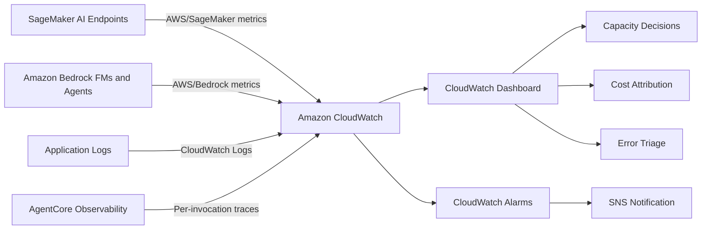
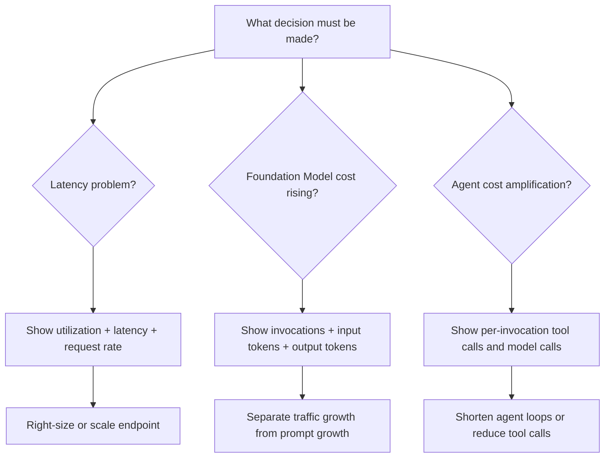

# Task 4.2: Operating, Monitoring, and Securing ML and AI Solutions - Optimize and manage ML and AI infrastructure costs and performance

## Skill 4.2.3: Set up dashboards to monitor performance metrics

### Overview

A performance dashboard in AWS is primarily an **Amazon CloudWatch dashboard**. It brings together operational metrics, logs, and alarm status into a single visual layout so an ML engineer can make a decision faster than jumping between multiple service consoles.

For the MLA-C02 exam, this skill goes beyond simply "knowing that CloudWatch exists." It focuses on:

- Knowing which metrics matter for **hosted ML inference** on Amazon SageMaker AI.
- Knowing which metrics matter for **token-based generative AI inference** on Amazon Bedrock.
- Combining those metrics into dashboards that answer a specific question, such as:
    - Is latency caused by capacity exhaustion?
    - Is a rising Foundation Model bill caused by more traffic or heavier prompts?
    - Is an agent invocation amplifying cost through repeated tool or model calls?
- Understanding the difference between a dashboard, an alarm, and a trace.

The guiding principle is:

> A dashboard earns its place when it shortens a decision. This means it holds the measures that move together.

### What a dashboard should help you decide

A well-designed ML/AI performance dashboard should make the following visible at a glance:

| Decision | Dashboard story |
| --- | --- |
| Is my endpoint overloaded? | CPU/GPU utilization beside latency and invocation rate |
| Is the error rate acceptable? | 4xx/5xx errors as a percentage of invocations |
| Is automatic scaling working? | Instance count or invocations per instance over time |
| Is Foundation Model cost rising due to traffic? | Invocation count over time |
| Is Foundation Model cost rising due to heavier prompts? | Input token count per invocation over time |
| Is my agent amplifying a single user request? | Agent per-invocation trace metrics showing model calls and tool calls |
| Is caching helping? | Cache hit ratio or prompt cache effectiveness metrics |

---

### Key performance metrics for ML and AI workloads

#### Amazon SageMaker AI hosted inference metrics

SageMaker AI real-time endpoints publish metrics to the `AWS/SageMaker` CloudWatch namespace. These are the core performance metrics to place on a dashboard:

| Metric | What it tells you |
| --- | --- |
| `Invocations` | Number of inference requests sent to the endpoint |
| `InvocationsPerInstance` | Number of invocations per instance; useful for automatic scaling decisions |
| `ModelLatency` | Time from request arrival to model response completion |
| `OverheadLatency` | Time added by the serving stack before and after model execution |
| `CPUUtilization` | Average CPU load across endpoint instances |
| `GPUUtilization` | Average GPU load across GPU-backed endpoint instances |
| `MemoryUtilization` | Memory pressure on endpoint instances |
| `DiskUtilization` | Storage pressure on endpoint instances |
| `Invocation4XXErrors` | Client-side request errors |
| `Invocation5XXErrors` | Server-side failures |

Exam interpretation:

- High `ModelLatency` combined with high `CPUUtilization` or `GPUUtilization` suggests a capacity issue.
- High `OverheadLatency` with low `ModelLatency` suggests a serving stack or request routing issue rather than the model itself.
- `InvocationsPerInstance` is commonly used as a target metric for SageMaker automatic scaling.

#### Amazon Bedrock Foundation Model metrics

Amazon Bedrock publishes metrics to the `AWS/Bedrock` namespace. There are no instances to right-size in on-demand mode, so the dashboard must focus on **tokens, invocations, and latency**.

| Metric | What it tells you |
| --- | --- |
| `Invocations` | Number of Foundation Model requests |
| `InvocationLatency` | Time to complete model invocation |
| `InputTokenCount` | Number of input tokens processed |
| `OutputTokenCount` | Number of output tokens generated |
| `InvocationClientErrors` | Client-side errors such as throttling or invalid requests |
| `InvocationServerErrors` | Service-side errors |
| `InvocationThrottles` | Requests throttled due to account or service limits |

For cost analysis, the key relationship is:

- If `Invocations` rises and token counts rise proportionally, cost is likely driven by **more traffic**.
- If `Invocations` is flat but `InputTokenCount` rises, the likely cause is **longer prompts or context**.
- If `OutputTokenCount` rises, the assistant is generating longer responses.

#### Agent observability metrics

For Amazon Bedrock agents, a single user request can produce:

- A planning call to a Foundation Model
- One or more tool invocations
- Memory or retrieval operations
- A final synthesis call

This is known as **cost and latency amplification**.

To monitor this, enable **Amazon Bedrock AgentCore Observability**. It captures:

- Inference calls
- Tool invocations
- Memory operations
- Coordination between agents

The dashboard or trace view should make resource consumption visible **per invocation**, not only as an account-wide total.

---

### Building a CloudWatch dashboard

A CloudWatch dashboard is created from metric widgets. A typical ML/AI performance dashboard may include:

1. **Graph widget for request volume**
    - SageMaker `Invocations`
    - Bedrock `Invocations`

2. **Graph widget for latency**
    - SageMaker `ModelLatency` with percentiles such as p50, p90, p99
    - Bedrock `InvocationLatency`

3. **Graph widget for capacity utilization**
    - SageMaker `CPUUtilization`, `GPUUtilization`, `MemoryUtilization`
    - Applied only where compute is provisioned

4. **Graph widget for errors**
    - SageMaker 4xx and 5xx errors
    - Bedrock client and server errors

5. **Graph widget for tokens**
    - Bedrock `InputTokenCount`
    - Bedrock `OutputTokenCount`
    - Optional math expression: input tokens divided by invocations

6. **Alarm status widget**
    - Shows whether key thresholds are in `OK`, `ALARM`, or `INSUFFICIENT_DATA` state

7. **Log query widget**
    - Displays CloudWatch Logs Insights results for application error patterns or agent traces

### Dashboard data flow

### Dashboard design by decision

---

### Metric math expressions on dashboards

CloudWatch dashboards support **metric math**, which lets you display derived values instead of only raw metrics.

| Dashboard expression concept | Example use | What it reveals |
| --- | --- | --- |
| Error rate | `5xxErrors / Invocations * 100` | Percentage of failed requests |
| Input tokens per request | `InputTokenCount / Invocations` | Prompt heaviness per request |
| Output tokens per request | `OutputTokenCount / Invocations` | Response length per request |
| Cache effectiveness | `CacheHits / TotalRequests * 100` | Reuse rate of cached context or model files |

Metric math is important on the exam because a dashboard question may present a raw metric problem and ask you to choose a derived metric.

---

### Scenario-based example questions

#### Scenario 1

A company runs a recommendation model on an Amazon SageMaker AI real-time endpoint. The endpoint is sized for the daytime peak, but users report high latency every weekday between 10:00 and 14:00. The team wants a dashboard that helps determine whether latency is caused by capacity saturation.

Which set of metrics should the dashboard display side by side?

**A.** `InputTokenCount`, `OutputTokenCount`, and `Invocations`  
**B.** `CPUUtilization`, `ModelLatency`, and `Invocations`  
**C.** S3 bucket size and VPC Flow Logs  
**D.** AWS Cost Explorer daily spend and AWS Budgets threshold  

**Answer:** **B**

**Explanation:**  
For a hosted SageMaker endpoint, the first capacity-diagnosis question is whether high latency coincides with high CPU or GPU utilization. Displaying `CPUUtilization` or `GPUUtilization` beside `ModelLatency` and `Invocations` shows whether the slowdown maps to a traffic peak and exhausted resources.

Option A is wrong because token metrics are for Amazon Bedrock Foundation Model billing and prompt analysis, not SageMaker hosted instance capacity. Option C is not relevant to model latency. Option D monitors cost, not performance.

---

#### Scenario 2

A team runs a generative AI assistant on Amazon Bedrock. The daily bill has increased by 40 percent, but the number of active users has not changed significantly. The team needs a dashboard to determine whether the cost increase is caused by heavier prompts or by more invocations.

Which CloudWatch dashboard view is most useful?

**A.** `InputTokenCount`, `OutputTokenCount`, and `Invocations` from `AWS/Bedrock`  
**B.** `CPUUtilization`, `MemoryUtilization`, and `DiskUtilization` from `AWS/SageMaker`  
**C.** AWS Trusted Advisor cost checks  
**D.** VPC Flow Logs aggregated by instance  

**Answer:** **A**

**Explanation:**  
Amazon Bedrock on-demand billing is token-based. The dashboard should show:

- `Invocations` to see traffic volume.
- `InputTokenCount` to see prompt/context length.
- `OutputTokenCount` to see generated response length.

If invocations are flat but `InputTokenCount` is rising, the issue is prompt or context growth. If invocations are rising, the issue is traffic growth. If `OutputTokenCount` is rising, responses are becoming longer.

Options B, C, and D do not directly explain the token-based cost driver.

---

#### Scenario 3

A company uses an Amazon Bedrock agent that calls multiple tools and retrieves data before synthesizing a final answer. The team wants a monitoring approach that makes the resource consumption of one agent invocation visible, including model calls and tool calls.

What should the team use?

**A.** Only the account-level `Invocations` metric from `AWS/Bedrock`  
**B.** AWS CloudTrail event history for every API call  
**C.** Amazon Bedrock AgentCore Observability to capture inference calls, tool invocations, and memory operations per invocation  
**D.** AWS Cost Explorer filtered by API operation  

**Answer:** **C**

**Explanation:**  
A single agent request can produce multiple Foundation Model calls and tool calls. Account-level metrics hide that amplification. AgentCore Observability captures the steps inside an agent invocation, making the actual cost and performance pattern visible per request.

CloudTrail records API activity but does not provide the structured performance and token/tool consumption view needed here. Cost Explorer shows cost afterward but does not explain per-invocation resource consumption.

---

### Best practices for ML/AI performance dashboards

- Put dependent metrics on the same dashboard.  
  For example, utilization next to latency, not on separate screens.

- Use percentiles.  
  An average latency of 200 ms can hide a p99 latency of 3 seconds. Use p90, p95, or p99 for latency widgets.

- Use derived metrics.  
  Error rate, input tokens per invocation, and output tokens per invocation are more actionable than raw totals.

- Separate the two billing models.  
  Hosted SageMaker AI endpoints are monitored by compute utilization and invocation throughput. Amazon Bedrock on-demand should be monitored by token metrics and invocation volume.

- Make the dashboard decision-oriented.  
  Label widgets by the question they answer: "Is capacity saturated?" or "Why did cost rise?"

- Pair dashboards with alarms.  
  Dashboards are for humans to observe. Alarms are for automated threshold-based alerts through Amazon SNS.

- Do not use a dashboard as a replacement for tracing.  
  A dashboard shows aggregate behavior. If the aggregate shows high latency but the cause is unclear, AWS X-Ray or agent tracing can attribute the delay to a specific component.

---

### Exam tips and traps

| Tip or trap | What to remember |
| --- | --- |
| **Dashboards are visual** | Amazon CloudWatch dashboards aggregate and display metrics. They do not resize instances or control costs by themselves. |
| **Know the metric namespaces** | SageMaker AI metrics live in `AWS/SageMaker`. Bedrock metrics live in `AWS/Bedrock`. |
| **Do not monitor token-based services with CPU metrics** | Amazon Bedrock on-demand billing is token-driven. The dashboard must show token counts, not instance utilization. |
| **Do not confuse logging and dashboards** | CloudTrail records API activity. CloudWatch Logs stores application logs. CloudWatch dashboards display metrics and log query results. |
| **Alarm vs dashboard** | A CloudWatch alarm sends a notification when a threshold is breached. A dashboard visualizes the current and historical state. |
| **Trace vs aggregate** | A dashboard provides aggregates. AWS X-Ray or Bedrock AgentCore Observability provides per-request component-level trace detail. |
| **Cost dashboards are not budgets** | A dashboard can show token usage, but AWS Budgets is the service that monitors spend against a defined threshold and sends alerts. |
| **Scaling decisions need the right metric** | For SageMaker automatic scaling, `InvocationsPerInstance` is a better target than raw instance count or raw invocations. |
| **Watch for prompt-length traps** | Long inputs and outputs are a direct Bedrock cost and latency driver. A dashboard without token metrics cannot diagnose this. |
| **Cross-account monitoring** | With CloudWatch cross-account observability, dashboards can aggregate metrics from multiple AWS accounts. This is useful when teams separate ML workloads by environment. |

---

### Summary table

| Need | Service or feature | Dashboard role |
| --- | --- | --- |
| Visualize SageMaker endpoint performance | Amazon CloudWatch dashboards using `AWS/SageMaker` metrics | Show invocations, latency, errors, CPU/GPU utilization |
| Visualize Bedrock token usage | Amazon CloudWatch dashboards using `AWS/Bedrock` metrics | Show invocations, input/output tokens, latency, throttles |
| Detect threshold breaches | CloudWatch Alarms | Trigger SNS notifications from dashboard metrics |
| Investigate per-request latency by component | AWS X-Ray or Bedrock AgentCore Observability | Trace where time and cost are spent inside a request |
| Track cost against a monthly limit | AWS Budgets | Alert on forecasted or actual cost thresholds |
| Monitor agent steps per invocation | Amazon Bedrock AgentCore Observability | Make model calls and tool calls visible per agent request |