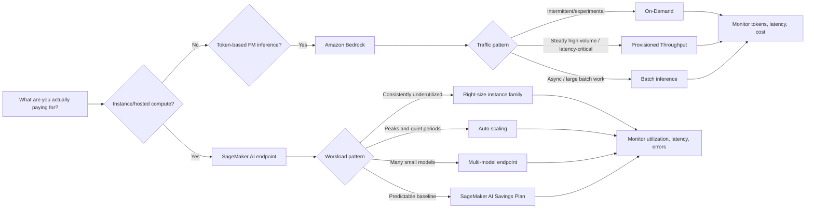
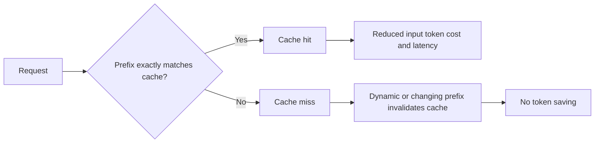

# Task 4.2: Operating, Monitoring, and Securing ML and AI Solutions - Optimize and manage ML and AI infrastructure costs and performance

## Skill 4.2.4: Optimize capacity for cost, performance, and reliability.

## 1. Core Concept

Optimizing capacity is not only about reducing cost. It is about matching the provisioned capacity to the workload so that:

- **Cost** is minimized for idle or unused capacity.
- **Performance** remains within the required latency and throughput targets.
- **Reliability** is maintained by preserving enough headroom, availability, and error budget.

The most important question in capacity optimization is:

> **What are you actually paying for?**

The answer changes everything:

| Workload type | Primary billing unit | Capacity lever |
| --- | --- | --- |
| Amazon SageMaker AI hosted inference endpoints | Instance hours / compute hours | Right-size instance family, auto scale instance count, multi-model endpoints, Savings Plans |
| Amazon Bedrock on-demand foundation model inference | Input and output tokens | Select a smaller model, shorten prompts, cap outputs, use prompt caching, move to batch/provisioned throughput |
| Vector databases / embeddings | Number of vectors, compute per embedding, storage | Optimize embedding dimensions, vector index configuration, storage tiers |

A lever that works for instance-based hosting may have little or no effect on token-based foundation model billing.

---

## 2. Capacity Optimization Decision Process

Use this general sequence before making changes:

1. **Measure first.**  
   Use Amazon CloudWatch, AWS X-Ray, and cost tools to observe utilization, latency, errors, token usage, and spend.

2. **Classify the workload pattern.**  
   Steady, diurnal/periodic, intermittent, long-running, or unpredictable.

3. **Identify the true billing unit.**  
   Compute hours, instance hours, tokens, model units, or storage.

4. **Choose the matching capacity lever.**  
   Right-sizing, auto scaling, shared hosting, provisioned throughput, batch inference, or commitment-based discounts.

5. **State the trade-off explicitly.**  
   Reducing capacity can remove headroom that previously absorbed spikes. Say what reliability or performance target is being accepted.

---

## 3. Optimizing SageMaker AI Endpoint Capacity

SageMaker AI real-time endpoints bill for the instance capacity they hold, even when traffic is low.

### 3.1 Right-Sizing Instance Families

Right-sizing means selecting the smallest or most efficient instance type that still meets performance requirements.

| Instance family | Typical use case |
| --- | --- |
| `ml.c5`, `ml.m5` | CPU-based models, tabular ML, XGBoost, LightGBM, feature preprocessing, lightweight inference |
| `ml.r5` | Memory-intensive ML workloads, large models that fit in CPU memory |
| `ml.g4dn`, `ml.g5` | GPU-accelerated deep learning inference, computer vision, medium-sized transformers |
| `ml.p3`, `ml.p4d`, `ml.p5` | Large GPU workloads, heavy training or very large model inference |
| `ml.inf1`, `ml.inf2` | Cost-effective high-throughput deep learning inference on AWS Inferentia / Inferentia2 |

Key right-sizing indicators:

- **CPUUtilization** or **GPUUtilization** consistently low.
- **MemoryUtilization** at safe levels.
- **ModelLatency** and error rates within the service level objective.
- The model genuinely needs a GPU. Do not replace a GPU instance with a CPU instance simply because GPU utilization looks low. Check whether CPU inference meets latency and throughput.

### 3.2 Auto Scaling Capacity to Demand

When traffic is not constant, instance count should follow demand.

Common Sierra? Use:

- **Target tracking scaling** based on:
  - `InvocationsPerInstance`
  - `CPUUtilization`
  - `GPUUtilization`
  - `MemoryUtilization`
- **Scheduled scaling** for known daily or weekly patterns.

Example:

> An endpoint is heavily used during business hours and almost idle overnight. The instances are correctly sized for the daytime peak.  
> **Correct action:** Configure automatic scaling to add instances during peak and release them overnight.  
> Do not move to smaller instances, because they are already right-sized for peak traffic. That would harm daytime performance.

### 3.3 Multi-Model Endpoints for Many Small Models

A multi-model endpoint (MME) hosts many models on one shared set of instances.

Use MME when:

- Many models are small or moderately sized.
- Models share the same serving container/framework.
- Models are called intermittently.
- You can tolerate model-loading latency when a model is not already resident.

Avoid MME when:

- A model has strict cold-start latency requirements.
- A model is used constantly and would occupy the shared endpoint.
- Models need completely different serving stacks.

### 3.4 Shared Capacity vs Dedicated Capacity

| Consideration | Dedicated endpoint | Multi-model endpoint |
| --- | --- | --- |
| Cost | Higher because every model has its own instances | Lower because many models share instances |
| Latency | Lower and predictable | Possible cold start when model is not loaded |
| Isolation | Stronger resource and failure isolation | More sensitivity to noisy neighbor behavior |
| Best for | Critical, high-traffic models | Many small, intermittent models |

---

## 4. Optimizing Foundation Model and Agent Capacity

Amazon Bedrock on-demand inference does not bill mainly for instance count. It bills primarily for input and output tokens.

### 4.1 Bedrock Capacity Modes

| Mode | Capacity behavior | Billing | Best use case |
| --- | --- | --- | --- |
| **On-Demand** | AWS-managed, elastic capacity | Per input/output token | Intermittent, variable, experimental, low-to-moderate traffic |
| **Provisioned Throughput** | Reserved model units for dedicated throughput | Fixed hourly rate for reserved model units | Steady, high-volume, latency-sensitive production workloads |
| **Batch inference** | Asynchronous execution; results delivered to S3 | Lower-cost token-based or batch rate | Large jobs that do not require immediate response |

### 4.2 Capacity and Cost Levers for Token-Based Workloads

| Lever | Cost effect | Performance/reliability effect |
| --- | --- | --- |
| Select a smaller foundation model | Lower cost per token | May be slightly lower quality; validate against task requirements |
| Shorten system prompts/instructions | Fewer input tokens | May reduce context depth |
| Reduce context/tools sent every request | Fewer input tokens | Less information available to model |
| Cap response length | Fewer output tokens | Shorter answers; must still meet user need |
| Use prompt caching for stable prefixes | Lower input token cost for reused prefix | Lower first-token latency; invalidated if prefix changes |
| Move asynchronous work to batch | Lower per-token/batch price | Higher latency; not suitable for interactive requests |

### 4.3 Prompt Caching Behavior

Prompt caching is useful only when the prompt prefix is **stable and repeated**.

Example:

> A team enables prompt caching, but the prompt prefix includes a request ID or timestamp that changes on every request.  
> **Expected result:** The cache is invalidated on each request, so the expected savings do not materialize.

Best practice: put **static content first**, such as system instructions, agent tool schemas, and stable context. Put dynamic user input later.

### 4.4 Agent Resource Consumption

One agent request can amplify cost and capacity use:

1. A planning model call.
2. Several tool calls.
3. A final synthesis model call.

This means cost per agent invocation is not equal to one model call. Monitoring should track **resource consumption per invocation**.

Use:

- **Amazon Bedrock AgentCore Observability** to see model calls, tool calls, memory operations, and traces inside an agent invocation.
- **AWS X-Ray** to trace a request across components and identify which component contributes to latency.
- **Amazon CloudWatch** dashboards to combine invocation count, token usage, latency, and error metrics.

---

## 5. Purchasing Options and Capacity Commitments

Capacity optimization also includes paying less for usage that is already predictable.

### 5.1 Savings Plans and Capacity Commitments

| Purchasing option | Applies to | Best for |
| --- | --- | --- |
| **SageMaker AI Savings Plans** | SageMaker AI instance usage, including real-time inference, batch transform, training, notebooks | Steady SageMaker AI baseline usage |
| **Compute Savings Plans** | Amazon EC2, AWS Lambda, AWS Fargate | Flexible compute workloads, but not SageMaker AI endpoints |
| **EC2 Instance Savings Plans** | Amazon EC2 instance usage in a specific instance family and Region | Stable EC2 instance workloads, not SageMaker AI endpoints |
| **Spot Instances** | Interruptible EC2 capacity | Training jobs that can checkpoint and resume; not suitable for serving baselines requiring reliability |
| **Bedrock Provisioned Throughput** | Reserved model throughput on Amazon Bedrock | Predictable high-volume foundation model inference |

Important exam distinction:

> SageMaker AI Savings Plans do **not** cover general Amazon EC2 workloads.  
> Compute Savings Plans and EC2 Instance Savings Plans do **not** cover SageMaker AI usage.

AWS Budgets is a monitoring and alerting tool. It does not reduce rates.

---

## 6. Monitoring for Capacity Decisions

A good optimization decision is based on evidence.

### 6.1 CloudWatch Metrics for SageMaker AI Endpoints

| Metric | Use in capacity optimization |
| --- | --- |
| `Invocations` | Total request volume |
| `InvocationsPerInstance` | Requests per instance; useful for target tracking scaling |
| `CPUUtilization` | CPU saturation |
| `GPUUtilization` | GPU saturation |
| `MemoryUtilization` | Memory pressure |
| `DiskUtilization` | Storage pressure |
| `ModelLatency` | Time spent in the model serving path |
| `ContainerLatency` | Time inside the container from request arrival to response |
| `OverheadLatency` | Time outside the model container |
| `Invocation4XXErrors` | Client errors, including throttling |
| `Invocation5XXErrors` | Server errors and availability problems |

A dashboard should show related metrics together:

- **Utilization + latency:** Is slowness caused by insufficient capacity?
- **Invocation count + token usage:** Is rising cost from more traffic or heavier requests?
- **Errors + invocations:** Are users being throttled or is the endpoint failing?

### 6.2 AWS X-Ray and AgentCore Observability

- **AWS X-Ray** traces a request across model endpoints, Lambda functions, databases, and external APIs.
- Use X-Ray to attribute latency to a specific component instead of adding capacity everywhere.
- **Amazon Bedrock AgentCore Observability** visualizes agent steps, tool calls, and memory operations per invocation.

### 6.3 AWS Compute Optimizer

AWS Compute Optimizer analyzes utilization history and recommends configurations for supported compute resources.

Use it as a right-sizing aid, but validate against ML-specific requirements such as GPU memory, batch size, model size, and latency constraints.

---

## 7. Cost Management Tools

| AWS Tool | Purpose in capacity optimization |
| --- | --- |
| **AWS Cost Explorer** | Analyze historical and forecasted spend; group by service, tag, usage type |
| **AWS Budgets** | Alert when spend or usage is forecasted to exceed a defined threshold |
| **AWS Trusted Advisor** | Surface idle or underutilized resources through best-practice cost checks |
| **Cost allocation tags** | Attribute spend to team, model, environment, or project |
| **AWS Compute Optimizer** | Recommend right-sized compute configurations |

Example:

> A team needs an alert when month-to-date spend is projected to cross the monthly budget.  
> **Correct tool:** AWS Budgets, because it supports forecasted cost alerts.  
> AWS Cost Explorer shows spend, but does not send alert notifications.

---

## 8. Scenario-Based Exam Questions

### Scenario 1

A company runs a real-time recommendation model on Amazon SageMaker AI. The endpoint uses an `ml.g4dn.2xlarge` instance. CloudWatch shows CPU and GPU utilization below 20% over two weeks, while latency is well within the requirement.

**What should the team do first to optimize capacity?**

- **A.** Enable target tracking auto scaling.
- **B.** Review the workload and consider moving to a smaller GPU instance.
- **C.** Purchase a SageMaker AI Savings Plan.
- **D.** Convert the endpoint to a multi-model endpoint.

**Correct answer:** **B**

**Explanation:**  
The endpoint is consistently underutilized, so the correct first step is right-sizing. Since the model may depend on GPU acceleration, the team should evaluate a smaller GPU instance, such as `ml.g4dn.xlarge`, not automatically move to CPU. Auto scaling addresses variable traffic, not consistent underutilization.

---

### Scenario 2

A SageMaker AI endpoint is busy during business hours and nearly idle overnight. Its instance size is already appropriate for daytime peak traffic.

**Which change best reduces overnight cost while preserving daytime performance?**

- **A.** Move the model to a smaller instance family.
- **B.** Configure automatic scaling to release instances when traffic drops.
- **C.** Convert the endpoint to asynchronous inference.
- **D.** Host the model on a multi-model endpoint.

**Correct answer:** **B**

**Explanation:**  
The problem is scaling, not sizing. Target-tracking auto scaling based on `InvocationsPerInstance`, CPU, or GPU utilization can scale down overnight and scale up before/during daytime peaks. Moving to smaller instances would harm peak performance. Asynchronous inference changes the request/response behavior unnecessarily.

---

### Scenario 3

A team runs 30 small ML models using the same framework. Each model has its own SageMaker AI real-time endpoint. Each model is used only a few times per hour. The infrastructure cost is too high.

**Which approach is most appropriate?**

- **A.** Move all models to larger GPU instances.
- **B.** Purchase EC2 Instance Savings Plans.
- **C.** Combine the models into a multi-model endpoint on shared instances.
- **D.** Store all models in Amazon S3 and use AWS Lambda for inference.

**Correct answer:** **C**

**Explanation:**  
The models share a framework and are used intermittently. A multi-model endpoint can host many models on one set of running instances, reducing idle compute. Some model-loading latency may occur, but this is usually acceptable for infrequent models.

---

### Scenario 4

A production assistant built on Amazon Bedrock has steady high traffic and latency-sensitive users. The team currently uses on-demand inference.

**What should the team evaluate for better capacity and cost management?**

- **A.** AWS Trusted Advisor
- **B.** SageMaker AI Savings Plans
- **C.** EC2 Instance Savings Plans
- **D.** Provisioned Throughput

**Correct answer:** **D**

**Explanation:**  
On-demand Bedrock usage is token-based. For steady, high-volume, latency-critical foundation model inference, Provisioned Throughput reserves dedicated model units at a fixed hourly rate. SageMaker and EC2 Savings Plans do not cover Bedrock.

---

## 9. Exam Tips and Traps

### Tips

- Always ask: **What is actually being billed?** Compute hours or tokens?
- Use **CloudWatch utilization metrics** as evidence before changing capacity.
- Distinguish between a **sizing problem** and a **scaling problem**.
  - Consistently low utilization → right-size.
  - Peak/off-peak variation → auto scale.
- For many small intermittent models, consider a **multi-model endpoint**.
- For a steady SageMaker AI baseline, use **SageMaker AI Savings Plans**.
- For a steady Bedrock inference baseline, consider **Provisioned Throughput**.
- Put static prompt content first when using **prompt caching**.
- Monitor agents per invocation. One agent request can produce multiple model and tool calls.
- Use **AWS X-Ray** to find the actual latency bottleneck before buying more capacity.
- Use **AWS Budgets** for forecasted threshold alerts.

### Traps

- Do not apply instance-right-sizing logic to token-based foundation model workloads.
- Do not use **EC2 Savings Plans** or **Compute Savings Plans** for SageMaker AI usage.
- Do not use **SageMaker AI Savings Plans** for EC2, Lambda, or Bedrock.
- Do not use **AWS Budgets** expecting a rate discount. It only monitors and alerts.
- Do not place dynamic data at the start of a cached prompt prefix; it invalidates the cache.
- Do not reduce capacity to average utilization without acknowledging that spikes may no longer be absorbed.
- Do not use multi-model endpoints for a single high-traffic latency-critical model.
- Do not treat Provisioned Throughput as equivalent to an EC2 Savings Plan. It reserves model throughput, not general compute hours.
- Do not use Spot capacity for a serving baseline that requires guaranteed availability.

---

## 10. Quick Reference Summary

| Optimization goal | Traditional ML on SageMaker AI | Generative AI on Amazon Bedrock |
| --- | --- | --- |
| Reduce minimum capacity cost | Right-size instance family | Choose a smaller foundation model |
| Match variable demand | Target-tracking auto scaling | On-demand inference |
| Consolidate small workloads | Multi-model endpoint | Shared agent/system prompt design |
| Reduce input cost | Not applicable in same way | Shorten prompts, optimize context |
| Reduce output cost | Not applicable in same way | Cap response length |
| Reuse repeated work | Cache preprocessed features if possible | Prompt caching |
| Commit predictable baseline | SageMaker AI Savings Plans | Provisioned Throughput |
| Observe unit costs | Instance utilization | Token usage and cost per invocation |