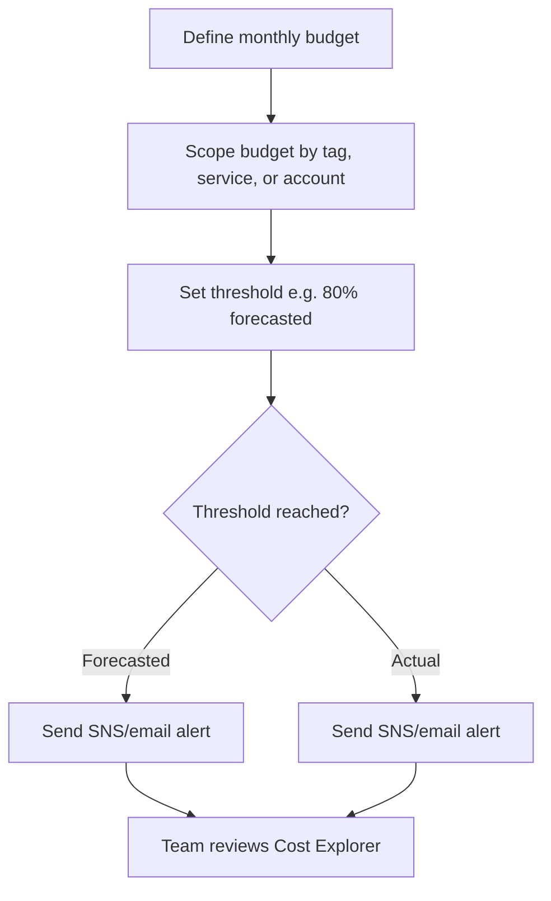
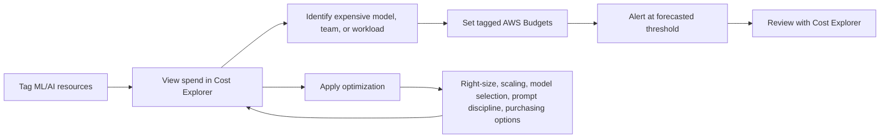

# Task 4.2: Operating, Monitoring, and Securing ML and AI Solutions - Optimize and manage ML and AI infrastructure costs and performance

## Skill 4.2.5: Optimize costs and set cost quotas by using appropriate cost management tools

---

## 1. Purpose of This Skill

This skill focuses on using AWS cost management services to:

- Analyze ML/AI spend across services such as Amazon SageMaker AI, Amazon Bedrock, Amazon EC2, and supporting storage.
- Attribute spend to teams, models, environments, or workloads.
- Set spending thresholds and alerts before costs grow beyond expectations.
- Choose optimization actions based on the correct billing driver.

A common mistake is to treat every ML cost as the same. The first step is to understand what you are actually paying for.

---

## 2. Understand the Billing Driver First

Cost management tools are only useful if you know what is being billed.

| Workload | Primary billing driver | Example cost optimization approach |
| --- | --- | --- |
| SageMaker real-time inference | Compute instance hours | Right-sizing, auto scaling, multi-model endpoints, Savings Plans |
| SageMaker training jobs | ML compute instance hours and storage | Spot training, checkpointing, right-sizing, Savings Plans |
| Amazon Bedrock on-demand inference | Input and output tokens | Smaller model selection, shorter prompts, prompt caching, output length control |
| Amazon Bedrock provisioned throughput | Provisioned model units per hour | Use for steady, predictable high-volume inference |
| Vector databases | Compute, storage, and data transfer | Right-sized cluster, storage class selection, vector index optimization |
| Agent-based workloads | Multiple model calls, tool calls, and retrieval per user request | Monitor per-invocation cost, optimize agent loops and tool usage |

Understanding this table is important because cost optimization for SageMaker is not the same as cost optimization for Amazon Bedrock.

---

## 3. AWS Cost Management Tools Overview

The following tools are the main services used to manage ML/AI costs and set quotas.

| AWS Tool | Primary Function | Role in Cost Optimization and Quotas |
| --- | --- | --- |
| **AWS Budgets** | Set custom cost or usage thresholds and send alerts | Primary tool for setting cost quotas and proactive budget alerts |
| **AWS Cost Explorer** | Visualize, filter, and analyze historical and forecasted spend | Identifies the actual cost driver before action is taken |
| **Cost Allocation Tags** | Attach business/technical metadata to resources | Enables spend attribution by team, model, environment, or project |
| **AWS Cost Anomaly Detection** | Uses machine learning to identify unusual spend patterns | Detects unexpected spikes or changes in spend |
| **AWS Trusted Advisor** | Runs AWS best-practice checks | Identifies idle or underused resources, including cost recommendations |
| **AWS Compute Optimizer** | Analyzes utilization and recommends optimized compute configurations | Supports right-sizing decisions to reduce hourly compute cost |
| **AWS Cost and Usage Report** | Provides detailed billing data | Useful for deep financial analysis and reconciliation |

---

## 4. Setting Cost Quotas with AWS Budgets

### 4.1 What AWS Budgets Does

AWS Budgets is the primary service for setting financial boundaries.

With AWS Budgets, you can:

- Define a monthly, quarterly, or yearly budget amount.
- Scope the budget to an account, service, tag, or resource group.
- Set threshold percentages such as `80%`, `90%`, or `100%`.
- Send alerts through email or Amazon SNS.
- Optionally trigger automated responses with budget actions.

Important: AWS Budgets does **not** reduce your bill. It notifies you when spend is approaching or passing the amount you defined.

### 4.2 Cost Budgets vs Usage Budgets

| Budget Type | What It Tracks | Example for ML/AI |
| --- | --- | --- |
| Cost budget | Tracks spend in dollars | `$5,000/month` for all tagged `model=ranking-v3` resources |
| Usage budget | Tracks usage units for eligible services | `10,000 GB` of storage or usage hours |
| Savings Plans/Reservation budget | Tracks discount coverage or utilization | Ensure SageMaker AI Savings Plans utilization stays high |

For most ML/AI cost quotas, use cost budgets scoped by cost allocation tags.

### 4.3 Actual vs Forecasted Alerts

This distinction is frequently tested.

| Alert Type | When It Fires | Use Case |
| --- | --- | --- |
| Actual spend alert | After spend has already crossed the threshold | Final warning for a hard business limit |
| Forecasted spend alert | When projected spend for the period is expected to cross the threshold | Early warning while there is still time to adjust |

Example from the exam style:

> A team needs to be alerted while spend is on track to pass an amount the team defined for the month.

This requires a **forecasted** AWS Budgets alert, not simply an actual spend alert.

### 4.4 AWS Budgets Workflow

### 4.5 Budget Actions

AWS Budgets can also run a configured response when a threshold is reached.

Example actions may include:

- Sending a message to an Amazon SNS topic.
- Triggering an IAM role-defined action to modify resources.
- Integrating with other AWS services for automated remediation.

For production ML inference, avoid aggressive automatic actions. For example, automatically stopping a production endpoint could cause user-facing failures. Use budget actions carefully on non-production or development workloads.

---

## 5. Using AWS Cost Explorer for Spend Analysis

### 5.1 What Cost Explorer Does

AWS Cost Explorer allows you to:

- View historical and forecasted spend.
- Group costs by service, tag, usage type, region, instance type, and more.
- Filter out unrelated spend.
- Compare periods, such as current month vs previous month.
- Check forecasted monthly spend.

Cost Explorer is an analysis tool. It does **not** send budget alerts by itself.

### 5.2 Common ML/AI Cost Questions

| Question | Cost Explorer Action |
| --- | --- |
| Why did our bill increase? | Compare current period with previous period |
| Which model is expensive? | Group by `tag:model` or `tag:workload` |
| Which team created this spend? | Group by `tag:team` |
| Is Bedrock cost driven by on-demand tokens or provisioned throughput? | Group by `usage-type` or usage type group |
| Are there untagged resources? | Group by tag and look for missing values |
| Are we likely to exceed our monthly quota? | Review the forecast view |

---

## 6. Cost Allocation Tags for ML/AI

Cost allocation tags are essential for cost optimization. Without tags, all you see is a service-level total, such as `$9,000` for Amazon Bedrock or `$7,000` for SageMaker AI.

### 6.1 Recommended Tags for ML/AI Systems

| Tag Key | Example Values | Purpose |
| --- | --- | --- |
| `environment` | `prod`, `staging`, `dev` | Separate production and experimentation costs |
| `team` | `ranking`, `search`, `ads` | Attribute spend to owning team |
| `model` | `ranker-v3`, `summary-v1` | Track model-level baseline costs |
| `workload` | `realtime-inference`, `batch-transform`, `agent` | Separate workload types |
| `cost-center` | `ML-104`, `AI-202` | Align with finance reporting |
| `experiment` | `exp-1001` | Isolate temporary experimental costs |

### 6.2 Steps to Use Tags for Cost Management

1. Define a consistent tagging standard.
2. Apply tags to SageMaker endpoints, training jobs, Bedrock resources, EC2 instances, and S3 buckets.
3. Activate the tags as cost allocation tags in the AWS Billing and Cost Management console.
4. Wait for tags to appear in Cost Explorer and cost reports.
5. Create AWS Budgets scoped to those tags.

---

## 7. Optimizing ML/AI Costs Based on Workload Type

### 7.1 Hosted SageMaker AI Inference

Cost drivers:

- Endpoint instance type
- Number of instances
- Hours the endpoint runs
- Number of endpoints

Typical optimization steps:

| Action | Purpose |
| --- | --- |
| Review CloudWatch utilization metrics | Determine if endpoint is oversized or idle |
| Right-size instance family | Reduce hourly cost when capacity is too large |
| Configure auto scaling | Release instances during low-traffic periods |
| Use multi-model endpoints | Consolidate many intermittent small models |
| Purchase SageMaker AI Savings Plans | Reduce cost for steady, predictable SageMaker usage |

Key exam detail: **SageMaker AI Savings Plans** apply to SageMaker usage. **Compute Savings Plans** and **EC2 Instance Savings Plans** do not cover SageMaker AI ML instance types.

### 7.2 Amazon Bedrock Foundation Model Inference

Cost drivers:

- Input token count
- Output token count
- Model choice
- Prompt length and context
- Caching behavior
- On-demand vs provisioned throughput

Typical optimization steps:

| Action | Purpose |
| --- | --- |
| Select the smallest model that meets quality needs | Lower cost per token |
| Reduce system prompt and repeated context | Lower input token count |
| Cap response length | Lower output token count |
| Use prompt caching for repeated prefixes | Reduce repeated input processing cost |
| Move predictable high-volume traffic to provisioned throughput | Lower rate for steady baseline usage |
| Monitor token usage with CloudWatch dashboards | See token cost per invocation or workload |

### 7.3 Agent Inference Costs

An agent invocation can quietly become expensive because one user request may produce:

- A planning model call
- Multiple tool calls
- Retrieval operations
- A final synthesis model call

Cost management actions for agents:

- Monitor cost per invocation with Claude/Amazon Bedrock metrics.
- Use Amazon Bedrock AgentCore observability to separate model calls from tool calls.
- Tag agent workloads and set budgets per agent application.
- Review retry loops and tool call efficiency.

---

## 8. Scenario-Based Examples

### Scenario 1: Budget Alert Before Monthly Overage

A team runs a production SageMaker inference endpoint. The monthly cost budget is `$6,000`. The team wants to receive an alert when spend is projected to exceed `$6,000` before the end of the month.

**Which tool should the team use?**

- **A.** AWS Cost Explorer
- **B.** AWS Budgets with a forecasted cost alert
- **C.** AWS Trusted Advisor
- **D.** AWS Compute Optimizer

**Correct answer:** B

**Explanation:**

AWS Budgets supports forecasted alerts. The alert fires when the projected end-of-month spend crosses the defined threshold. Cost Explorer can analyze and forecast spend but does not notify the team. Trusted Advisor checks best practices. Compute Optimizer recommends compute sizing.

---

### Scenario 2: Bedrock Spend Is Rising by Model and Team

An AI platform team uses multiple Amazon Bedrock models. Finance wants to know which model and which team is driving spend. The team also wants separate monthly cost quotas for each team.

**Which combination is most appropriate?**

- **A.** Use AWS Cost Explorer alone
- **B.** Use cost allocation tags, then create tagged AWS Budgets and Cost Explorer views
- **C.** Use Amazon CloudWatch alarms only
- **D.** Use AWS Trusted Advisor alerts

**Correct answer:** B

**Explanation:**

Cost allocation tags are needed to attribute Bedrock spend to teams and models. After tags are activated, AWS Cost Explorer can group and filter by tag. AWS Budgets can be scoped to those tags to create separate monthly quotas.

---

### Scenario 3: Unexpected Spend Spike

A company notices an unexpected increase in its ML account. The team cannot identify the cause by looking only at the overall monthly total.

**Which tool helps identify the spend driver?**

- **A.** AWS Budgets
- **B.** AWS Cost Explorer with grouping by service and tag
- **C.** AWS Trusted Advisor
- **D.** AWS X-Ray

**Correct answer:** B

**Explanation:**

AWS Cost Explorer can group the bill by service, usage type, region, instance type, or cost allocation tag. This helps find the specific model, workload, or team causing the increase. AWS X-Ray is for tracing request latency and component performance, not financial analysis.

---

## 9. Exam Tips and Traps

| Trap | Correct Understanding |
| --- | --- |
| Choosing Cost Explorer for budget alerts | Cost Explorer is for analysis and forecasting. **AWS Budgets** sends the alerts. |
| Assuming AWS Budgets reduces the bill | AWS Budgets monitors and alerts. It does not provide discounts. |
| Choosing Compute Savings Plans for SageMaker endpoints | SageMaker AI Savings Plans cover SageMaker. Compute Savings Plans cover EC2, Lambda, and Fargate. |
| Applying instance right-sizing logic to Amazon Bedrock | Bedrock on-demand billing is token-based. Right-size the model and prompt, not a virtual instance. |
| Confusing AWS Budgets with Service Quotas | Service Quotas manage resource limits, not cost ceilings. |
| Ignoring cost allocation tags | Without tags, you cannot attribute spend to models, teams, or environments. |
| Selecting actual alerts for proactive warnings | If the question says “on track to exceed” or “before it happens,” pick forecasted alerts. |
| Assuming budgets stop spend automatically | Budget actions are separate. By default, AWS Budgets primarily sends alerts. |
| Treating prompt caching as free | Cached tokens still cost money, and dynamic prompt prefixes can invalidate the cache. |
| Using Trusted Advisor for custom cost quotas | Trusted Advisor checks best practices but does not monitor your defined monthly limit. |
| Using X-Ray for cost analysis | X-Ray is for distributed tracing and latency analysis, not financial spend. |

---

## 10. Visual Summary: Cost Management Workflow for ML/AI

---

## 11. Quick Recall

Use this framework when answering exam questions:

1. If asked to be notified before spend exceeds a defined amount, choose **AWS Budgets** with a **forecasted alert**.
2. If asked to find why the bill increased, choose **AWS Cost Explorer**.
3. If asked to attribute spend to teams or models, choose **cost allocation tags**.
4. If asked to lower the hourly rate for steady SageMaker usage, choose **SageMaker AI Savings Plans**.
5. If asked to reduce Amazon Bedrock spend, think about **tokens**, **model selection**, **prompt length**, **output limits**, and **provisioned throughput**.
6. If asked to detect an unusual spend pattern, consider **AWS Cost Anomaly Detection**.
7. If asked to check best practices for idle or underused resources, consider **AWS Trusted Advisor** or **AWS Compute Optimizer**.

The central question remains: **What am I actually paying for?**