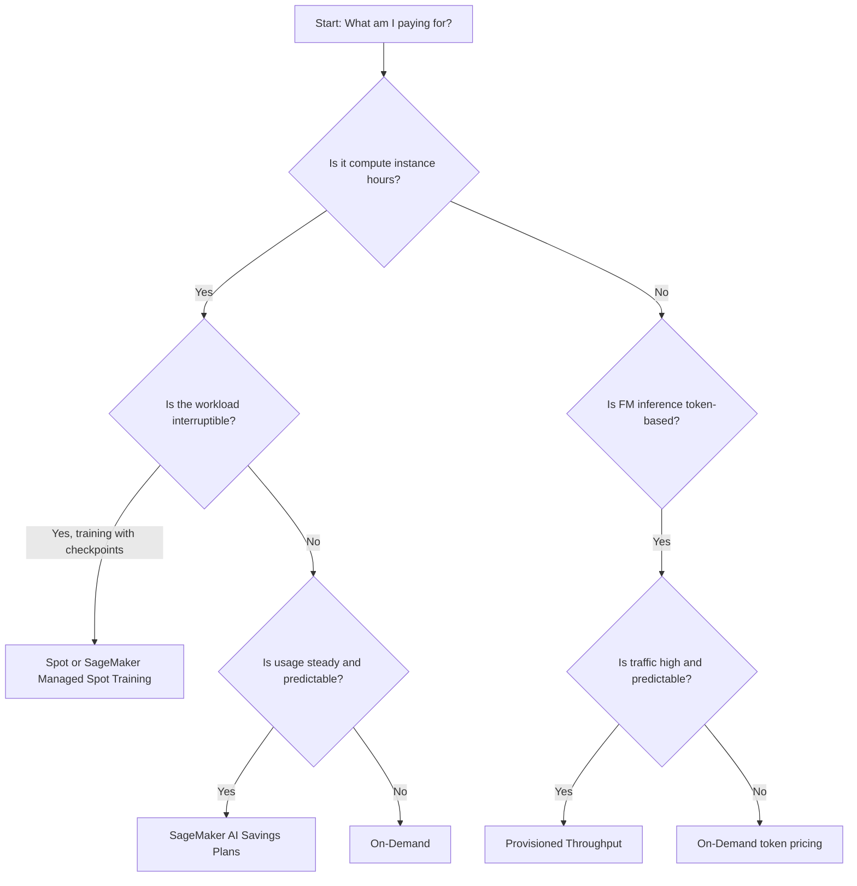

# Task 4.2: Operating, Monitoring, and Securing ML and AI Solutions - Optimize and manage ML and AI infrastructure costs and performance

## Skill 4.2.6: Optimize infrastructure costs by selecting purchasing options

### Overview

Selecting the correct purchasing option means matching how you pay to how you actually consume infrastructure. The goal is to pay a lower rate for usage that is already predictable, while keeping variable or experimental workloads flexible and on-demand.

The most important question in ML cost optimization is:

> **What are you actually paying for?**

- Traditional Amazon SageMaker AI workloads are billed for **compute instance hours**.
- Foundation model inference on Amazon Bedrock is billed for **tokens in and tokens out**, or for **reserved model units** when using Provisioned Throughput.

A purchasing option that lowers a SageMaker bill will not lower a Bedrock token bill, and vice versa.

---

### Purchasing options at a glance

| Purchasing option | What it covers | Applies to SageMaker `ml.*` instances? | Typical ML use case |
| --- | --- | --- | --- |
| **On-Demand** | Pay for actual usage with no commitment | Yes, but at full price | Variable, experimental, new workloads |
| **SageMaker AI Savings Plans** | SageMaker AI instance usage | Yes | Steady SageMaker training, processing, or inference baseline |
| **Compute Savings Plans** | Amazon EC2, AWS Lambda, AWS Fargate | No | Self-managed ML workloads on EC2, Lambda, or Fargate |
| **EC2 Instance Savings Plans** | Amazon EC2 instances in a specific family and Region | No | Self-managed EC2 inference or training with stable instance type |
| **EC2 Spot / SageMaker Managed Spot Training** | Unused AWS capacity at a large discount | Yes for SageMaker managed spot training | Interruptible, checkpointable training jobs |
| **Provisioned Throughput for Amazon Bedrock** | Dedicated foundation model capacity at a fixed hourly rate | No; it covers FM inference model units | High, predictable FM inference volume |

---

### Detailed option selection

#### 1. On-Demand

**Use when:** Traffic is variable, experimental, or unpredictable.

- No upfront commitment.
- Pay for only the instance hours or tokens you consume.
- Most flexible, but highest regular rate.

A new proof of concept, a model being A/B tested, or an occasional batch job should generally remain on On-Demand until usage stabilizes.

#### 2. SageMaker AI Savings Plans

**Best for:** Steady, year-round Amazon SageMaker AI usage.

- Provide a discount in exchange for committing to a consistent dollar-per-hour spend over a 1-year or 3-year term.
- Cover SageMaker ML instance usage such as:
  - Real-time inference endpoints
  - Batch Transform jobs
  - Training jobs
  - Processing jobs
  - SageMaker Studio notebooks that use ML instances
- Apply automatically to eligible SageMaker usage.
- Do **not** cover SageMaker Serverless Inference because serverless inference is billed per invocation and duration, not per instance hour.

Use SageMaker AI Savings Plans when you know a SageMaker endpoint or training workload runs continuously and predictably.

#### 3. Compute Savings Plans

**Best for:** Self-managed ML infrastructure running on Amazon EC2, AWS Lambda, or AWS Fargate.

- Provide flexibility to switch instance families, sizes, Regions, operating systems, tenancies, and even between EC2, Lambda, and Fargate.
- Do **not** apply to SageMaker `ml.*` instance types.
- If you host a model on EC2 instances that you manage yourself, Compute Savings Plans can reduce that bill.

A common trap is choosing Compute Savings Plans for a SageMaker endpoint. SageMaker endpoints use `ml.*` instances, which Compute Savings Plans do not cover.

#### 4. EC2 Instance Savings Plans

**Best for:** Self-managed EC2 workloads with very stable instance family and Region usage.

- Offer a higher discount than Compute Savings Plans but are less flexible.
- Apply only to Amazon EC2 usage for a specified instance family in a specified Region.
- Do **not** apply to SageMaker ML instances.

Use EC2 Instance Savings Plans only when you are certain your self-managed EC2 instance family and Region will not change for the term.

#### 5. Spot Instances / SageMaker Managed Spot Training

**Best for:** Interruptible, fault-tolerant training workloads.

- Uses spare AWS capacity at a significantly reduced rate.
- Capacity can be reclaimed with a short notice.
- Suitable for training jobs that can restart from a checkpoint.
- Not suitable for real-time inference endpoints that require guaranteed availability.

SageMaker Managed Spot Training lets you apply spot capacity to SageMaker training jobs. If the spot capacity is interrupted, SageMaker can automatically restart or resume the training job from checkpoints.

#### 6. Provisioned Throughput for Amazon Bedrock

**Best for:** Predictable, high-volume foundation model inference.

- Reserves dedicated model units at a fixed hourly rate instead of paying per token on demand.
- Does not charge per token in the same way as on-demand FM inference.
- Use when you have large, stable inference workloads on supported foundation models.
- Variable or experimental traffic should remain on Bedrock on-demand token pricing.

Provisioned Throughput is the GenAI equivalent of committing to a baseline: the commitment unit changes from instance hours to model throughput.

---

### Decision framework

---

### Cost-optimization translation: hosted endpoints vs. foundation models

| Traditional SageMaker hosted workloads | Equivalent Bedrock FM workload |
| --- | --- |
| Billing unit: instance hours | Billing unit: tokens or model units |
| On-Demand for variable traffic | On-Demand token pricing for variable traffic |
| SageMaker AI Savings Plans for steady baseline | Provisioned Throughput for predictable high volume |
| Spot training for interruptible jobs | Batch inference for delay-tolerant work |
| Auto scaling to follow demand | Prompt discipline and caching to reduce tokens |

A commitment is not a general discount. It is tied to a specific usage type. SageMaker AI Savings Plans cover SageMaker, not EC2 or Lambda. Provisioned Throughput covers Bedrock capacity, not SageMaker instance hours.

---

### Scenario-based examples

#### Scenario 1: Steady real-time fraud detection on SageMaker

A financial services team runs a real-time fraud detection model on a SageMaker endpoint. The endpoint receives consistent traffic 24/7 throughout the year. The team wants to reduce the rate it pays.

**Which purchasing option applies?**

- **A.** Compute Savings Plans
- **B.** SageMaker AI Savings Plans
- **C.** EC2 Instance Savings Plans
- **D.** Spot Instances

**Correct answer:** **B. SageMaker AI Savings Plans**

**Explanation:** The workload uses SageMaker ML instances. SageMaker AI Savings Plans are designed specifically for steady SageMaker instance usage. Compute Savings Plans and EC2 Instance Savings Plans do not cover SageMaker `ml.*` instances. Spot Instances are inappropriate for a real-time endpoint that must stay available.

---

#### Scenario 2: Long-running distributed training with checkpoints

A research team runs a large distributed training job for several days each month. The job can restart from a checkpoint if interrupted. The team is willing to tolerate interruptions to reduce cost.

**Which purchasing option is the best fit?**

- **A.** On-Demand
- **B.** SageMaker AI Savings Plans
- **C.** SageMaker Managed Spot Training
- **D.** Provisioned Throughput

**Correct answer:** **C. SageMaker Managed Spot Training**

**Explanation:** Spot capacity is ideal for interruptible, fault-tolerant training jobs that can resume from checkpoints. A long-running training job that does not require continuous availability can take advantage of spare capacity at a reduced rate. On-Demand would be safe but more expensive. SageMaker Savings Plans require a longer-term steady commitment. Provisioned Throughput applies to Bedrock foundation models, not SageMaker training.

---

#### Scenario 3: High-volume generative AI production traffic

A company has a production assistant on Amazon Bedrock. Traffic is consistently high and projected to remain so for the next year. The team wants to reduce per-token costs and reserve capacity.

**Which option should the team evaluate?**

- **A.** SageMaker AI Savings Plans
- **B.** Compute Savings Plans
- **C.** Provisioned Throughput
- **D.** Spot Instances

**Correct answer:** **C. Provisioned Throughput**

**Explanation:** For a predictable, high-volume Bedrock workload, Provisioned Throughput reserves model units at a fixed hourly rate. This is the purchasing commitment appropriate for foundation model inference. SageMaker and Compute Savings Plans do not apply to Bedrock token usage. Spot Instances are not relevant to managed foundation model inference.

---

### Exam tips and traps

- **Precision about coverage is critical.**  
  Know which commitment covers which service:
  - SageMaker AI Savings Plans → SageMaker AI ML instances
  - Compute Savings Plans → EC2, Lambda, Fargate
  - EC2 Instance Savings Plans → EC2 only

- **Spot capacity is not for serving baselines.**  
  Spot capacity can be reclaimed. Do not use it for real-time inference endpoints that require guaranteed availability.

- **Savings Plans are billing discounts, not capacity reservations.**  
  They reduce rates but do not by themselves guarantee capacity.

- **SageMaker Serverless Inference is not covered by SageMaker Savings Plans.**  
  Serverless inference is billed per invocation and duration. Do not recommend Savings Plans for serverless endpoints.

- **AWS Budgets and AWS Cost Explorer are not purchasing options.**  
  They help observe, allocate, and alert on spend. They do not reduce rates.

- **Cost allocation tags are a prerequisite for optimization.**  
  Without tags, you cannot attribute spending to a specific team, model, environment, or project.

- **On-Demand is correct for variable or experimental workloads.**  
  Do not force a long-term commitment on usage that has not yet proven stable.

- **For a steady SageMaker baseline, do not choose Compute Savings Plans.**  
  This is the most common exam trap. SageMaker endpoints use `ml.*` instances, which Compute Savings Plans do not cover.

---

### Quick recall

- Ask **what are you actually paying for?**  
  - SageMaker compute → instance hours  
  - Bedrock FM inference → tokens or reserved model units

- Commit only when usage is steady and predictable.

- Coverage mapping:
  - SageMaker AI Savings Plans → SageMaker `ml.*` usage
  - Compute Savings Plans → EC2, Lambda, Fargate
  - EC2 Instance Savings Plans → EC2 families in a Region
  - Spot / SageMaker Managed Spot → interruptible training
  - Provisioned Throughput → predictable Bedrock FM capacity

- Spot is for training, not real-time serving.

- Budgets, tags, and Cost Explorer support cost optimization but do not reduce billed rates.