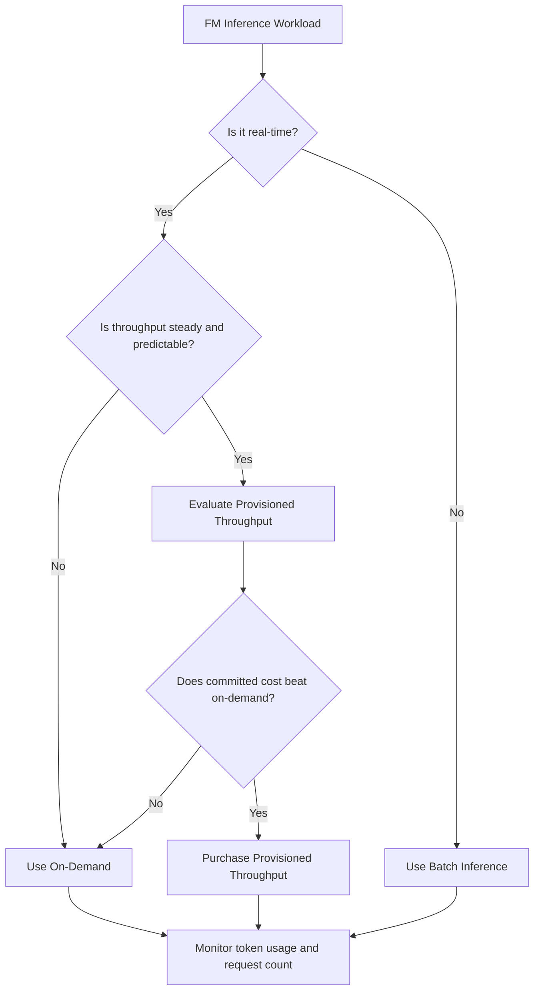

# Task 4.2: Operating, Monitoring, and Securing ML and AI Solutions - Optimize and manage ML and AI infrastructure costs and performance

## Skill 4.2.7: Evaluate cost implications of using FMs for inference in production

---

## 1. Core Concept

For foundation model (FM) inference in production, the central question is:

> **What are you actually paying for?**

With traditional ML endpoints such as Amazon SageMaker real-time inference, you pay primarily for **compute hours**. With Amazon Bedrock on-demand FM inference, you pay primarily for **tokens** entering and leaving the model.

Applying endpoint-style optimization instincts—such as changing instance size or auto scaling instance count—does not directly reduce a token-based Amazon Bedrock bill.

The important evaluation is not just how much compute the model appears to use, but:

- How many input tokens are sent.
- How many output tokens are generated.
- Which model is invoked.
- Which pricing mode is selected.
- How often and how predictably inference is called.

---

## 2. Amazon Bedrock Inference Pricing Modes

Amazon Bedrock offers different capacity and pricing modes for FM inference. Choosing the wrong mode for the workload is a common cost and performance mistake.

| Pricing Mode | Primary Cost Driver | Best Fit | Cost Behavior |
| --- | --- | --- | --- |
| **On-Demand** | Input tokens and output tokens, at model-specific rates | Variable, intermittent, experimental, or unpredictable traffic | Pay only for usage; no idle compute cost; easiest to start with |
| **Provisioned Throughput** | Fixed hourly rate for reserved model units, usually with a term commitment | Steady, predictable, latency-sensitive, high-throughput workloads | Predictable cost; can be more cost-efficient at scale; you pay whether or not the reserved capacity is fully used |
| **Batch Inference** | Token-based, but at a discounted batch rate | Large asynchronous jobs, offline processing, jobs that tolerate delay | Lower cost than on-demand for bulk work; not suitable for real-time requests |

The same fundamental trade-off appears in many AWS pricing decisions:

- **On-demand** = flexibility, no commitment.
- **Provisioned or reserved** = commitment for lower unit cost or guaranteed capacity.
- **Batch** = lower cost in exchange for delayed processing.

---

## 3. Cost Drivers for FM Inference in Production

When evaluating FM inference costs, separate the drivers from traditional infrastructure cost thinking.

### 3.1 Direct Token Drivers

| Driver | Why It Matters |
| --- | --- |
| **Model selection** | Larger foundation models generally cost more per token. A model larger than the task requires increases every request's cost. |
| **Input prompt length** | Every input token is billed. Long system prompts, large retrieved context, or repeated boilerplate increase cost on every call. |
| **Conversation history** | Multi-turn conversations can grow quickly because previous turns are resent. |
| **Retrieval-augmented generation (RAG) context** | Retrieved chunks are billed as input tokens. Retrieving too many chunks or overly long chunks increases recurring input cost. |
| **Output length** | Output tokens are often priced higher than input tokens. Long answers, verbosity, or missing `max_tokens` controls can inflate cost. |
| **Request volume** | Even small per-request cost becomes material at scale. |
| **Tool calls in agents** | A single agent invocation can become multiple model calls and tool calls, multiplying token usage. |
| **Retry loops** | Agent retries or error recovery loops may create additional model calls without any change in user traffic. |
| **Prompt caching efficiency** | Cached prefixes can reduce input token cost, but unstable prefixes prevent savings. |

### 3.2 Adjacent AI-Specific Costs

While evaluating an FM production system, also consider related costs that often appear on the same bill:

- **Embedding computation costs** for ingestion and query-time embedding.
- **Vector database storage costs**, including replica and index size.
- **Agent observability and logging costs** from high-cardinality traces and invocation logs.
- **Data transfer and retrieval costs** from knowledge bases or external tools.

These are not endpoint compute costs, and should be monitored separately.

---

## 4. Evaluation Framework

Use a structured approach to evaluate FM inference costs before and after deployment.

### Step 1: Profile the Workload

Answer these questions:

| Question | Cost Evaluation Impact |
| --- | --- |
| Is traffic steady, spiky, or unpredictable? | Helps choose on-demand vs. provisioned throughput vs. batch |
| Is latency real-time or can it be asynchronous? | Determines if batch inference is viable |
| What is the typical input token count? | Determines input cost weight |
| What is the expected output token count? | Determines output cost weight and capping strategy |
| How many model calls does one business transaction create? | Reveals agent or multi-step amplification |
| Is the prompt prefix mostly static or dynamic? | Determines prompt caching value |
| Can a smaller model meet quality requirements? | Determines model selection opportunity |

### Step 2: Estimate Cost Per Request

A simplified evaluation formula for on-demand inference is:

\[
\text{Cost per request} = (\text{input tokens} \times \text{input price}) + (\text{output tokens} \times \text{output price})
\]

For prompt caching, add cached token effects:

\[
\text{Cost per request} = (\text{uncached input tokens} \times \text{input price}) + (\text{cache write tokens} \times \text{cache write price}) + (\text{cache read tokens} \times \text{cache read price}) + (\text{output tokens} \times \text{output price})
\]

Then:

\[
\text{Monthly cost} = \text{requests per month} \times \text{cost per request}
\]

For provisioned throughput, evaluate the fixed hourly or monthly cost against the expected throughput and token volume.

### Step 3: Compare Options

Compare:

- On-demand cost at expected token volume.
- Provisioned throughput cost at committed capacity.
- Batch cost if asynchronous.

Select the option that meets latency and reliability requirements at the lowest production cost.

---

## 5. Cost Optimization Levers for FM Inference

The optimization levers for FM inference map conceptually to traditional ML levers, but the unit of control changes.

| Traditional ML Lever | FM Inference Equivalent | What Changes |
| --- | --- | --- |
| Right-size instance | Select a smaller, task-appropriate model | Cost per token decreases |
| Auto scale instance count | Prompt discipline, context trimming, output caps | Token count per request decreases |
| Add capacity for latency | Use provisioned throughput only if stable | Capacity unit becomes model units |
| Use Savings Plans | Use Provisioned Throughput for steady FM workloads | Commitment unit changes from compute hours to model capacity |
| Multi-model endpoint for many small models | Share a single well-chosen FM across multiple tasks where acceptable | Consolidates model sprawl |
| Monitor CPU utilization | Monitor token usage, invocation count, cache hit rate | Observability metric changes |

### Key FM Cost Reduction Actions

1. **Use the smallest model that satisfies quality requirements.**
   - A smaller FM can significantly reduce per-token cost.
   - Do not default to the largest available model.

2. **Shorten and stabilize prompts.**
   - Remove unnecessary instructions.
   - Place static content before dynamic content.
   - Keep conversation history as short as possible.

3. **Retrieve fewer, more relevant chunks.**
   - In RAG systems, retrieval size directly adds input token cost.
   - Better retrieval and reranking can reduce context length.

4. **Cap output length.**
   - Limit `max_tokens` or equivalent configuration.
   - Design prompts to answer concisely when appropriate.

5. **Use prompt caching where prefixes are stable.**
   - Place stable system prompts, tool schemas, and shared context first.
   - Keep any request-specific dynamic content at the end.

6. **Move time-insensitive work to batch inference.**
   - Batch is appropriate for offline summarization, labeling, and bulk analysis.

7. **Use provisioned throughput for stable high-volume traffic.**
   - This can reduce cost for predictable workloads compared with on-demand.

8. **Monitor and alert on token usage.**
   - Token usage is the FM equivalent of infrastructure utilization.

---

## 6. Monitoring FM Inference Costs

Cost evaluation is continuous. Use AWS observability and cost management tools to track production behavior.

### 6.1 Amazon CloudWatch Metrics

Amazon Bedrock emits metrics such as:

| Metric Purpose | Example Metric |
| --- | --- |
| Request volume | `Invocations` |
| Input token volume | `InputTokenCount` |
| Output token volume | `OutputTokenCount` |
| Latency | `ModelLatency` |
| Errors | `Invocation5xxErrors`, `Invocation4xxErrors` |

Build dashboards that show:

- Invocations over time.
- Input and output tokens over time.
- Token count per request.
- Cost per request or cost per user transaction.
- Cache hit effectiveness.
- Latency and error rates.

### 6.2 AWS Cost Explorer

Use AWS Cost Explorer to:

- Group costs by service, account, region, or tag.
- Filter by usage type to see token-based costs.
- Identify which model, team, or environment is driving spend.
- View forecasted cost trends.

### 6.3 AWS Budgets

Use AWS Budgets to:

- Set monthly, quarterly, or yearly cost thresholds.
- Alert on actual or forecasted spend.
- Notify the team before spend crosses the required threshold.

Important: AWS Budgets does not reduce cost. It provides visibility and alerting.

---

## 7. Scenario-Based Examples

### Scenario 1: Variable Customer Support Assistant

A company deploys a customer support assistant using a large frontier foundation model on Amazon Bedrock. The traffic is variable and the system prompt is long because it includes extensive policy details. Costs are rising.

The team should consider:

- **Use a smaller model** if it meets quality requirements.
- **Shorten the system prompt** and remove redundant policy text.
- **Use a stable prompt prefix** and place dynamic customer input at the end.
- **Remain on-demand** if traffic remains unpredictable.

**Why:**  
The cost is token-based. Reducing model size, input tokens, and output length directly reduces per-request cost. On-demand avoids paying for unused capacity.

---

### Scenario 2: Nightly Document Summarization

A team needs to summarize millions of documents overnight. The job is asynchronous and can tolerate delay.

**Recommended approach:** Use Amazon Bedrock Batch Inference.

**Why:**  
Batch inference is designed for large, asynchronous workloads at a lower token cost than on-demand. Real-time provisioned throughput would be unnecessary and likely more expensive because the workload does not need low latency during the day.

---

### Scenario 3: Steady High-Volume Production Assistant

A production assistant serves a predictable, high-volume stream of requests throughout the year. The team has enough history to estimate required throughput.

**Recommended approach:** Evaluate Provisioned Throughput.

**Why:**  
Provisioned Throughput reserves model units at a fixed hourly rate and can reduce cost compared with on-demand for steady, high-volume workloads. This is the FM inference equivalent of committing to steady baseline usage.

---

### Scenario 4: Prompt Cache Invalidated by a Dynamic Prefix

A team enables prompt caching for an assistant. However, the prompt prefix includes a timestamp that changes on every request.

**Likely result:** The cache is invalidated on every request, so cost savings do not materialize.

**Explanation:**  
Prompt caching relies on a stable token sequence at the beginning of the prompt. Dynamic content inside the prefix changes the sequence and prevents cache hits. Static content must come first, and dynamic content must be placed at the end.

---

### Scenario 5: Agent Cost Amplification

A user request to an agent creates:

1. A planning model call.
2. One or more tool calls.
3. Another model call to synthesize the final answer.

As a result, one user request can consume thousands of tokens across multiple model invocations.

**Evaluation insight:**  
Measure cost per user transaction or per agent invocation, not only per model invocation. Agent retries and repeated tool calls can increase token usage without any change in traffic.

---

## 8. Exam Tips and Traps

### What You Are Actually Paying For

- Amazon SageMaker real-time endpoints charge primarily for **instance hours**.
- Amazon Bedrock on-demand inference charges primarily for **input and output tokens**.
- Do not apply SageMaker instance optimization to Bedrock on-demand token pricing.

### Pricing Mode Selection

- **On-demand** for variable, experimental, or low-volume traffic.
- **Provisioned Throughput** for stable, predictable, high-throughput traffic.
- **Batch Inference** for asynchronous, large, latency-tolerant jobs.

### Prompt Caching Is Not Free

Cached tokens may be billed at a lower rate, but cache writes can have their own cost. A dynamic prefix, timestamp, request ID, or frequently changing content can invalidate the cache.

### Model Size Is a Cost Control

- The largest model is not always the best cost decision.
- A smaller model that meets quality requirements reduces cost on every token.

### Output Tokens Are Important

Output tokens are often more expensive than input tokens. Controlling answer length and style is a direct cost lever.

### Agents Amplify Costs

A single agent request may generate multiple model and tool calls. Monitor:

- Cost per agent invocation.
- Tool call count.
- Retry loops.
- Token usage per invocation.

### Savings Plans vs. Provisioned Throughput

- **SageMaker AI Savings Plans** apply to SageMaker AI usage.
- **Provisioned Throughput** is the commitment-based option for Amazon Bedrock model capacity.
- Do not treat these as interchangeable.

### Monitoring vs. Cost Reduction

- **CloudWatch** monitors token metrics.
- **Cost Explorer** analyzes spend.
- **AWS Budgets** alerts on spend.
- None of these tools automatically reduce costs by themselves.

### Batch Is Not Real-Time

Batch inference is not suitable for interactive user-facing requests that require immediate responses.

---

## 9. Quick Recall Summary

To evaluate FM inference costs in production:

1. Identify the billing unit: **tokens**, not compute hours.
2. Profile the workload: request volume, latency, token counts, and traffic pattern.
3. Choose the right pricing mode: on-demand, provisioned throughput, or batch.
4. Optimize token usage: model selection, prompt length, output caps, caching, and retrieval context.
5. Monitor token metrics and set budgets.
6. Re-evaluate regularly as model, traffic, prompt, and feature changes occur.