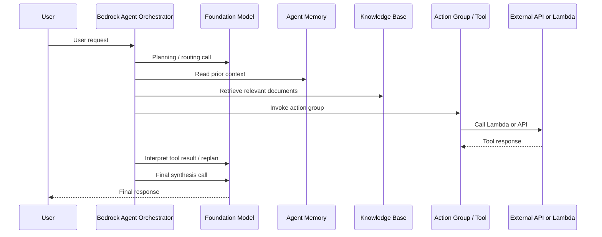
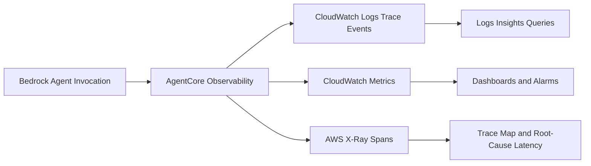

# Task 4.2: Operating, Monitoring, and Securing ML and AI Solutions - Optimize and manage ML and AI infrastructure costs and performance.

## Skill 4.2.8: Monitor agent resource consumption patterns.

---

## 1. Core Concept

Monitoring agent resource consumption means understanding how a **single agent invocation** consumes underlying resources: foundation model tokens, tool calls, knowledge base retrieval operations, memory operations, and orchestration steps.

A generative AI agent built on **Amazon Bedrock Agents** is not a single model request. One user request can produce:

- A planning or routing model call
- One or more tool or action group invocations
- A knowledge base retrieval call
- Memory read/write operations
- One or more follow-up model calls
- A final synthesis model call

This amplification is why monitoring must happen **per invocation**, not only at the account or service level.



Each arrow above can consume billable resources or add latency.

---

## 2. Why This Skill Matters for Cost and Performance

For a traditional hosted ML endpoint, the bill is dominated by **instance hours**. For an agent, the bill is driven by:

- **Input and output tokens** across several model calls
- **Tool invocations**, backed by Lambda, APIs, or other services
- **Knowledge base and vector database operations**
- **Memory read/write calls**
- **Retry loops and replanning calls**

A single user request might generate three, five, or more hidden model calls. If the agent enters a retry or replanning loop, cost can increase without any change in external traffic.

**Common cost amplification example**

| User traffic | Model calls per user request | Effective model inference volume |
|---|---|---|
| 10,000 requests/day | 3 calls | 30,000 model calls/day |
| 10,000 requests/day | 6 calls due to replanning or retries | 60,000 model calls/day |

Monitoring per-invocation call counts and token usage makes this amplification visible.

---

## 3. AWS Services for Agent Observability

| AWS Service / Feature | Role in Monitoring Agent Resource Consumption |
|---|---|
| **Amazon Bedrock AgentCore Observability** | Captures per-invocation details for inference calls, tool invocations, memory operations, and orchestration steps within a Bedrock agent. This is the primary source of truth for agent-level resource usage. |
| **Amazon CloudWatch Metrics** | Stores aggregate time-series metrics, such as invocation count, model invocation count, tokens per invocation, latency, tool call count, and error count. Used for dashboards and alarms. |
| **Amazon CloudWatch Logs** | Stores detailed trace events emitted by AgentCore Observability. Use CloudWatch Logs Insights to query specific invocations, errors, and slow steps. |
| **AWS X-Ray** | Provides end-to-end tracing across the components that serve a request. Useful for connecting agent latency or errors to external services, Lambda functions, or API calls. |
| **AWS Cost Explorer** | Reports historical and forecast spend. Helps identify service-level or tag-level cost trends, but does not explain internal agent behavior. |
| **AWS Budgets** | Sends alerts when spend or usage thresholds are approached. Good for guardrails, not for root-cause analysis of agent resource patterns. |

---

## 4. What to Monitor in an Agent

### 4.1 Key Resource Dimensions

| Resource dimension | What it tells you |
|---|---|
| **Model invocations per agent invocation** | How much orchestration amplification is occurring. A rising number often means replanning, multi-step tool use, or retry loops. |
| **Input tokens per invocation** | Prompt size, memory context, retrieved document size, and system instruction overhead. |
| **Output tokens per invocation** | Final response length, reasoning output, and intermediate summarized tool results. |
| **Tool invocation count** | How many action group, Lambda, or API calls the agent makes. |
| **Tool latency** | Whether external tool or API performance is slowing the agent. |
| **Knowledge base invocations** | Number of retrieval calls and how much context is being sent to the model. |
| **Memory operations** | Reads and writes to agent memory. Memory summarization can create hidden model calls and token costs. |
| **Guardrail invocations** | Policy checks and content filtering, which can add latency and cost. |
| **Error count and retry count** | Faulty tool schemas, malformed responses, or permission issues causing repeated calls. |
| **End-to-end latency by step** | Which component is actually slow: model inference, retrieval, tool execution, memory, or orchestration. |

### 4.2 Agent-Specific Cost Pattern

Conceptual cost per agent invocation:

```
Cost per invocation =
  (input tokens + output tokens across all model calls) × token rate
  + tool execution costs
  + knowledge base / vector DB costs
  + memory operations cost
```

Monitoring only the final user response tokens hides most of this cost.

---

## 5. Using Amazon Bedrock AgentCore Observability

AgentCore Observability makes the internal behavior of a Bedrock agent visible. Instead of seeing only a total `InvocationCount`, you can see the sequence of steps inside each invocation.



### What AgentCore Observability Captures

| Agent event | Example resource signal |
|---|---|
| **Orchestrator planning** | Initial model call, routing decision, input/output tokens |
| **Model invocation** | Model ID, latency, token usage, error type |
| **Action group/tool invocation** | Tool name, duration, status, payload size |
| **Knowledge base invocation** | Number of retrieved documents, retrieval latency |
| **Memory operation** | Memory read/write, tokens introduced into context |
| **Guardrail invocation** | Policy checks triggered, filtering actions |
| **Subagent coordination** | Calls between agents in a multi-agent setup |

---

## 6. Interpreting Common Resource Patterns

| Observed pattern | Likely cause | Recommended action |
|---|---|---|
| User traffic stable, but **model invocations per request increasing** | Retry loop, replanning, unstable tool output | Inspect per-invocation traces, fix tool response format, add validation |
| Invocation count stable, but **input tokens per invocation rising** | Growing memory context, larger retrieved documents, longer dynamic prompt | Trim context, reduce retrieved snippets, move dynamic content later in prompt |
| **Knowledge base invocation high** | Agent retrieves too often or too broadly | Reduce retrieval frequency, tune vector index, limit number of chunks |
| **Tool invocation count high** | Agent repeatedly calls tool or uses multiple small tools | Consolidate tools, return richer tool results |
| **Memory writes high** | Memory updates on every request | Store only durable user preferences, avoid per-turn writes |
| **Latency attributed to action group** | Slow Lambda or API dependency | Optimize tool performance, add caching, improve cold start |
| **Latency attributed to model inference** | Large model, long prompt, long output | Use smaller model, cap output length, enable prompt caching |
| **High error or throttle rate** | Tool schema mismatch, API limits, missing permissions | Check CloudWatch Logs trace events, fix action group config |

---

## 7. Scenario-Based Examples

### Scenario 1: Stable Traffic, Rising Cost

> A company runs a customer support agent on Amazon Bedrock. The number of user requests is stable, but token spend is increasing week over week. Which monitoring approach best identifies the root cause?

**Correct approach:**  
Enable Amazon Bedrock AgentCore Observability and analyze **per-invocation model call counts, token usage, and tool invocation counts**.

The likely issue is not user traffic. The agent may be making extra model calls due to replanning or a retry loop. A per-invocation trace reveals whether the agent is repeating a planning call, retrying a tool, or appending growing memory context to every prompt.

**Exam-style options and reasoning**

| Option | Correct? | Reason |
|---|---|---|
| Configure auto scaling for the agent endpoint | No | Bedrock Agent has no endpoints to scale in the same way as SageMaker real-time endpoints. Traffic is also stable. |
| Purchase Provisioned Throughput | No | Provisioned Throughput may reduce the rate, but it does not explain or fix the rising invocation cost. |
| Enable AgentCore Observability and inspect per-invocation traces | Yes | This makes hidden model calls, tool calls, retries, and token usage visible. |
| Check Lambda CPU utilization | No | Lambda CPU alone does not expose the agent’s orchestration-level token consumption. |

---

### Scenario 2: High Latency with No Clear Infrastructure Problem

> Users report an Amazon Bedrock agent is slow. The Lambda function behind the action group has normal duration and CPU utilization. The foundational model is not overloaded. Where should the team look next?

**Correct approach:**  
Use **Amazon Bedrock AgentCore Observability** and **CloudWatch Logs Insights** to split end-to-end latency into orchestrator, model invocation, knowledge base retrieval, memory, and action group steps.

The issue may be:

- The knowledge base is retrieving too many documents.
- Memory operations are adding large context.
- The agent is performing multiple planning calls before the final response.
- A guardrail is adding processing time.

Without per-invocation traces, average latency only shows that the request was slow, not which internal step made it slow.

---

## 8. Building a Monitoring Dashboard

An effective agent monitoring dashboard should show metrics that move together:

| Dashboard section | Metrics to display |
|---|---|
| **Traffic** | User invocations, agent invocations, errors, throttle count |
| **Token usage** | Input tokens per invocation, output tokens per invocation, total tokens over time |
| **Agent amplification** | Model invocations per user request, tool invocations per user request, subagent calls per request |
| **Latency breakdown** | End-to-end latency, model latency, action group latency, knowledge base latency, memory latency |
| **Cost guardrails** | Estimated token cost, budget alerts, unusual spend detection |

When token usage and invocation count are shown together, you can distinguish:

- **More traffic** → invocations and tokens rise together.
- **Heavier or less efficient agent behavior** → invocations stable, but tokens per invocation rise.

---

## 9. Exam Tips and Traps

### ✅ Exam Tips

- Remember that **Amazon Bedrock AgentCore Observability** is the service or feature that provides **per-invocation visibility** into a Bedrock agent’s internal operations.
- For root-cause analysis of agent cost or latency, look for **per-invocation traces**, not only aggregate metrics.
- The key cost question is: **What are you actually paying for?** For agents, the answer is amplified model calls, tool calls, memory operations, and retrieval operations.
- A single user request can produce multiple model calls. Always monitor **cost per invocation**, not cost per user request alone.
- Use **CloudWatch dashboards** to combine invocation count, token usage, latency, and error metrics in one view.
- Use **CloudWatch Logs Insights** to query AgentCore trace events and identify slow or failing steps.
- Use **AWS X-Ray** when the problem may span external services, not just inside the Bedrock agent.

### ❌ Common Traps

- **Do not** assume that stable user traffic means stable agent resource usage. Replanning loops and growing memory can increase cost silently.
- **Do not** apply traditional endpoint optimization instincts, such as smaller instance families or auto scaling, to a token-billed agent workload.
- **Do not** treat AWS Cost Explorer or AWS Budgets as tools that explain internal agent resource behavior. They report spend and alert, but they do not show which model call or tool call caused the spend.
- **Do not** expect standard CloudWatch invocation metrics alone to reveal hidden orchestration behavior. Enable AgentCore Observability for per-step detail.
- **Do not** assume prompt caching will automatically reduce cost if part of the prompt prefix changes on every request. Dynamic content invalidates the cache.
- **Do not** confuse high Lambda CPU utilization with agent orchestration inefficiency. A slow agent can be caused by multiple model calls or memory operations even when Lambda is healthy.

---

## 10. Summary

| Monitoring need | Primary tool |
|---|---|
| Per-invocation agent trace | Amazon Bedrock AgentCore Observability |
| Aggregate agent metrics | Amazon CloudWatch Metrics |
| Query individual trace events | Amazon CloudWatch Logs Insights |
| End-to-end distributed tracing | AWS X-Ray |
| Cost trend and attribution | AWS Cost Explorer with cost allocation tags |
| Alerting before spend exceeds threshold | AWS Budgets |

The core skill is to move from seeing an agent as one request to seeing it as a chain of resource-consuming steps. Monitoring that chain per invocation is what enables both performance optimization and cost control for generative AI agents.