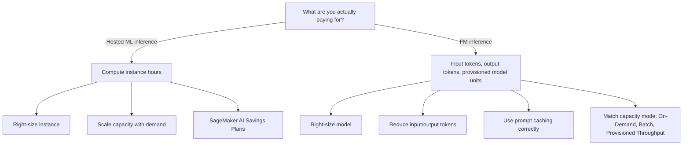
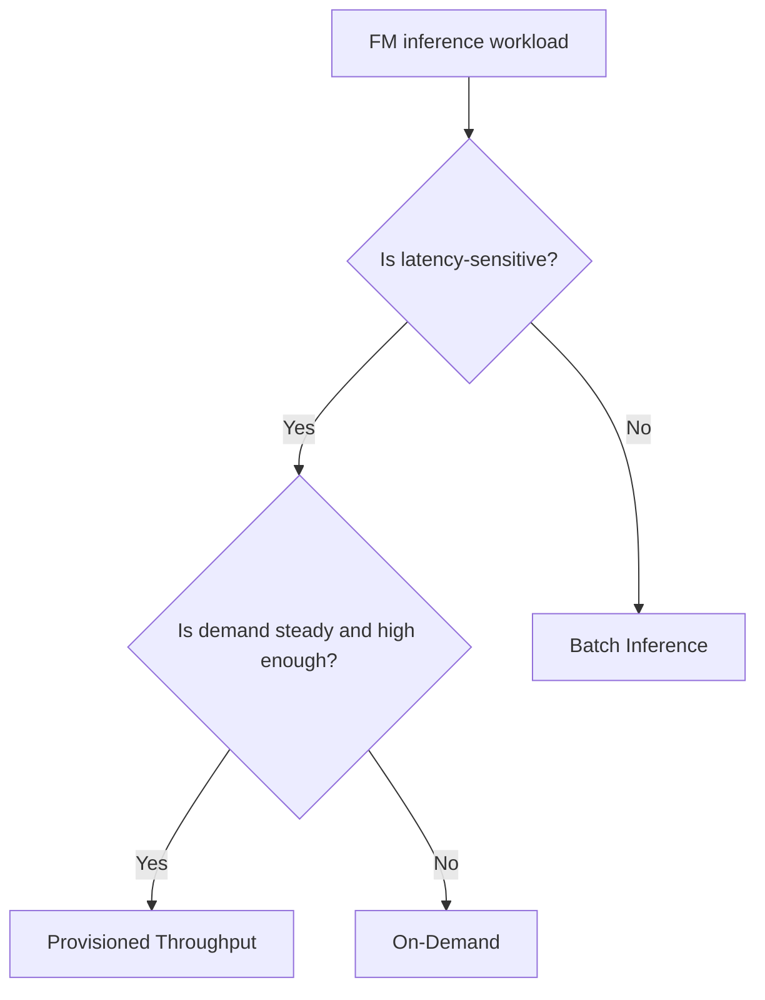
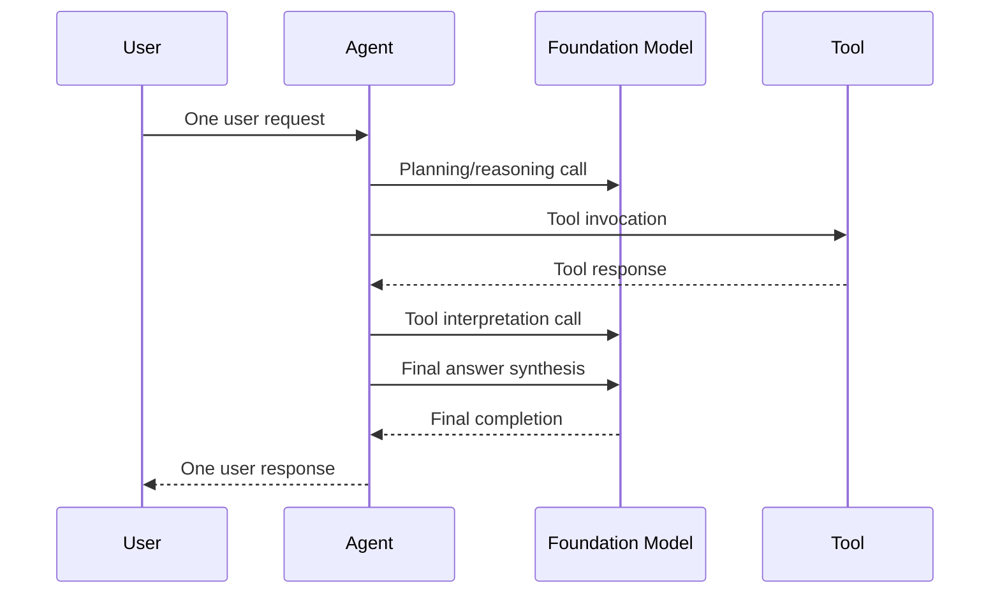

# Task 4.2: Operating, Monitoring, and Securing ML and AI Solutions - Optimize and manage ML and AI infrastructure costs and performance

## Skill 4.2.9: Manage FM inference costs with usage optimization

### 1. What This Skill Is About

Managing foundation model inference costs is not the same as managing traditional hosted model endpoints. The core exam skill is being able to decide the correct cost lever based on **what the service is actually charging for**.

| Workload type | Primary billing driver | Cost optimization focus |
| --- | --- | --- |
| Amazon SageMaker AI hosted endpoint | Provisioned compute / instance hours | Instance right-sizing, auto scaling, Savings Plans |
| Amazon Bedrock on-demand FM inference | Input tokens, output tokens, model units | Model selection, prompt size, output caps, caching |

The most important mental question for this skill is:

> **What are you actually paying for?**

For FM inference, the bill usually follows token consumption, not the amount of infrastructure you provision. Therefore, endpoint-style cost techniques like changing the instance family often do not reduce the Bedrock bill.

---

### 2. High-Level Cost Optimization Translation

The table version is useful for exam questions:

| Optimization goal | Traditional SageMaker endpoint | Amazon Bedrock FM inference |
| --- | --- | --- |
| Reduce unit cost | Choose smaller instance family | Choose smaller/cheaper model |
| Handle variable traffic | Auto scaling instance count | Prompt discipline, caching, On-Demand mode |
| Handle steady high volume | Savings Plans | Provisioned Throughput |
| Handle non-real-time work | Async inference or batch transform | Bedrock Batch inference |

---

### 3. Key FM Inference Cost Drivers

| Cost driver | Why it matters | Primary usage optimization lever |
| --- | --- | --- |
| Model choice | Larger models cost more per 1M tokens | Select the smallest model that meets quality requirements |
| Input token count | Prompt and context tokens are billed per request | Shorten instructions, context, and examples |
| Output token count | Generated tokens are usually more expensive than input tokens | Cap maximum response length |
| Prompt repetition | Repeated identical prefixes get recomputed each request | Prompt caching for stable prefixes |
| Request volume | More invocations means more token consumption | Batch work where possible; monitor agent fan-out |
| Capacity mode | On-demand, batch, and provisioned throughput have different economics | Match mode to traffic pattern |

---

### 4. Usage Optimization Levers in Detail

#### 4.1 Right-Size the Model

The FM equivalent of right-sizing an instance is choosing the right model.

- Do not use a very large, expensive model when a smaller model can satisfy accuracy, latency, and safety requirements.
- Evaluate model quality on the specific task rather than defaulting to the largest available model.
- A smaller model can cut the cost of every request because the price per token is lower.

Example:

A customer-service summarizing application initially uses a very large model, but after evaluation, a smaller model achieves acceptable summarization quality. Selecting the smaller model reduces cost across all invocations.

---

#### 4.2 Reduce Input Tokens

Input tokens are billed on every request, so repeated long context can be expensive.

Usage optimization actions:

- Remove unnecessary system instructions.
- Shorten few-shot examples.
- Truncate or summarize retrieved context.
- Use retrieval-augmented generation to include only relevant documents rather than an entire knowledge base.
- Store stable, reusable text in a prompt cache rather than resending it unchanged.

Example:

An assistant retrieves 20 document excerpts and places all of them into the prompt. By reducing the retrieved context to the top 5 most relevant excerpts, the team cuts input tokens significantly without necessarily hurting answer quality.

---

#### 4.3 Cap Output Tokens

Output tokens are often more expensive than input tokens. The model should produce only what the application needs.

- Set a maximum output length.
- Avoid allowing unnecessarily long completions.
- Design prompts to ask for concise responses when shorter output is acceptable.

This is a direct cost control because it bounds the most expensive part of many generative workloads.

---

#### 4.4 Use Prompt Caching Correctly

Prompt caching can lower cost and latency when a long prompt prefix is reused often. In Amazon Bedrock, cached prompt tokens can be billed at a reduced rate compared with uncached input tokens.

Important exam details:

- Caching works best when the **beginning of the prompt is identical** across requests.
- Put static content first: system instructions, tool schemas, few-shot examples.
- Put dynamic content last: user query, request ID, timestamp.
- A changing value inside or before the cached prefix will invalidate the cache.
- Cached tokens are **not free**; they are billed at a lower rate.
- Cache writes can be billed at a higher rate than normal input tokens.
- There is usually a minimum prefix length for caching to apply.

| Prompt caching best practice | Avoid |
| --- | --- |
| Stable system prompt at the start | Dynamic timestamp at the start |
| Repeated tool definitions and instructions | Unique prompt for every request |
| High reuse of identical prefix | One-off requests with no repetition |
| Clear separation of static and dynamic content | Mixing dynamic values into the cached prefix |

Example:

A virtual assistant uses a long set of static instructions, tool definitions, and few-shot examples followed by the customer question. This is a good prompt caching case. If the customer ID is placed at the beginning of the prompt, the cache misses every time.

---

#### 4.5 Match the Bedrock Capacity Mode

For Amazon Bedrock, the capacity mode should match the workload pattern.

| Mode | Use case | Cost characteristic |
| --- | --- | --- |
| On-Demand | Intermittent, variable, experimental assistant traffic | Pay per token; no upfront commit |
| Batch | Asynchronous, non-latency-sensitive processing such as large-scale classification, summarization, or embedding jobs | Lower cost than on-demand for supported workloads |
| Provisioned Throughput | Steady, predictable, high-volume inference | Pay per provisioned model unit; fixed hourly rate |

Exam trap:

- Provisioned Throughput is not ideal for highly spiky or experimental traffic. If usage is unpredictable, On-Demand may avoid paying for unused reserved model units.
- Batch inference is not suitable for real-time applications.

---

#### 4.6 Manage Agent and Tool Invocation Amplification

Agents can multiply inference cost even when user traffic does not increase. A single user request can become:

1. A planning or reasoning call to the FM.
2. One or more tool calls.
3. Additional FM calls to interpret tool results.
4. A final synthesis call to the FM.

Cost optimization actions for agents:

- Monitor cost per user request, not only total invocations.
- Use Amazon Bedrock AgentCore Observability to inspect model calls, tool calls, and memory operations per agent invocation.
- Limit retry loops because they can grow the bill without changing user traffic.
- Use smaller models for intermediate steps when quality requirements allow.
- Cache or cache-like optimize repeated tool outputs where possible.

---

### 5. Monitoring and Cost Governance

Usage optimization requires visibility. Without metrics and tags, you cannot know which model, team, or application is driving spend.

| AWS service | Use for FM inference cost management |
| --- | --- |
| Amazon CloudWatch | Monitor Bedrock metrics such as Invocations, InputTokenCount, OutputTokenCount, throttles, and latency |
| AWS Cost Explorer | Analyze historical and forecasted Bedrock spend, grouped by model, service, or usage type |
| AWS Budgets | Send alerts when actual or forecasted spend exceeds a defined budget |
| Cost allocation tags | Attribute Bedrock costs to teams, applications, environments, or models |

Key CloudWatch metrics to understand:

| Metric | What it tells you | Cost-related action |
| --- | --- | --- |
| Invocations | Number of Bedrock calls | Detect traffic changes |
| InputTokenCount | Input tokens consumed | Find prompt-size growth, caching opportunities |
| OutputTokenCount | Output tokens consumed | Evaluate output cap or model choice |
| InvocationThrottles | Requests throttled | Check Provisioned Throughput or rate limits |

Budget alerts should be set on **forecasted cost**, not only actual cost, so the team can act before overspending occurs.

---

### 6. Scenario-Based Examples

#### Scenario 1: Prompt Caching with a Dynamic Prefix

A team builds a support assistant on Amazon Bedrock. The system prompt includes instructions, few-shot examples, and a customer ID at the beginning. The team enables prompt caching, but sees almost no savings.

**Why?**  
The customer ID at the beginning changes on every request, invalidating the cache.

**Fix:** Place static instructions and examples at the beginning of the prompt, and put the dynamic customer ID or user question at the end.

---

#### Scenario 2: Offline Document Processing

A company processes 100,000 support transcripts every night to generate summaries. The team initially calls Bedrock On-Demand for each transcript interactively. The work is not latency-sensitive.

**Recommended optimization:** Use Amazon Bedrock Batch inference.

**Why?**  
Batch inference is designed for asynchronous, large-scale workloads and typically offers a lower cost than real-time on-demand requests.

---

#### Scenario 3: Steady Business-Hours Assistant

A financial assistant has very high, predictable usage during trading hours, but almost no use overnight. After model right-sizing and prompt optimization, the team wants to reduce cost further.

**Recommended approach:** Consider Provisioned Throughput for the predictable, steady baseline.

**Traps:**  
Do not buy Provisioned Throughput for the entire 24/7 period if the overnight demand is near zero. Monitor usage to avoid paying for unused model units. Bursty, unpredictable traffic should remain On-Demand.

---

### 7. Knowledge Check

#### Question 1

A team enables prompt caching for an assistant whose prompt prefix includes a value that changes on every request. What is the likely result?

- A. The cache is invalidated on each request, so the saving does not materialize
- B. The response length is reduced automatically
- C. The request is routed to a smaller model
- D. The workload is billed at the batch rate instead

**Answer:** A

Prompt caching depends on a stable, identical prefix. A changing value in the prefix prevents cache reuse. Caching does not change response length, model routing, or batch pricing.

---

#### Question 2

A production FM application is latency-sensitive and has unpredictable traffic. It has been optimized by reducing prompt size and capping output tokens. Which capacity mode is generally most appropriate?

- A. Provisioned Throughput
- B. Batch inference
- C. On-Demand
- D. SageMaker Savings Plans

**Answer:** C

On-Demand fits variable, latency-sensitive traffic because you pay per token without committing to reserved model units. Batch inference is asynchronous, Provisioned Throughput is for predictable high volume, and SageMaker Savings Plans apply to SageMaker compute, not Bedrock token usage.

---

#### Question 3

Which action most directly controls output token cost for a Bedrock generative application?

- A. Enabling AWS X-Ray tracing
- B. Setting a maximum response length
- C. Changing the SageMaker endpoint instance type
- D. Creating an AWS Budgets alert

**Answer:** B

Setting a maximum response length limits the number of output tokens generated. X-Ray traces latency, SageMaker instance changes affect SageMaker endpoints, and Budgets alerts report spending but do not reduce token use.

---

### 8. Exam Tips and Traps

- **Do not treat prompt caching as free.** Cached tokens are discounted, but still billed. Cache writes can cost more than normal reads.
- **Prompt caching requires exact prefix reuse.** Dynamic content at the start of the prompt invalidates the cache.
- **Do not apply SageMaker endpoint optimizations to Bedrock token billing.** Changing instance types, auto scaling, or Savings Plans does not optimize Bedrock on-demand token usage.
- **For FM inference, right-sizing means model selection.** A smaller model can reduce token cost across all requests, but validate quality first.
- **Prompt length is a cost control.** Trimming system instructions and context reduces input tokens on every invocation.
- **Output tokens often cost more than input tokens.** Capping output length is a direct and effective cost lever.
- **Provisioned Throughput is not a universal discount.** Use it for steady, predictable, high-volume workloads. It can waste money if traffic is spiky or experimental.
- **Batch inference is for asynchronous work.** Do not choose it for real-time use cases.
- **Agent requests amplify cost.** One agent invocation can produce multiple FM calls and tool calls. Monitor cost per invocation and watch for hidden retry loops.
- **Use CloudWatch metrics for token-level insights.** InputTokenCount and OutputTokenCount help identify whether rising cost comes from more traffic, longer prompts, or longer completions.
- **Tag resources and use cost allocation.** Without tags, it is hard to know which team, application, or model is responsible for Bedrock spend.