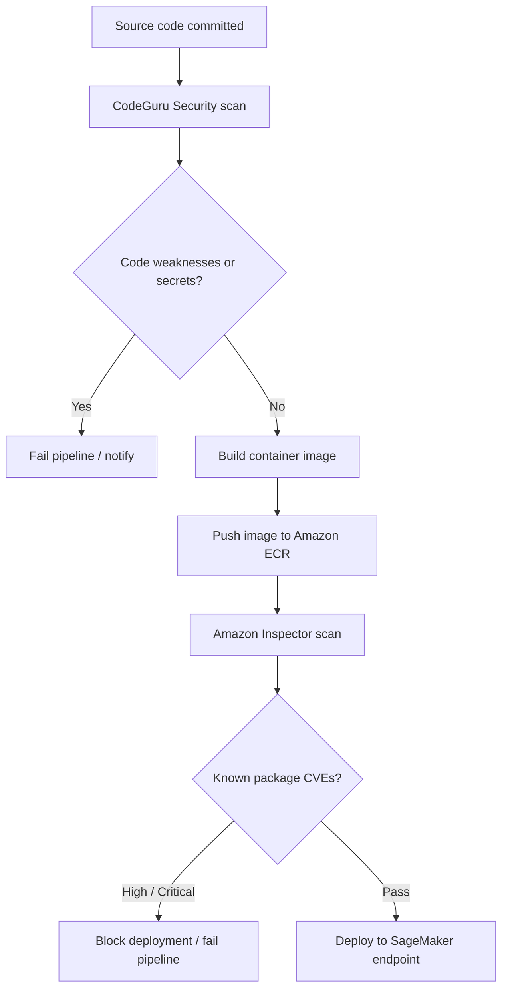

# Task 4.3: Operating, Monitoring, and Securing ML and AI Solutions - Secure ML and AI workloads and model endpoints.

## Skill 4.3.1: Secure continuous integration and continuous delivery (CI/CD) pipelines by checking for code and image vulnerabilities (for example, by using Amazon CodeGuru, Amazon Inspector).

### Purpose

Securing an ML CI/CD pipeline means identifying vulnerabilities before a model, training job, or inference endpoint is deployed. In AWS, this is achieved by combining two complementary checks:

- **Code vulnerability scanning** — finds insecure patterns, secrets, and flaws in the application source code.
- **Image vulnerability scanning** — finds known Common Vulnerabilities and Exposures (CVEs) in the packages, operating system layers, and dependencies assembled into a container image.

These are not interchangeable. A pipeline that checks only source code can still deploy a container built from an outdated, vulnerable base image.

---

### Key AWS Services

| AWS Service | What It Scans | What It Finds | ML Pipeline Example |
|---|---|---|---|
| **Amazon CodeGuru Security** | Application source code | Hardcoded credentials, injection flaws, insecure cryptography, path traversal, OWASP-style weaknesses | Detects an AWS access key embedded in a Python training script |
| **Amazon Inspector** | Amazon EC2 instances, Amazon ECR container images, AWS Lambda functions | Known CVEs in operating system packages, language libraries, application dependencies, unintended network exposure | Finds a vulnerable version of `tensorflow-serving` or `libssl` in a model container image |

---

### Why Both Scanning Types Are Required

A secure CI/CD pipeline must answer two different questions:

| Scan Type | Question Answered | Service |
|---|---|---|
| Source scan | Did the engineers write insecure code or store secrets in code? | Amazon CodeGuru Security |
| Image scan | Does the assembled runtime contain known vulnerable packages? | Amazon Inspector |

A common exam scenario asks why a pipeline that already performs source analysis still has a vulnerability gap. The answer is usually that it is not scanning the built container image for package-level CVEs.

---

### CI/CD Integration Flow for ML Workloads

A typical ML CI/CD pipeline with security gates follows these stages:

1. **Source check**  
   After code is committed, Amazon CodeGuru Security scans the training code, preprocessing scripts, and inference application code.  
   It reports severity ratings such as `Critical`, `High`, `Medium`, and `Low`.

2. **Build stage**  
   The pipeline builds a container image for training or inference. The image may include ML frameworks such as PyTorch, TensorFlow, or scikit-learn.

3. **Image push**  
   The image is pushed to Amazon ECR.

4. **Vulnerability scan**  
   Amazon Inspector scans the image in Amazon ECR.  
   If ECR enhanced scanning is enabled, this uses Amazon Inspector and can run on every image push and continuously after push.

5. **Release gate**  
   The pipeline blocks deployment when high or critical vulnerabilities are found.  
   It can send findings to Amazon EventBridge, AWS Security Hub, or notify the security team.

6. **Deploy**  
   Only approved artifacts progress to staging or production.

---

### Amazon CodeGuru Security in ML Pipelines

Amazon CodeGuru Security is a static application security testing tool. It inspects code without executing it.

Common ML-specific issues it can detect include:

- Hardcoded AWS access keys or API keys in scripts.
- Use of insecure TLS versions when calling model endpoints.
- Path traversal when loading datasets or model artifacts.
- Deserialization of untrusted model files or inputs.
- Overly permissive file handling in training jobs.
- Insecure use of Python’s `pickle` or similar serialization.

In a pipeline, CodeGuru Security can be run from AWS CodeBuild or through a CLI action. Findings can be used as a quality gate based on severity.

---

### Amazon Inspector in ML Pipelines

Amazon Inspector is a vulnerability management service. It examines the compiled artifact and running environment.

For ML workloads, Inspector is especially relevant for:

- Scanning Amazon ECR images used for SageMaker training jobs, inference containers, or batch transform jobs.
- Scanning Lambda functions that contain small inference or preprocessing code.
- Scanning EC2 instances used for self-hosted model endpoints.
- Detecting network reachability issues, which can indicate unintended internet exposure of an endpoint or training instance.

Amazon Inspector uses vulnerability databases continuously updated with new CVEs.

---

### Example Security Findings

| Finding Type | Example | Likely Service |
|---|---|---|
| Hardcoded secret | AWS access key embedded in a feature engineering script | Amazon CodeGuru Security |
| Source code flaw | SQL injection in an inference API built with Python | Amazon CodeGuru Security |
| Vulnerable package | Outdated `numpy` or `OpenSSL` inside SageMaker inference image | Amazon Inspector |
| Unintended exposure | Training instance reachable from the internet | Amazon Inspector |
| Malformed IAM policy | Overly permissive role in pipeline | IAM Access Analyzer, not a code scanner |

---

### Scenario-Based Exam Questions

#### Scenario 1

A company builds a SageMaker inference container through a CI/CD pipeline. The pipeline already scans Python source code with Amazon CodeGuru Security. However, the security team reports that deployed containers include a widely known vulnerability in the base image’s operating system packages.

Which action should the team take?

- **A.** Add static analysis for the operating system packages using AWS CloudTrail.
- **B.** Enable Amazon Inspector scanning of Amazon ECR images and fail the pipeline on high-severity findings.
- **C.** Add a sensitive information filter to the model response.
- **D.** Move the container into a public subnet to avoid network exposure.

**Correct Answer:** **B**

**Explanation:**  
Amazon CodeGuru Security analyzes source code, not compiled base image packages. Amazon Inspector scans Amazon ECR images and detects known CVEs in operating system and application packages. Enabling Inspector scanning on ECR and failing the pipeline on high-severity findings closes the gap.

---

#### Scenario 2

During a pipeline run, a code scanner reports that a training script contains a hardcoded long-term AWS access key.

Which service most likely produced this finding?

- **A.** Amazon Inspector
- **B.** AWS Config
- **C.** Amazon CodeGuru Security
- **D.** AWS Secrets Manager

**Correct Answer:** **C**

**Explanation:**  
Amazon CodeGuru Security detects hardcoded credentials and other security issues in source code. Amazon Inspector scans for software vulnerabilities, not embedded secrets. AWS Config records resource configuration drift, and AWS Secrets Manager stores secrets but does not scan code.

---

#### Scenario 3

A machine learning team has a CI/CD pipeline that builds and deploys a container for a public SageMaker endpoint. A high-severity CVE is found in the image by Amazon Inspector.

What is the most security-conscious production response?

- **A.** Deploy the image anyway because the model accuracy is not affected.
- **B.** Disable Inspector scanning for this pipeline.
- **C.** Rebuild the image using a patched base image or updated dependency, then rerun the pipeline.
- **D.** Add the CVE to an allowlist and promote the image.

**Correct Answer:** **C**

**Explanation:**  
A high-severity CVE in a public-facing ML endpoint is a serious risk. The correct response is to remediate the vulnerable package by updating the base image or dependency and rerunning the pipeline. Suppressing the finding or disabling scanning leaves the endpoint vulnerable.

---

### Exam Tips and Traps

| Tip / Trap | Guidance |
|---|---|
| **Do not mix CodeGuru and Inspector** | CodeGuru Security is for source code and secrets. Inspector is for built artifacts and known package CVEs. |
| **Image scanning with Inspector is continuous** | With ECR enhanced scanning, images can be scanned on push and continuously monitored for newly discovered CVEs. |
| **A scanner alone is not enough** | Security findings must feed a pipeline gate. The pipeline should fail or block deployment for critical or high-severity findings. |
| **Do not disable the scanner to clear a failure** | If a vulnerability blocks a deployment, remediate the code or image, not the control. |
| **Hardcoded secrets belong in AWS Secrets Manager** | If CodeGuru finds a hardcoded credential, the fix is to remove it from source and retrieve it from AWS Secrets Manager or use an IAM role. |
| **CloudTrail does not scan vulnerabilities** | CloudTrail records API activity. AWS Config records configuration compliance. Do not choose them for code or image vulnerability detection. |
| **Inspector also detects network exposure** | For ML endpoints and training instances, Inspector can flag unintended internet reachability. |
| **Both checks complement each other** | A pipeline with only source scanning still misses vulnerable base images. A pipeline with only image scanning may miss hardcoded credentials in custom code. |

---

### Summary

To secure ML CI/CD pipelines, use Amazon CodeGuru Security to inspect application and training code for security flaws and hardcoded secrets, and use Amazon Inspector to scan container images and Lambda functions for known package vulnerabilities. Configure pipeline gates based on severity, remediate findings before deployment, and archive findings through AWS Security Hub or EventBridge for auditing and operational response.