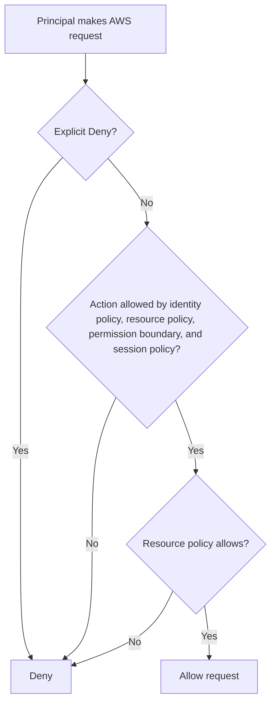
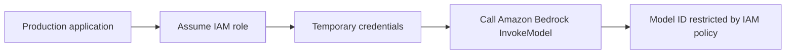
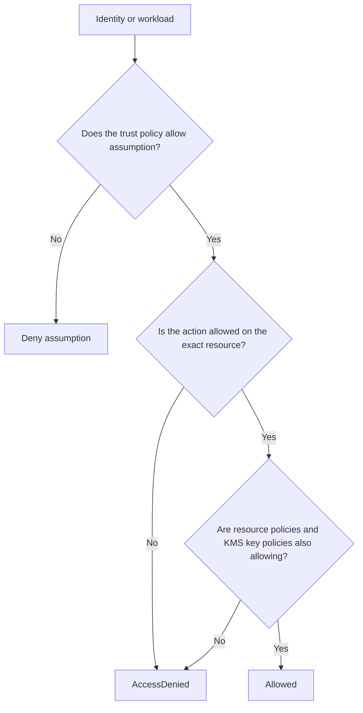

# Task 4.3: Operating, Monitoring, and Securing ML and AI Solutions - Secure ML and AI workloads and model endpoints

## Skill 4.3.2: Configure least privilege access to ML and AI artifacts

---

## 1. What "Least Privilege Access" Means for ML and AI Artifacts

Least privilege means granting exactly the permissions needed to perform a task, on only the resources required, for only as long as necessary.

In ML and AI systems, artifacts include:

| Category | Examples |
|---|---|
| Data artifacts | Training data, validation data, test data, feature store data, labeled datasets in Amazon S3 |
| Model artifacts | Trained model files, model.tar.gz files, model registry entries, model packages |
| Code artifacts | Training scripts, preprocessing code, pipeline code |
| Container artifacts | Docker images, SageMaker container images, Amazon ECR repositories |
| Runtime artifacts | SageMaker endpoints, endpoint configurations, model invocations |
| Governance artifacts | Labels, metadata, experiment records, model cards |

A common exam theme is not just knowing which IAM action to grant, but recognizing the most restrictive way to grant it.

---

## 2. IAM Concepts Used in ML Least Privilege

### 2.1 Identity-based vs resource-based policies

| Policy type | Attached to | Use in ML/AI |
|---|---|---|
| Identity-based policy | IAM user, group, or role | Grant a data scientist access to a specific S3 prefix or SageMaker action |
| Resource-based policy | A resource such as an S3 bucket, ECR repository, or KMS key | Allow another account or service to access a specific artifact directly |
| Trust policy | IAM role | Allow SageMaker, Lambda, EC2, or another AWS service to assume a role |
| Permission boundary | IAM user or role | Cap the maximum permissions an identity can ever receive |
| Session policy | Temporary role session | Further restrict permissions for a specific session |
| SCP | AWS organization account or OU | Set a guardrail across all identities in an account |

### 2.2 IAM policy evaluation flow



An explicit deny always wins. This matters when using permission boundaries, SCPs, bucket policies, or KMS key policies to prevent broad access.

---

## 3. Least Privilege by ML/AI Artifact Type

### 3.1 Data in Amazon S3

Least privilege access to ML data commonly uses:

- `s3:GetObject`
- `s3:ListBucket`
- `s3:PutObject`
- `s3:DeleteObject`

To restrict access to a subset of objects, use bucket-level `ListBucket` with a `Condition` limiting the prefix, and object-level permissions restricted by ARN.

**Least privilege design:**

| Requirement | Restrictive approach |
|---|---|
| Data scientist reads only one project's data | Grant `s3:GetObject` only on `arn:aws:s3:::bucket/project-a/*` |
| Training job writes only to one output folder | Grant `s3:PutObject` only on `arn:aws:s3:::bucket/output/project-a/*` |
| A role needs to list only one folder | Allow `s3:ListBucket` with a `s3:prefix` condition |
| Cross-account access to data | Use a bucket resource policy, not a new IAM user in the owner account |

### 3.2 Model artifacts in Amazon S3

Model artifacts are usually stored as compressed model files such as `model.tar.gz`.

Least privilege includes:

- Grant `s3:GetObject` only on the specific model output prefix.
- Do not allow `s3:DeleteObject` on the entire bucket when a model endpoint only needs to read.
- If the model artifact is encrypted with AWS KMS, the role also needs `kms:Decrypt` for the specific key.
- When deploying across accounts, use a bucket policy and KMS key policy together.

### 3.3 Amazon SageMaker resources

SageMaker has separate permissions for control-plane actions, data-plane actions, and job execution roles.

| SageMaker resource | Least privilege example |
|---|---|
| Notebook instance | Allow `sagemaker:CreatePresignedNotebookInstanceUrl` only for a specific notebook, not `sagemaker:*` |
| Training job | The training role needs S3 input/output access, ECR pull access, and CloudWatch logs access |
| Processing job | Same pattern as training, but for processing inputs/outputs |
| Batch transform | Needs S3 input/output and model artifact access |
| Model deployment | Needs model artifact access, ECR image access, and CloudWatch logging |
| Endpoint invocation | Application needs `sagemaker:InvokeEndpoint` only for the specific endpoint ARN |
| Model registry | Developers may need read access; only ML engineers should have publish/update access |

### 3.4 Amazon ECR container images

Training and inference containers need to pull images from Amazon ECR.

Least privilege approach:

- Grant `ecr:BatchGetImage`
- Grant `ecr:GetDownloadUrlForLayer`
- Restrict these permissions by repository ARN
- Avoid granting `ecr:*`
- Use Amazon Inspector or ECR scan findings as a pipeline gate

### 3.5 Amazon Bedrock foundation models

Amazon Bedrock uses IAM permissions to control access to foundation models.

A production application should use an IAM role with temporary credentials.

Least privilege for Bedrock includes:

- Restrict `bedrock:InvokeModel` to a specific model ID ARN
- Allow only specific inference profile IDs for cross-Region inference
- Separate permissions for `InvokeModel`, `CreateModelInvocationJob`, and `Converse`
- Restrict `bedrock:CreateGuardrail` and `bedrock:UpdateGuardrail` to security or policy teams
- Limit access to agents, knowledge bases, and prompt flows by ARN

---

## 4. IAM Roles for ML Workloads

### 4.1 Separate human identities from workload identities

| Identity type | Example | Best practice |
|---|---|---|
| Human identity | Data scientist, ML engineer | Use AWS IAM Identity Center or IAM users with assigned policies |
| Workload identity | SageMaker training job, Lambda function | Use an IAM role with a trust policy for the service |
| Application identity | Production server calling Bedrock | Use an IAM role assumed through EC2, ECS, Lambda, or STS |

A common mistake is embedding a human engineer's long-term access key into an application. The exam considers this a security risk.

### 4.2 Service role trust policies

For SageMaker to assume a role, the role must have a trust policy that says `sagemaker.amazonaws.com` can assume it.

A missing or incorrect trust policy causes the `CreateTrainingJob` or `CreateEndpoint` operation to fail, even if the role has the correct S3 permissions.

### 4.3 PassRole permission

When an ML engineer passes an IAM role to a SageMaker training job, endpoint, or processing job, the engineer's own identity needs `iam:PassRole`.

Least privilege for `PassRole`:

- Grant `iam:PassRole` only for the target role ARN
- Do not use `iam:PassRole` with `Resource: "*"`
- Use a condition to allow passing only to `sagemaker.amazonaws.com`

Example concept without code:

```text
Principal: ML Engineer
Action: iam:PassRole
Resource: arn:aws:iam::123456789012:role/sagemaker-training-role
Condition: iam:PassedToService equals sagemaker.amazonaws.com
```

---

## 5. AWS KMS and Least Privilege for Encrypted Artifacts

If S3 buckets, ECR repositories, or SageMaker volumes are encrypted with AWS KMS customer managed keys, the workload role must also have KMS access.

| Task | Required KMS permission |
|---|---|
| Read encrypted S3 object | `kms:Decrypt` |
| Write encrypted S3 object | `kms:GenerateDataKey` |
| SageMaker training role accesses encrypted data | `kms:Decrypt` and `kms:GenerateDataKey` |
| ECR image encrypted with KMS | `kms:Decrypt` for the key |

KMS key policies are resource-based policies. Both the KMS key policy and the IAM policy must allow access.

---

## 6. Cross-Account Access to ML Artifacts

Cross-account access to ML artifacts can be handled in two primary ways:

| Method | Use case |
|---|---|
| Resource-based policy on S3 bucket, ECR repository, or KMS key | Allow another account to read a dataset or model artifact directly |
| IAM role assumption with `sts:AssumeRole` | Allow an application or user in another account to assume a role in the ML account |

For cross-account SageMaker access, IAM role assumption is usually required because SageMaker resources do not all support resource-based policies.

---

## 7. Credential Selection for Foundation Model Access

The exam distinguishes between API keys and IAM credentials.

| Credential type | Best use | Exam view |
|---|---|---|
| Short-term API key | Temporary exploration | Inherits the permissions of the identity that created it; expires with the session |
| Long-term API key | Exploration and development only | Not recommended for production because it is static and harder to rotate |
| IAM role with temporary credentials | Production workloads | Preferred credential type for AWS services and foundation model access |
| Secret stored in AWS Secrets Manager | Third-party API key or token that must persist | Stored and rotated securely; retrieved at runtime |

### Production foundation model access

The correct production pattern is:



---

## 8. How to Design Least Privilege for ML and AI Artifacts

A structured approach:

```text
1. Identify the exact artifacts and operations required.
2. Identify who or what needs access: human, workload, or service.
3. Choose an identity type:
   - Human -> IAM Identity Center user or IAM user
   - Workload -> IAM role with trust policy
4. Write an identity-based policy with only the required actions.
5. Restrict resources to the smallest ARN or prefix.
6. Add condition keys where appropriate.
7. If the resource supports it, add a matching resource-based policy.
8. Include KMS decrypt/generate data key if encryption is used.
9. Validate with IAM Access Analyzer.
10. Review access when project scope changes.
```

---

## 9. Scenario-Based Examples

### Scenario 1: SageMaker training job access failure

A data scientist creates a SageMaker training job that must read training data from `s3://company-data/project-alpha/train/` and write model output to `s3://company-data/project-alpha/output/`. The training job uses a role with `s3:GetObject` and `s3:PutObject` permissions on the entire bucket.

The job can read the data, but the security team flags the role as over-permissive.

**Question:** Which change best applies least privilege?

**Options:**

- A. Remove `s3:PutObject` from the role
- B. Restrict `s3:GetObject` to the training prefix and `s3:PutObject` to the output prefix
- C. Add `s3:ListBucket` for the entire bucket
- D. Use an S3 bucket policy to deny all access except from the training role

**Correct Answer: B**

**Explanation:**  
The training job only needs `s3:GetObject` on the training prefix and `s3:PutObject` on the output prefix. Option B grants exactly those operations and resources. Option A would break the job. Option C adds unnecessary access. Option D does not itself grant access and is not sufficient without the correct IAM role policy.

---

### Scenario 2: Production application accessing Amazon Bedrock

An application running on Amazon ECS needs to invoke an Amazon Bedrock foundation model in production. A developer proposes using a long-term API key stored in the container image.

**Question:** Which approach is most secure and appropriate for production?

**Options:**

- A. Use a long-term API key stored in AWS Secrets Manager
- B. Use a short-term API key generated manually each day
- C. Use an ECS task role that assumes an IAM role and receives temporary credentials
- D. Store the long-term API key in an environment variable on the container host

**Correct Answer: C**

**Explanation:**  
Production workloads should use IAM roles with temporary credentials. ECS task roles automatically provide temporary credentials to the container. Long-term API keys are not recommended for production, even when stored in Secrets Manager, because they are still static credentials compared with temporary IAM role credentials.

---

### Scenario 3: Cross-account model artifact access

Team A in Account A trains a model and stores the model artifact in an encrypted S3 bucket. Team B in Account B needs to deploy the model in SageMaker.

**Question:** Which combination of permissions is required for least privilege cross-account access?

**Options:**

- A. In Account B, grant `s3:GetObject` on the bucket and `kms:Decrypt` on the key
- B. In Account A, allow Account B in the S3 bucket policy and KMS key policy; in Account B, grant `s3:GetObject` and `kms:Decrypt`
- C. Create an IAM user in Account A for Team B
- D. In Account B, use `s3:*` and `kms:*` permissions

**Correct Answer: B**

**Explanation:**  
Cross-account access to encrypted S3 artifacts requires both the bucket policy and the KMS key policy to allow access. Team B also needs corresponding identity-based permissions for `s3:GetObject` and `kms:Decrypt`. Creating an IAM user in Account A is less scalable and less secure. Using wildcard permissions violates least privilege.

---

### Scenario 4: Resolving AccessDenied without over-permission

A machine learning engineer receives an `AccessDenied` error while calling `sagemaker:CreateTrainingJob`. The engineer asks for `sagemaker:*` to fix it.

**Question:** What is the most appropriate response?

**Options:**

- A. Grant `sagemaker:*` because the engineer needs to create training jobs
- B. Inspect the denied action and resource, then grant only the missing action on the required resource
- C. Add `iam:PassRole` with `Resource: "*"`
- D. Add the engineer to the admin group temporarily

**Correct Answer: B**

**Explanation:**  
The fastest wrong fix is to widen permissions until the error disappears. The denied action and resource should be identified from CloudTrail or the error detail. The access should be granted narrowly. If the issue is missing `iam:PassRole`, it should be scoped to the target role and service, not granted with wildcard resource.

---

## 10. Exam Tips and Traps

| Tip or Trap | Explanation |
|---|---|
| Do not confuse control-plane with data-plane permissions | Creating an endpoint requires control-plane permissions; invoking it requires `sagemaker:InvokeEndpoint` or `bedrock:InvokeModel` |
| Missing `iam:PassRole` is a common failure | The engineer's identity must be allowed to pass the service role to SageMaker |
| Trust policy is separate from permission policy | A role may have S3 access but SageMaker cannot assume it if the trust policy is missing |
| Use ARNs and prefixes instead of wildcards | `s3:GetObject` on `bucket/project/*` is more secure than on `bucket/*` |
| KMS access is required for encrypted artifacts | IAM permission alone is not enough if the S3 object or ECR image is encrypted with a customer managed key |
| Resource-based policies are often needed for cross-account access | S3 bucket policies, ECR repository policies, and KMS key policies all matter |
| Production workloads use IAM roles | Avoid long-term API keys or access keys in images, code, or environment files |
| Short-term API keys are acceptable for exploration | They inherit session permissions and expire |
| Use IAM Access Analyzer to find overly broad access | It helps identify wildcard permissions and external access |
| Do not use the root user for ML workflows | Use IAM roles or IAM Identity Center identities |
| Permission boundaries and SCPs can override IAM role policies | Even a role policy that grants access cannot exceed the boundary |
| Least privilege is dynamic | Review access when models, data, or projects change |

---

## 11. Summary

Least privilege access to ML and AI artifacts is about matching every identity to the smallest possible set of actions and resources.

Key principles for the exam:

- Separate human identities from workload identities.
- Use IAM roles with temporary credentials for production workloads.
- Restrict access by artifact ARN, S3 prefix, ECR repository, or Bedrock model ID.
- Include `iam:PassRole`, KMS decrypt permissions, and resource-based policies when required.
- Avoid wildcard actions and resources.
- Prefer temporary IAM credentials over long-term API keys for foundation models.
- Use IAM Access Analyzer to validate least privilege.

