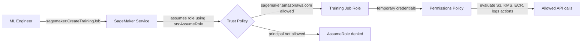
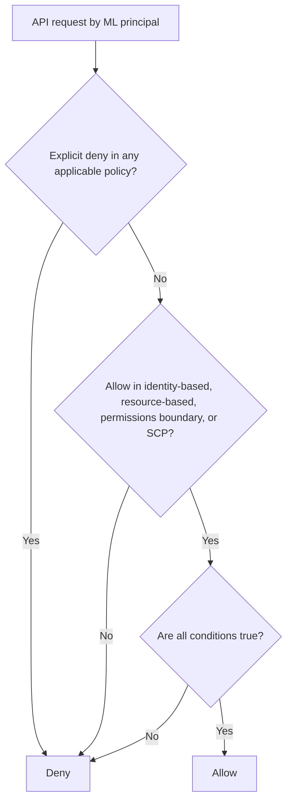

# Task 4.3: Secure ML and AI workloads and model endpoints

## Skill 4.3.3: Configure IAM policies and roles for users and applications in ML and AI systems

### Objective

This skill focuses on controlling **who** can perform **which actions** on **which machine learning or AI resources**. In ML systems, IAM is the primary boundary for:

- Training data in Amazon S3
- Model artifacts and container images
- Amazon SageMaker training jobs, processing jobs, and endpoints
- Amazon Bedrock foundation model invocations
- AWS KMS encrypted datasets and model artifacts
- Secrets and API keys used by ML applications

The core principle is **least privilege**: grant only the smallest set of actions on only the specific resources required for a job, and review that scope whenever the job changes.

---

## IAM Fundamentals for ML and AI Systems

AWS Identity and Access Management (IAM) controls access to ML and AI resources through:

- **Identities** — IAM users, IAM user groups, and IAM roles
- **Policies** — JSON documents that state allowed or denied actions
- **Roles** — identities with temporary credentials that can be assumed by trusted entities
- **Trust policies** — policies attached to roles that define who or what can assume them
- **Resource-based policies** — policies attached directly to resources such as S3 buckets, KMS keys, ECR repositories, and Secrets Manager secrets

### IAM Users vs IAM Roles for ML Workloads

| ML identity type | Who uses it | Credential type | Typical use case |
| --- | --- | --- | --- |
| **IAM user** | Human or legacy application | Long-term access keys or console password | Should be avoided for production applications; acceptable only for early development or limited human use |
| **IAM role** | Human (temporary), AWS service, or application | Temporary credentials via AWS STS | Preferred for all ML workloads, including SageMaker jobs, Lambda inference functions, ECS services, and Bedrock applications |
| **IAM Identity Center / federated user** | Human workforce with SSO | Temporary SSO credentials | Best practice for data scientists and ML engineers using SageMaker Studio or the AWS Console |
| **SageMaker service role** | SageMaker notebook, training job, processing job, or endpoint | Temporary credentials assumed by SageMaker | Grants the SageMaker service access to S3 data, ECR images, logs, and KMS keys on behalf of the job |
| **Application role** | EC2 instance profile, ECS task role, or Lambda execution role | Temporary credentials from the compute service | Grants ML applications permission to invoke SageMaker endpoints or Amazon Bedrock models |

> **Exam tip:** For any production application that invokes a model, the correct answer is almost always **an IAM role with temporary credentials**, not a long-term access key or a key embedded in an image.

---

## Anatomy of an IAM Role

An IAM role has two essential parts:

1. **Trust policy**  
   Defines which principal is allowed to assume the role. For example, a SageMaker training job role must trust the SageMaker service principal `sagemaker.amazonaws.com`.

2. **Permissions policy**  
   Defines what actions the role can perform on which resources after it is assumed.

### Role assumption flow for a SageMaker training job

---

## IAM Policy Types Used in ML/AI Systems

| Policy type | Attached to | Purpose in ML/AI |
| --- | --- | --- |
| **Identity-based policy** | User, group, or role | Grant a data scientist or application role permission to call `sagemaker:CreateTrainingJob`, `sagemaker:InvokeEndpoint`, or `bedrock:InvokeModel` |
| **Role trust policy** | IAM role | Allow SageMaker, Lambda, ECS, EC2, or another account to assume the role |
| **Resource-based policy** | S3 bucket, KMS key, ECR repository, Secrets Manager secret | Grant cross-account access to training data, model artifacts, container images, or secrets |
| **Permissions boundary** | IAM user or role | Limit the maximum permissions an identity can ever have, even if policies attempt to grant more |
| **Service control policy (SCP)** | AWS organization or account | Block risky ML actions, such as deleting endpoints or using unsupported foundation models |

### IAM policy evaluation order

> **Exam tip:** An explicit `Deny` always wins over any `Allow`. If an ML engineer is blocked by a permissions boundary or SCP, removing that boundary is not the correct fix if security policy requires it.

---

## IAM Roles for Common SageMaker ML Workloads

| Workload | Trusted principal | Role purpose | Typical permissions to include | Common overly broad grants to avoid |
| --- | --- | --- | --- | --- |
| **Amazon SageMaker Studio / Notebook instance** | `sagemaker.amazonaws.com` | Interactive data science work | S3 read/write on project buckets, ECR pull, CloudWatch logs, KMS decrypt, SageMaker create actions if launching jobs | `s3:*` on all buckets, `sagemaker:*` on all resources |
| **SageMaker training job** | `sagemaker.amazonaws.com` | Read training data, write model artifacts | `s3:GetObject` and `s3:ListBucket` on input prefix; `s3:PutObject` on output prefix; ECR pull; CloudWatch logs; KMS decrypt | `s3:DeleteObject` on source data, broad S3 access |
| **SageMaker processing job** | `sagemaker.amazonaws.com` | Feature engineering or data transformation | S3 read/write on specific prefixes, ECR pull, CloudWatch logs, KMS decrypt | Broad S3 write access outside job output prefixes |
| **SageMaker inference endpoint / model** | `sagemaker.amazonaws.com` | Load model artifacts and write logs | `s3:GetObject` on model artifact prefix; CloudWatch logs; KMS decrypt | S3 write access, training permissions, Bedrock permissions |
| **SageMaker pipeline** | `sagemaker.amazonaws.com` | Orchestrate jobs, steps, and model registration | PassRole to step roles, S3 access, SageMaker step actions, ECR pull | Cross-account or wildcard `iam:PassRole` |

---

## IAM for Amazon Bedrock Foundation Model Access

Amazon Bedrock model access is controlled primarily through IAM identity-based policies. A user or application role needs permission such as:

- `bedrock:InvokeModel` on a specific foundation model ARN
- `bedrock:ListFoundationModels` to view available foundation models
- `bedrock:GetFoundationModel` to read model details
- `bedrock:CreateModelCustomizationJob` to fine-tune models
- `bedrock:InvokeAgent` to call Bedrock agents
- `bedrock:ApplyGuardrail` or related guardrail actions if explicitly needed

### Best-practice scoping

Instead of granting all Bedrock model invocations, restrict access to:

- A specific foundation model ARN
- A specific custom model ARN or inference profile
- A condition key such as `bedrock:GuardrailIdentifier` to require a configured guardrail
- A condition key such as `bedrock:FoundationModelArn` where supported

| Credential approach | Usage | Security posture |
| --- | --- | --- |
| IAM role with temporary credentials assumed by EC2/ECS/Lambda | Production | **Best practice** |
| Short-term API key generated from an IAM role session | Exploration or temporary automation | Inherits role permissions and session expiry |
| Long-term API key stored in image or environment variable | Development only | **Not recommended for production** |
| IAM user access keys stored in Secrets Manager | Legacy or external systems if unavoidable | Better than hardcoded keys, but roles are preferred |

> **Exam trap:** A question might describe a production application that invokes Amazon Bedrock and asks which credential type to use. The correct answer is an **IAM role providing temporary credentials**. Long-term API keys are development-only and should not be baked into application artifacts.

---

## IAM PassRole in ML and AI Systems

`iam:PassRole` is a critical and commonly missed permission when launching SageMaker jobs or Bedrock agents.

### How PassRole works in ML

1. A developer or application calls `sagemaker:CreateTrainingJob` or `sagemaker:CreateProcessingJob`.  
2. The caller includes an IAM role ARN that SageMaker should use to execute the job.  
3. The caller’s own IAM policy must include `iam:PassRole` for that specific role ARN.  
4. The target role’s trust policy must allow `sagemaker.amazonaws.com` to assume it.

If either side is missing, the request fails.

### Common PassRole troubleshooting

| Error or symptom | Likely cause |
| --- | --- |
| `AccessDenied` when starting a SageMaker training job | Caller lacks `sagemaker:CreateTrainingJob`, lacks `iam:PassRole`, or both |
| Error: “Not authorized to perform sts:AssumeRole” | The role’s trust policy does not allow the service principal |
| Error: “The role cannot be assumed” | Wrong role ARN, trust policy misconfigured, or cross-account assumption not allowed |
| Developer can pass any role | `iam:PassRole` resource is `*`, which is a privilege escalation risk |

> **Exam tip:** A least-privilege `iam:PassRole` policy should reference only the specific role ARNs the developer or application is allowed to pass. Allowing `iam:PassRole` on `*` is dangerous because it may allow a user to pass a more privileged role to a service.

---

## Scoping Permissions to Specific ML Resources

### Resource ARN examples

| Resource | ARN pattern |
| --- | --- |
| SageMaker endpoint | `arn:aws:sagemaker:region:account:endpoint/endpoint-name` |
| SageMaker training job | `arn:aws:sagemaker:region:account:training-job/job-name` |
| SageMaker model | `arn:aws:sagemaker:region:account:model/model-name` |
| S3 training data prefix | `arn:aws:s3:::bucket-name/input/` |
| KMS key | `arn:aws:kms:region:account:key/key-id` |
| Bedrock foundation model | `arn:aws:bedrock:region::foundation-model/model-id` |

### Examples of least-privilege access

| Principal | Needed action | Resource scope |
| --- | --- | --- |
| Data scientist | `sagemaker:CreateTrainingJob` | Specific training job resources or tag-based condition |
| Training job role | `s3:GetObject`, `s3:ListBucket` | Input bucket and specific data prefix |
| Training job role | `s3:PutObject` | Output bucket and specific prefix |
| Inference application role | `sagemaker:InvokeEndpoint` | Specific endpoint ARN |
| Bedrock application role | `bedrock:InvokeModel` | Specific foundation model ARN |
| All roles accessing encrypted data | `kms:Decrypt` | Specific KMS key ARN |

---

## IAM Conditions to Tighten ML Access

IAM condition keys add another layer of control beyond actions and resources.

| Condition key | Example use in ML/AI |
| --- | --- |
| `aws:SourceVpc` / `aws:SourceVpce` | Allow SageMaker or Bedrock API calls only from a private VPC endpoint |
| `aws:SourceIp` | Restrict console or API calls from a known corporate network |
| `aws:MultiFactorAuthPresent` | Require MFA for sensitive deletion actions, such as `sagemaker:DeleteEndpoint` |
| `sagemaker:ResourceTag/team` | Allow actions only on resources tagged with a specific team |
| `aws:RequestTag` | Require tags when creating ML resources |
| `bedrock:GuardrailIdentifier` | Require a specific Bedrock guardrail to be attached when invoking a model |
| `bedrock:FoundationModelArn` | Restrict which foundation models can be invoked |
| `aws:SourceAccount` / `aws:SourceArn` | Prevent confused-deputy attacks in ML service roles |

---

## Cross-Account Access for ML Data and Artifacts

ML workflows often require one account to access another account’s data or model artifacts.

### Example: SageMaker training job in account B reads data from account A

To allow this securely, you must configure both sides.

| Side | Required permission |
| --- | --- |
| **Account A — S3 bucket resource policy** | Allow the training job role ARN from account B to perform `s3:GetObject` and `s3:ListBucket` on the bucket |
| **Account B — training job role identity policy** | Allow `s3:GetObject` and `s3:ListBucket` on the account A bucket ARN |
| **Account A — KMS key policy** | If the bucket is encrypted with a KMS key, allow the account B training role to perform `kms:Decrypt` |
| **Account B — training job role identity policy** | Allow `kms:Decrypt` on the account A KMS key ARN |

> **Exam trap:** Setting only the S3 bucket policy may not be enough. The IAM policy in the calling account must also allow access, and for encrypted data, the KMS key policy must grant decrypt access.

---

## IAM and Encryption for ML Artifacts

When ML data and model artifacts are encrypted with AWS KMS, IAM permissions alone are not enough. The role must also have KMS key access.

| ML activity | KMS permissions typically needed |
| --- | --- |
| Read encrypted training data from S3 | `kms:Decrypt` |
| Write model artifacts to encrypted S3 bucket | `kms:GenerateDataKey`, `kms:Encrypt`, or `kms:Decrypt` depending on client |
| Read encrypted container images from ECR | `kms:Decrypt` if the ECR repository uses a customer-managed KMS key |
| Read encrypted secrets from Secrets Manager | `kms:Decrypt` if the secret is encrypted with a customer-managed key |

> **Exam tip:** If an ML job or endpoint fails with `AccessDenied` against an S3 object even though S3 access appears correct, check whether the bucket or object is encrypted and whether the role has `kms:Decrypt` on the correct key.

---

## Troubleshooting IAM Issues in ML/AI

| Symptom | Likely IAM issue |
| --- | --- |
| `AccessDenied` when calling `sagemaker:CreateTrainingJob` | Missing `sagemaker:CreateTrainingJob` or `iam:PassRole` on the caller |
| `AccessDenied` when invoking a SageMaker endpoint | Missing `sagemaker:InvokeEndpoint` on the endpoint ARN in the application role |
| `AccessDenied` when reading S3 data in a training job | Missing `s3:GetObject` or `s3:ListBucket` on the input bucket, or missing `kms:Decrypt` |
| `AccessDenied` when calling `bedrock:InvokeModel` | Missing `bedrock:InvokeModel` on the foundation model ARN or a condition blocking the request |
| AssumeRole failure when SageMaker starts a job | Trust policy does not allow `sagemaker.amazonaws.com` |
| `AccessDenied` when pulling an image from ECR | Missing `ecr:GetDownloadUrlForLayer`, `ecr:BatchGetImage`, or `ecr:BatchCheckLayerAvailability` |
| Model endpoint cannot load model artifacts | Endpoint execution role lacks S3 read or KMS decrypt on the model artifact location |
| A developer can launch jobs with any role | Overly broad `iam:PassRole` grants `*` on all roles |

---

## Exam-Style Scenario Questions

### Scenario 1

A machine learning team uses Amazon SageMaker to train a model. The training job must read data from `s3://company-data/training/customer-churn/` and write model artifacts to `s3://company-data/models/churn/`. The team wants to apply least-privilege permissions to the training job role.

Which permission set best meets this requirement?

**A.** Allow `s3:GetObject` and `s3:ListBucket` on all buckets in the account  
**B.** Allow `s3:GetObject` and `s3:ListBucket` on the input prefix, and `s3:PutObject` on the output prefix  
**C.** Allow `s3:ListAllMyBuckets` and `s3:GetObject` on all S3 objects  
**D.** Allow `s3:PutObject` and `s3:DeleteObject` on the training data prefix  

**Answer:** **B**

**Explanation:**  
Least-privilege IAM for a training job means granting only the specific S3 prefixes needed. The role needs to read the input prefix and write model artifacts to the output prefix. `ListAllMyBuckets` is not needed unless the application must enumerate all buckets, and it should not be able to delete source training data.

---

### Scenario 2

A production application running on Amazon ECS invokes a foundation model through Amazon Bedrock. The security team requires temporary, automatically rotated credentials and prohibits long-term access keys in application images.

Which approach should be used?

**A.** Create an IAM user access key and store it in an encrypted S3 bucket  
**B.** Generate a long-term Bedrock API key once and store it in the ECS task image  
**C.** Use an ECS task role with temporary credentials and an IAM policy allowing `bedrock:InvokeModel` only on the required model  
**D.** Use the AWS root user access key to sign Bedrock requests  

**Answer:** **C**

**Explanation:**  
Production applications should use an IAM role with temporary credentials. An ECS task role provides those credentials automatically, and the IAM policy should allow only the required Bedrock model invocation. Long-term access keys, API keys embedded in images, and root keys are insecure and violate AWS best practices.

---

### Scenario 3

A developer receives an `AccessDenied` error when trying to create an Amazon SageMaker training job. The error message states that the developer is not authorized to perform `iam:PassRole`. The developer already has `sagemaker:CreateTrainingJob` permission.

What should the developer's IAM policy include to resolve the issue?

**A.** `sts:AssumeRole` on all roles  
**B.** `iam:PassRole` on the training job role ARN  
**C.** `sagemaker:InvokeEndpoint` on the endpoint ARN  
**D.** `s3:GetObject` on the training data bucket  

**Answer:** **B**

**Explanation:**  
When creating a SageMaker training job, the caller passes the role ARN that SageMaker should use to execute the job. The caller’s identity-based policy must allow `iam:PassRole` for that specific role. The target role must also trust `sagemaker.amazonaws.com`. `sts:AssumeRole` is for other use cases and `iam:PassRole` is the correct permission here.

---

### Scenario 4

A SageMaker endpoint fails to load a model artifact from an encrypted S3 bucket. The endpoint execution role has `s3:GetObject` and `s3:ListBucket` on the model bucket, but the endpoint still receives an `AccessDenied` error.

What is the most likely missing permission?

**A.** `s3:PutObject` on the model bucket  
**B.** `kms:Decrypt` on the KMS key used to encrypt the model artifacts  
**C.** `sagemaker:InvokeEndpoint` on the endpoint ARN  
**D.** `iam:PassRole` on the model role ARN  

**Answer:** **B**

**Explanation:**  
Even with S3 read permissions, an encrypted object requires permission to decrypt it with the KMS key. The endpoint execution role must have `kms:Decrypt` on the KMS key that encrypts the model artifacts. S3 write access and `iam:PassRole` are not relevant to reading the encrypted model artifact.

---

## Exam Tips and Traps

### Tips

1. **Always choose IAM roles with temporary credentials for applications.**  
   Whether the workload is EC2, ECS, Lambda, SageMaker, or Bedrock, the production answer is a role, not a long-term key.

2. **Remember the two-part nature of roles.**  
   A service role needs both:
   - A trust policy that allows the AWS service to assume it
   - A permissions policy that allows the required actions

3. **Check `iam:PassRole` when jobs fail at creation.**  
   Missing `iam:PassRole` is one of the most common IAM errors in SageMaker scenarios.

4. **Scope permissions to exact resources and prefixes.**  
   A training job role should access only the input data prefix and output artifact prefix, not the whole bucket.

5. **Add KMS permissions for encrypted ML artifacts.**  
   S3 and ECR access alone do not grant access to encrypted objects or images. The role needs `kms:Decrypt` or related key permissions.

6. **Use IAM conditions for extra control.**  
   Conditions such as `aws:SourceVpc`, `bedrock:GuardrailIdentifier`, and `sagemaker:ResourceTag` can significantly reduce risk.

7. **Use IAM Access Analyzer and IAM Policy Simulator.**  
   These tools help validate whether policies are overly broad and whether a request will be allowed.

### Traps

1. **Granting broad `sagemaker:*` or `bedrock:*` access.**  
   The exam may present a scenario where a role can perform all SageMaker or Bedrock actions. This violates least privilege if the role should only train or only invoke endpoints.

2. **Confusing endpoint execution role with caller permission to invoke.**  
   The endpoint execution role lets SageMaker load model artifacts and write logs. It does **not** give users or applications permission to call `sagemaker:InvokeEndpoint`. The caller needs its own identity-based policy.

3. **Forgetting the trust policy when troubleshooting assume role failures.**  
   An `sts:AssumeRole` failure is not fixed by adding more permissions to the role. It is fixed by updating the trust policy to trust the correct service or principal.

4. **Treating long-term API keys as production credentials.**  
   The exam may present a long-term Bedrock API key stored in a container image as an option. This is a security risk. Production workloads should use roles.

5. **Widening IAM policies to fix an `AccessDenied` error.**  
   The correct approach is to read the denial message, identify the exact action and resource, and grant only that missing permission.

6. **Assuming one cross-account policy is enough.**  
   For cross-account access to S3 data, both the resource-based S3 bucket policy in the owning account and the identity-based policy in the calling account are required. If KMS encryption is used, the key policy must also grant access.

7. **Ignoring `iam:PassRole` as a security boundary.**  
   Allowing a user to pass any role is a privilege escalation risk. The exam may ask you to identify the most secure configuration, which should restrict PassRole to specific role ARNs.

---

## Summary Checklist

Use this checklist when configuring IAM for ML and AI systems:

- [ ] Human users use IAM Identity Center or federated roles, not permanent IAM user keys
- [ ] Applications and AWS services use IAM roles with temporary credentials
- [ ] Role trust policies allow only the required service principal
- [ ] Permissions policies grant only required actions on specific resources
- [ ] Callers have `iam:PassRole` only for specific service roles
- [ ] KMS key policies allow necessary encrypt/decrypt access
- [ ] Bedrock model access is scoped to specific foundation models and required guardrails
- [ ] SageMaker endpoint invocation is scoped to specific endpoint ARNs
- [ ] Cross-account access includes both resource-based and identity-based policies
- [ ] Overly broad wildcards are removed
- [ ] IAM Access Analyzer and policy simulator are used to validate access