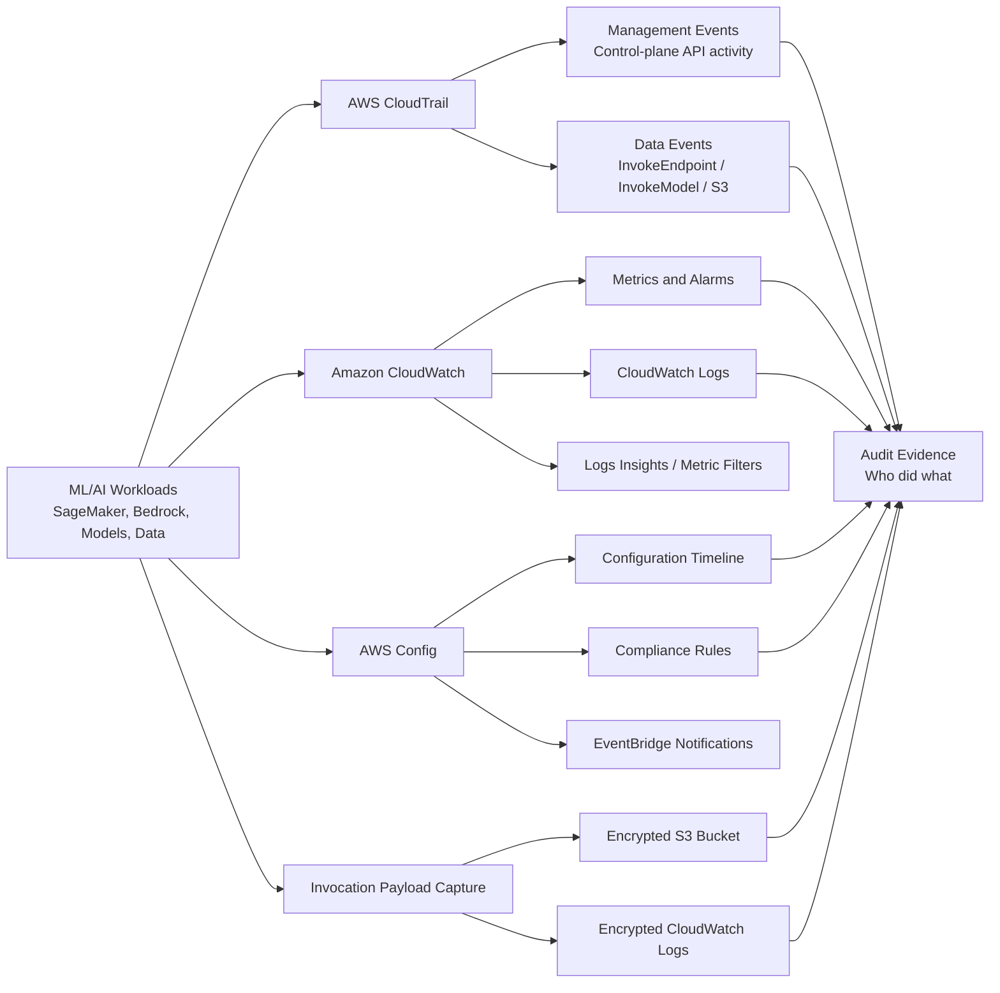

# Task 4.3: Operating, Monitoring, and Securing ML and AI Solutions - Secure ML and AI workloads and model endpoints

## Skill 4.3.4: Configure comprehensive monitoring, auditing, compliance, and logging for ML and AI systems (for example, AWS CloudTrail, AWS Config)

### Overview

This skill focuses on building a complete governance and observability layer for machine learning and AI workloads. The goal is to answer questions such as:

- Who invoked a model, changed an endpoint, or accessed training data?
- Was the ML resource configured according to policy at a given point in time?
- Did the configuration drift from compliance?
- What input and output payloads flowed through a model endpoint?
- Is the ML system healthy, and are there unexpected errors or security signals?

A common exam mistake is treating all monitoring and logging services as interchangeable. In practice, each AWS service answers a different audit question. For ML and AI systems, you typically need at least three records working together:

1. **API activity record** – AWS CloudTrail answers *who did what and when*.
2. **Configuration record** – AWS Config answers *what did the resource look like, and was it compliant*.
3. **Operational and invocation record** – Amazon CloudWatch, SageMaker Data Capture, and Amazon Bedrock invocation logging answer *how is it behaving, and what payloads entered and left the model*.

---

### Core Services and What They Record

| AWS Service | Primary Purpose | ML/AI Example | Audit Question Answered |
|---|---|---|---|
| **AWS CloudTrail** | Records API activity and identity metadata | `CreateEndpoint`, `InvokeEndpoint`, `InvokeModel` | Who called which API, when, and from where? |
| **AWS Config** | Records resource configuration history and evaluates compliance rules | SageMaker endpoint configuration, S3 bucket encryption, KMS key rotation | Did the resource drift from policy? Is it compliant now? |
| **Amazon CloudWatch** | Collects operational metrics, logs, alarms, and dashboards | SageMaker endpoint latency, invocation errors, Bedrock metrics | Is the ML workload healthy? Are there error spikes? |
| **SageMaker Data Capture** | Captures input and output payloads from SageMaker endpoints | Request/response to a hosted model | What data entered and returned from the model? |
| **Amazon Bedrock Invocation Logging** | Captures prompts, responses, and model metadata from Bedrock | Prompt and foundation model response | What was sent to and returned from the foundation model? |

---

### AWS CloudTrail: API Auditing for ML and AI Systems

AWS CloudTrail provides an audit trail of API calls made in an AWS account. It records identity, time, source IP, operation, and request/response metadata.

#### Management Events vs. Data Events

This distinction is critical for the exam.

| Event Type | Default Status | ML/AI Examples | What It Records |
|---|---|---|---|
| **Management events** | Enabled by default | `CreateModel`, `CreateEndpointConfig`, `UpdateEndpoint`, `DeleteModel`, `CreateGuardrail` | Control-plane changes to ML resources |
| **Data events** | Must be explicitly configured | `InvokeEndpoint`, `InvokeModel`, `Converse`, S3 `GetObject`, Lambda `Invoke` | Data-plane calls, including model invocation and object-level data access |

A typical CloudTrail trail records management events automatically. However, model invocation calls such as SageMaker `InvokeEndpoint` and Amazon Bedrock `InvokeModel` are data events. If data events are not configured, the trail will not contain evidence that the model was invoked, even though the model served traffic.

#### What CloudTrail Does Not Record

- It does **not** record the actual inference request payload or response content.
- It does **not** evaluate configuration compliance.
- It does **not** capture application logs or performance metrics.
- It can capture S3 object-level access only when S3 data events are explicitly enabled.

For model payload content, use SageMaker Data Capture or Amazon Bedrock invocation logging.

#### CloudTrail Best Practices for ML/AI

- Enable a multi-Region organization trail for centralized audit across all accounts.
- Explicitly enable data events for:
  - SageMaker endpoints
  - Amazon Bedrock model invocations
  - S3 buckets containing training data, validation data, and model artifacts
- Use CloudTrail Lake for SQL-based audit queries across events.
- Encrypt CloudTrail logs with AWS KMS.
- Enable CloudTrail log file validation to detect tampering.
- Restrict CloudTrail log access using least privilege IAM policies.

---

### AWS Config: Configuration Compliance and Drift Detection

AWS Config continuously records the configuration of supported AWS resources and stores a historical timeline. It can evaluate resources against AWS managed or customer-defined rules.

#### What AWS Config Does for ML/AI

- Tracks when a SageMaker endpoint, notebook instance, S3 bucket, or KMS key configuration changes.
- Shows the relationship between resources, such as an endpoint referencing a model and an endpoint configuration.
- Evaluates rules such as:
  - SageMaker endpoint configuration requires KMS encryption
  - S3 bucket hosting training data must have server-side encryption enabled
  - Guardrails or model artifacts must be tagged correctly
- Produces compliance status:
  - `COMPLIANT`
  - `NON_COMPLIANT`
  - `INSUFFICIENT_DATA`
- Sends change notifications through Amazon EventBridge for automated remediation.

#### What AWS Config Does Not Do

- It does not record API invocation identity like CloudTrail.
- It does not capture model input/output payloads.
- It does not provide real-time operational metrics like CloudWatch.

#### Example Compliance Rule for ML

A security policy states: *All SageMaker endpoint configurations must use KMS encryption.*  
AWS Config can evaluate every endpoint configuration against this rule. When a developer creates an endpoint configuration without KMS encryption, AWS Config marks the resource as `NON_COMPLIANT` and emits a finding.

---

### Amazon CloudWatch: Operational Monitoring and Logs

Amazon CloudWatch provides operational visibility through metrics, logs, alarms, and dashboards. It is the primary service for detecting performance problems and security anomalies in running ML systems.

#### CloudWatch Metrics for ML/AI

| Metric Example | Service | Purpose |
|---|---|---|
| `Invocations` | SageMaker endpoint | Number of model invocation requests |
| `ModelLatency` | SageMaker endpoint | Time for the model to process a request |
| `OverheadLatency` | SageMaker endpoint | Time not spent by the model |
| `InvocationErrors` | SageMaker endpoint | Number of failed invocations |
| `ClientError`, `ServerError` | Amazon Bedrock | Errors in foundation model requests |
| `InvocationLatency` | Amazon Bedrock | Latency for foundation model invocations |

CloudWatch Alarms can trigger notifications when errors rise above a threshold, latency degrades, or invocation volume changes unexpectedly.

#### CloudWatch Logs for ML/AI

- SageMaker training jobs and endpoints can send application logs to CloudWatch Logs.
- Amazon Bedrock invocation logging can send prompts and responses to CloudWatch Logs.
- CloudWatch Logs Insights can be used to search for error patterns, sensitive data clues, or unexpected invocation behavior.
- Metric filters can convert log patterns into metrics and alarms.

---

### Capturing Model Invocation Payloads

CloudTrail data events record the metadata of a model invocation. They do not capture the actual request or response payload.

For compliance scenarios that require payload capture:

| Capture Mechanism | Service | Destination | Use Case |
|---|---|---|---|
| **SageMaker Data Capture** | Amazon SageMaker | S3 bucket or CloudWatch Logs | Capture requests and responses from SageMaker endpoints |
| **Amazon Bedrock Invocation Logging** | Amazon Bedrock | S3 bucket or CloudWatch Logs | Capture prompts and responses from foundation models |

These payload captures may contain sensitive data. Therefore:

- Encrypt the destination S3 bucket or log group with AWS KMS.
- Use IAM policies to restrict access to only audit and security principals.
- Consider using Amazon Bedrock Guardrails sensitive information filters to mask PII before logging.
- Do not embed payload capture bodies in CloudTrail; CloudTrail is not designed for that purpose.

---

### Bringing the Records Together

A complete compliance investigation for an ML system may require:

1. **CloudTrail management event** to show who changed an endpoint configuration.
2. **AWS Config timeline** to show the endpoint configuration before and after the change.
3. **CloudTrail data event** to show who invoked the model.
4. **SageMaker Data Capture or Bedrock invocation log** to show what data entered and returned.
5. **CloudWatch metrics** to show whether the change caused errors or latency degradation.

---

### Scenario-Based Exam Examples

#### Scenario 1: Auditing Model Invocation Identity

**Question:**  
An audit requires evidence of every `InvokeEndpoint` call made in an AWS account during the previous month. A CloudTrail trail already exists with default configuration. The auditor reports that no `InvokeEndpoint` events are present. What is the most likely cause?

**Options:**

- **A.** The trail was created in the wrong AWS Region.
- **B.** Data events were not configured on the trail.
- **C.** AWS Config was not enabled.
- **D.** The endpoint did not have CloudWatch logging enabled.

**Answer:** **B. Data events were not configured on the trail.**

**Explanation:**  
CloudTrail records management events by default. `InvokeEndpoint` is a data event and must be explicitly enabled. A multi-Region trail could capture events from all Regions, but the missing data events are the likely cause. AWS Config and CloudWatch do not record caller identity for API invocation in this manner.

---

#### Scenario 2: Detecting Configuration Drift

**Question:**  
A security team requires that all SageMaker endpoint configurations reference a KMS-encrypted model artifact bucket. A new endpoint is created with an unencrypted bucket. Which service is best suited to detect and report this violation over time?

**Options:**

- **A.** AWS CloudTrail
- **B.** Amazon CloudWatch Logs
- **C.** AWS Config
- **D.** Amazon Inspector

**Answer:** **C. AWS Config**

**Explanation:**  
AWS Config evaluates resource configurations against rules and records changes over time. It can mark the endpoint configuration as `NON_COMPLIANT` when it references an unencrypted bucket. CloudTrail shows who created it but does not evaluate configuration compliance. CloudWatch Logs store operational logs and do not perform configuration assessment. Amazon Inspector scans software vulnerabilities, not resource configuration rules.

---

#### Scenario 3: Capturing Model Input and Output for Compliance

**Question:**  
A compliance requirement states that a financial services company must retain the full input and output payloads of all requests to a SageMaker endpoint. The company already has AWS CloudTrail enabled with data events for `InvokeEndpoint`. Does this satisfy the requirement?

**Options:**

- **A.** Yes, because CloudTrail data events include the complete request and response body.
- **B.** No, because CloudTrail data events record API metadata but not the actual payload.
- **C.** Yes, because CloudTrail always stores payloads in encrypted S3 buckets.
- **D.** No, because only AWS Config records payload contents.

**Answer:** **B. No, because CloudTrail data events record API metadata but not the actual payload.**

**Explanation:**  
CloudTrail data events show that an `InvokeEndpoint` call was made, by whom, and when, but they do not contain the full inference payload. To capture request and response bodies, you must enable SageMaker Data Capture and store the output in an encrypted S3 bucket or CloudWatch Logs.

---

### Exam Tips and Traps

- **CloudTrail data events are not enabled by default.** If a question states that an existing trail lacks model invocation events, the likely answer is to configure data events.
- **CloudTrail records API metadata, not payloads.** Do not select CloudTrail when the requirement is to capture model input/output content.
- **AWS Config records configuration and compliance, not API activity.** Do not choose AWS Config when the question asks who invoked a model or accessed an object.
- **Amazon CloudWatch is for operational monitoring.** Use it for latency, errors, invocations, and alarms, not for caller identity or configuration history.
- **For payload-level invocation records, use SageMaker Data Capture for SageMaker endpoints or Amazon Bedrock invocation logging for Bedrock.**
- **If sensitive data is involved, encrypt logs and payload captures with AWS KMS.** Also restrict access using least privilege IAM policies.
- **A compliance investigation often needs multiple services together.** Do not try to answer a compliance question with only one log source if the requirement spans configuration, identity, and payload.
- **CloudTrail management events answer who changed the endpoint.** Data events answer who called the endpoint. Payload logging answers what entered and returned.
- **AWS Config can send compliance changes to Amazon EventBridge.** Use this for automated response, such as notifying security or running remediation.
- **Use KMS CMKs for log encryption.** This enables key-use auditing and prevents unauthorized log access.

---

### Summary

| Requirement | Best Service or Feature |
|---|---|
| Who invoked a model, when, and from where? | AWS CloudTrail data events |
| Who created, updated, or deleted an ML resource? | AWS CloudTrail management events |
| Is an ML resource configured according to policy? | AWS Config rules |
| When did an ML resource configuration change? | AWS Config timeline |
| What payloads entered and returned from a model? | SageMaker Data Capture or Bedrock Invocation Logging |
| Is the ML system experiencing high errors or latency? | Amazon CloudWatch metrics and alarms |
| Where can I query audit logs at scale? | CloudTrail Lake or CloudWatch Logs Insights |
| How can I protect logs and captured payloads? | AWS KMS encryption and IAM least privilege |