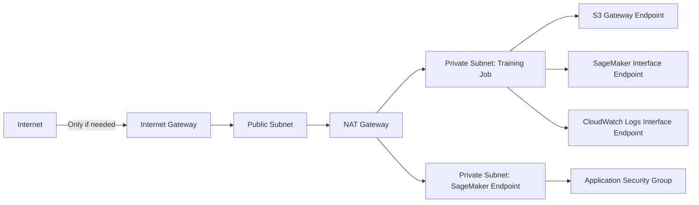

# Task 4.3: Operating, Monitoring, and Securing ML and AI Solutions - Secure ML and AI workloads and model endpoints

## Skill 4.3.6: Create VPCs, subnets, and security groups to securely isolate ML and AI systems

### Overview

This skill is about controlling the **network reachability** of machine learning and AI workloads. A model endpoint, training job, notebook, or data store should be exposed only to the traffic that genuinely needs to reach it.

Key idea:  
A VPC isolates the network path. Subnets decide what can reach the internet or other subnets. Security groups decide which traffic is allowed to and from the ML resource itself.

Network isolation is a separate control from identity, encryption, and content safeguards:

- **IAM** controls who may call APIs and access resources.
- **KMS** controls encryption of data at rest.
- **Security groups and VPCs** control network reachability.
- **Guardrails** control content in prompts and responses.

A private network path does not remove the need for IAM least-privilege permissions, and IAM permissions do not fix a missing VPC endpoint or a failed network route.

---

### Core Networking Components for ML/AI Isolation

| Component | What it does | Security role for ML/AI |
|---|---|---|
| **Amazon VPC** | Isolated virtual network in an AWS Region | Hosts training jobs, notebooks, and inference endpoints in a private network |
| **Subnet** | A range of IP addresses within a VPC | Public subnets can reach the internet; private subnets should hold sensitive ML workloads |
| **Route table** | Determines where subnet traffic goes | A private subnet has no route to an internet gateway |
| **Internet gateway** | Allows inbound/outbound internet access | Should not be attached to a fully isolated ML system |
| **NAT gateway** | Allows outbound-only internet from private subnets | Use only when necessary; VPC endpoints are preferred for AWS service access |
| **Security group** | Stateful, instance/ENI-level firewall | Allows only required traffic, such as HTTPS from an application security group |
| **VPC endpoint / AWS PrivateLink** | Private connection from VPC to AWS services | Keeps SageMaker, S3, CloudWatch, and Bedrock calls off the internet |
| **Network ACL** | Optional stateless subnet-level firewall | Adds a second boundary, but security groups are the primary control for most ML tasks |

---

### Public vs Private Subnets

| Subnet type | Route table | Typical use in ML/AI |
|---|---|---|
| **Public subnet** | Has a route `0.0.0.0/0` to an internet gateway | Load balancers, bastion hosts, or resources that must accept inbound internet traffic |
| **Private subnet** | No route to an internet gateway | SageMaker training jobs, processing jobs, notebooks, and model endpoints |
| **Private subnet with NAT** | `0.0.0.0/0` to a NAT gateway | When outbound internet is needed for package downloads or software updates |
| **Private subnet with VPC endpoints** | Routes local traffic to VPC endpoints | Preferred for production ML/AI workloads that need AWS service access only |

A common production ML architecture is:

For strict isolation, remove the internet gateway and NAT gateway from the sensitive workload path entirely.

---

### Security Group Behavior for ML Workloads

Security groups act as a virtual firewall at the network interface level.

Key facts:

- **Default inbound:** deny all traffic.
- **Default outbound:** allow all traffic.
- **Stateful:** If inbound traffic is allowed, return traffic is automatically allowed.
- A security group can use another security group as a source or destination.
- A security group cannot explicitly deny traffic; it only allows.

Example security group placement:

| Security Group | Direction | Protocol/Port | Source/Destination | Purpose |
|---|---|---|---|---|
| `app-sg` | Inbound | HTTPS/443 | Trusted client CIDR or load balancer SG | Allow application requests |
| `endpoint-sg` | Inbound | HTTPS/443 | `app-sg` | Allow only application tier to call the model endpoint |
| `endpoint-sg` | Outbound | HTTPS/443 | VPC endpoints | Allow logs/metrics to CloudWatch |
| `training-sg` | Inbound | None | None | Training jobs usually do not need inbound access |
| `training-sg` | Outbound | HTTPS/443 | S3 prefix list, SageMaker endpoint, CloudWatch Logs | Allow required AWS service access |

Using a security group as the source is more scalable than using individual IP addresses because new application instances can be automatically allowed once they use the correct security group.

---

### VPC Endpoints for Private ML/AI Service Access

When ML workloads run in private subnets without internet access, they still commonly need to call AWS services.

| AWS Service | Typical endpoint type | ML/AI use |
|---|---|---|
| **Amazon S3** | Gateway endpoint | Read training data and write model artifacts |
| **Amazon SageMaker API** | Interface endpoint | Create training jobs, models, and endpoints |
| **Amazon SageMaker Runtime** | Interface endpoint | Invoke a SageMaker-hosted model endpoint privately |
| **Amazon CloudWatch Logs** | Interface endpoint | Send logs and metrics from training and inference |
| **Amazon ECR** | Interface endpoint | Pull container images for training or inference |
| **Amazon Bedrock / Bedrock Runtime** | Interface endpoint | Invoke foundation models privately |
| **AWS Secrets Manager** | Interface endpoint | Retrieve API keys or credentials from the private network |
| **AWS STS** | Interface endpoint | Obtain temporary credentials for workload roles |

Important distinction:

- **Gateway endpoint for S3** uses a route table entry and does not require an ENI.
- **Interface endpoints** use an ENI and a private IP address inside the VPC.

A VPC endpoint controls the network path. It does **not** replace IAM. You should still use IAM policies and, where applicable, VPC endpoint policies to restrict what can be accessed through the endpoint.

---

### ML/AI Isolation Patterns

#### 1. SageMaker Training Job in a Private Subnet

A typical isolated training job:

- Runs in private subnets across multiple Availability Zones.
- Has no internet gateway route.
- Reads data from S3 through a **gateway VPC endpoint**.
- Pulls container images from ECR through an **interface VPC endpoint**.
- Writes logs and metrics to CloudWatch through an **interface VPC endpoint**.
- Calls SageMaker control plane APIs through a **SageMaker API interface endpoint**.
- Uses a security group that allows only required outbound traffic.

If the job fails to reach S3 or CloudWatch, the most likely cause is a missing route or missing VPC endpoint, not an IAM policy failure.

#### 2. SageMaker Hosted Endpoint Accessible Only from an Application

To keep a model endpoint private:

- Place the endpoint in a private subnet.
- Use a security group that allows inbound HTTPS only from the application security group.
- Do not expose the endpoint directly to the internet.
- Use a SageMaker Runtime interface endpoint if the application itself runs in a private subnet without internet access.
- Use IAM or token-based authorization to control who can invoke the endpoint.

#### 3. Amazon Bedrock Private Invocation

To invoke Amazon Bedrock foundation models from a private VPC:

- Create an interface VPC endpoint for **Amazon Bedrock**.
- Create an interface VPC endpoint for **Bedrock Runtime** if needed.
- Attach an endpoint policy that limits which models or actions can be invoked.
- Use IAM roles with least privilege for the application calling Bedrock.

This keeps foundation model traffic within the AWS network rather than using public internet endpoints.

---

### Scenario-Based Example Questions

#### Scenario 1

A machine learning engineer launches a SageMaker training job in a private subnet. The job starts, but it fails when it attempts to read training data from Amazon S3. The VPC has no internet gateway and no VPC endpoints configured. The training job's IAM role has `s3:GetObject` permission.

Which action should resolve the issue while preserving network isolation?

**A.** Add a NAT gateway to the private subnet  
**B.** Add a gateway VPC endpoint for Amazon S3 and update the private subnet route table  
**C.** Add an inbound `0.0.0.0/0` rule to the training job security group  
**D.** Make the S3 bucket public  

**Correct Answer:** **B**

**Explanation:**  
The training job is in a private subnet with no internet route. To reach Amazon S3 without opening the subnet to the internet, use a gateway VPC endpoint for S3 and add the corresponding route to the private subnet route table. A NAT gateway would provide outbound internet, but it is not required for S3 access and may violate a strict network isolation requirement. A security group inbound rule does not fix outbound routing. Making the bucket public is a data exposure risk and does not address private network routing.

---

#### Scenario 2

A company runs a SageMaker real-time inference endpoint that processes sensitive customer data. The endpoint must be reachable only by the application tier running in the same VPC. The application tier uses a security group named `app-sg`.

Which security group configuration should be applied to the endpoint?

**A.** Inbound: HTTPS/443 from `0.0.0.0/0`  
**B.** Inbound: HTTPS/443 from `app-sg`; outbound: all  
**C.** Inbound: all traffic from VPC CIDR `10.0.0.0/16`; outbound: all  
**D.** Place the endpoint in a public subnet and allow all inbound traffic from the application IP range  

**Correct Answer:** **B**

**Explanation:**  
The most restrictive correct configuration is to allow inbound HTTPS only from the `app-sg` security group. This allows the application tier to call the model while preventing arbitrary VPC resources or internet hosts from reaching it. Allowing `0.0.0.0/0` or the full VPC CIDR is too broad. Placing the endpoint in a public subnet increases exposure.

---

#### Scenario 3

An application in a private subnet needs to invoke Amazon Bedrock foundation models without sending requests over the public internet. The organization requires that only the application role can call the model.

Which combination of controls meets these requirements?

**A.** Add an internet gateway to the application subnet.  
**B.** Create a Bedrock VPC interface endpoint and use an endpoint policy to restrict access.  
**C.** Add a NAT gateway and allow all outbound traffic.  
**D.** Add an inbound rule allowing `0.0.0.0/0` to the application security group.  

**Correct Answer:** **B**

**Explanation:**  
A Bedrock VPC interface endpoint provides private connectivity from the VPC to Amazon Bedrock. The endpoint policy can restrict which principals or actions may use the endpoint. This keeps traffic off the public internet while enforcing least-privilege access. Internet gateways and NAT gateways are unnecessary and may reduce isolation. Inbound rules on the application security group do not control outbound private connectivity to Bedrock.

---

### Exam Tips and Traps

#### Tips

- For private S3 access from ML workloads, think **S3 gateway endpoint** or **S3 interface endpoint**. The gateway endpoint is the cost-effective, route-based option for workloads inside a VPC.
- For SageMaker API calls from private subnets, use **SageMaker API interface endpoints**.
- For private model invocation, use **SageMaker Runtime interface endpoints** or **Bedrock Runtime interface endpoints**.
- When a training job or notebook in a private subnet fails to reach a service, check for missing **VPC endpoints** before broadening security groups or roles.
- Use security group references, such as allowing `app-sg`, instead of broad CIDR ranges where possible.
- Prefer custom VPCs with private subnets over the default VPC for production ML/AI workloads.
- Combine network isolation with IAM least privilege, encryption, logging, and monitoring for defense in depth.
- A private subnet with no NAT and no internet gateway is appropriate when the workload only needs AWS service access through VPC endpoints.

#### Traps

- Do not confuse **subnet routing** with **security group rules**. A subnet may be routing-private, but an open security group can still expose the workload. Conversely, a restrictive security group does not fix a missing VPC endpoint or internet route.
- Do not add a NAT gateway unless the workload requires outbound internet. Many AWS services can be reached privately with VPC endpoints.
- Do not use an internet gateway for a workload that should be isolated. An internet gateway makes public subnets internet-reachable.
- Do not replace IAM with VPC endpoints. A VPC endpoint controls the network path; IAM controls authorization.
- Do not open `0.0.0.0/0` inbound on a model endpoint security group unless the endpoint is explicitly intended to be public and internet-facing.
- Security groups are stateful. If you allow inbound HTTPS from the application, return traffic is automatically allowed. However, new outbound connections to CloudWatch, S3, or Bedrock still need a network path and appropriate rules.
- A missing VPC endpoint often causes a job to hang or fail with a network timeout, not an `AccessDenied` IAM error. An `AccessDenied` error usually points to IAM policy issues.
- Amazon S3 gateway endpoints are route-based. An interface endpoint is ENI-based. The exam may expect you to distinguish where each is appropriate.
- VPC isolation protects the **network path**, but it does not inspect model input and output. For prompt safety and PII redaction, use Amazon Bedrock Guardrails or another content safeguard.

---

### Quick Recall Checklist

For secure ML/AI network isolation, verify the following:

- Custom VPC with private subnets across multiple Availability Zones.
- No internet gateway route to ML training or inference subnets.
- Security groups allow only required traffic from trusted sources.
- S3 access through a gateway or interface VPC endpoint.
- SageMaker, CloudWatch, ECR, Bedrock, and Secrets Manager access through interface endpoints where needed.
- IAM roles remain least privilege even when network is private.
- Model endpoints have inbound access from an application security group, not `0.0.0.0/0`.
- Training jobs and notebooks do not depend on public internet unless required and explicitly approved.
- Logging, monitoring, and encryption are configured alongside network isolation.

This skill is not only about building the network; it is about placing ML and AI systems in a path that limits exposure while still allowing the AWS services they depend on to operate privately.