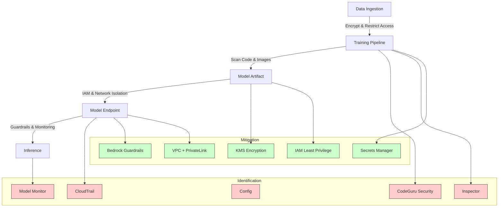

# Task 4.3: Operating, Monitoring, and Securing ML and AI Solutions - Secure ML and AI workloads and model endpoints

## Skill 4.3.7: Identify and mitigate security risks and vulnerabilities in ML and AI systems

### 1. Introduction

Security in machine learning (ML) and artificial intelligence (AI) systems extends beyond traditional application security. It encompasses the entire ML lifecycle: data ingestion, model training, model deployment, and inference. Threats can arise at any stage—poisoned training data, vulnerable dependencies in a training container, over‑permissive IAM roles, unprotected endpoints, or adversarial prompts that manipulate model behavior.

The goal of this skill is to **recognize security risks specific to ML/AI workloads** and **apply appropriate AWS services and best practices** to mitigate them. This includes both preventive measures (e.g., least privilege, encryption, network isolation) and detective measures (e.g., scanning, monitoring, auditing).

### 2. Common Security Risks in ML and AI Systems

Risks can be grouped into four layers: **data**, **model**, **infrastructure/pipeline**, and **application/inference**. The table below summarizes them.

| Layer | Risk | Description | Potential Consequence |
|-------|------|-------------|----------------------|
| **Data** | Data poisoning | Malicious or biased data introduced during training | Model learns incorrect behavior, degraded performance |
| | Data leakage | Sensitive training data exposed through model outputs | Privacy violations, compliance breaches |
| | Unauthorized access | Misconfigured S3 bucket or data store | Data exfiltration, tampering |
| **Model** | Model theft | Extraction of model parameters or functionality | Loss of intellectual property, revenue |
| | Adversarial inputs | Crafted inputs cause misclassification or unexpected outputs | Wrong predictions, safety incidents |
| | Model inversion | Reconstruct training data from model outputs | Privacy breach |
| | Membership inference | Determine if a record was in training set | Privacy breach |
| **Infrastructure/Pipeline** | Vulnerable dependencies | Outdated libraries or packages in container images | Exploitation, system compromise |
| | Hardcoded credentials | Secrets embedded in code or images | Credential theft, unauthorized access |
| | Over‑permissive IAM | Roles with broader permissions than needed | Lateral movement, data breach |
| | Network exposure | Public endpoints, open security groups | Unauthorized access, data exfiltration |
| | Unvalidated third‑party artifacts | Model or code from untrusted source | Malware, backdoors |
| **Application/Inference** | Prompt injection | Malicious instructions in user input manipulate model | Unauthorized actions, data disclosure |
| | Insecure output handling | Model response used unsafely (e.g., XSS) | Client‑side attacks |
| | Sensitive data leakage | PII in prompts or responses not filtered | Compliance violation, reputational damage |
| | Insufficient logging | No record of model invocations | Inability to audit or investigate incidents |

### 3. Identifying Security Risks and Vulnerabilities

AWS provides a suite of services to **detect risks across the ML lifecycle**. The appropriate tool depends on what you are examining:

| AWS Service / Feature | What It Inspects | Example Risk Identified |
|------------------------|------------------|-------------------------|
| **Amazon CodeGuru Security** | Application source code (static analysis) | Hardcoded secrets, code injection, insecure patterns |
| **Amazon Inspector** | EC2 instances, container images (ECR), Lambda functions | Known CVEs in packages, unintended network exposure |
| **AWS Config** | Resource configurations over time | Public S3 bucket, open security group, misconfigured endpoint |
| **IAM Access Analyzer** | IAM policies and resource‑based policies | Overly permissive cross‑account access, external sharing |
| **AWS CloudTrail** | API activity (management and data events) | Who invoked model, from where, at what time |
| **Amazon Bedrock Guardrails** | Prompts and model responses | Prompt injection, denied topics, PII leakage |
| **Amazon SageMaker Model Monitor** | Data and model quality metrics over time | Data drift, bias, possible poisoning |
| **VPC Flow Logs** | Network traffic metadata | Unexpected traffic patterns, attempts to reach internet |
| **Amazon CloudWatch** | Logs, metrics, alarms | Anomalous invocation rates, error spikes |

**Key insight**: No single tool covers all risks. A robust detection strategy combines source code scanning, image scanning, configuration monitoring, and runtime inspection.

### 4. Mitigating Security Risks and Vulnerabilities

Mitigations should be layered and mapped to specific risks. The table below pairs common risks with appropriate AWS mitigations.

| Risk Category | Mitigation Strategies | Relevant AWS Services |
|---------------|-----------------------|-----------------------|
| **Data poisoning** | – Use data validation and sanitization – Monitor data drift – Restrict write access to training data | Amazon SageMaker Data Wrangler, Model Monitor, IAM, S3 bucket policies |
| **Data leakage / privacy** | – Encrypt data at rest and in transit – Apply sensitive information filters on outputs – Use differential privacy techniques | AWS KMS, Amazon Bedrock Guardrails, Amazon Macie (optional) |
| **Model theft** | – Restrict model access via IAM and network isolation – Use VPC endpoints to avoid public exposure – Encrypt model artifacts | IAM, Amazon VPC, AWS KMS |
| **Adversarial inputs** | – Implement input validation and quality checks – Monitor model performance for anomalies | Amazon SageMaker Model Monitor, custom logic (not code here) |
| **Vulnerable dependencies** | – Scan container images in CI/CD – Fail pipeline on critical findings – Keep base images updated | Amazon Inspector, Amazon ECR image scanning |
| **Hardcoded credentials** | – Static code analysis to detect secrets – Retrieve secrets at runtime from a secrets manager – Rotate credentials automatically | Amazon CodeGuru Security, AWS Secrets Manager |
| **Over‑permissive IAM** | – Apply least privilege policies – Use roles with temporary credentials for production – Review with IAM Access Analyzer | IAM, AWS STS |
| **Network exposure** | – Isolate resources in private subnets – Restrict security group inbound/outbound rules – Use VPC endpoints for private API access | Amazon VPC, AWS PrivateLink, Gateway Endpoints |
| **Prompt injection / harmful content** | – Configure guardrails with content filters, denied topics, word filters – Use contextual grounding checks for RAG applications | Amazon Bedrock Guardrails |
| **Sensitive data in responses** | – Apply sensitive information filters (PII redaction) – Mask or block outputs containing PII | Amazon Bedrock Guardrails |
| **Insufficient logging** | – Enable CloudTrail data events for model invocations – Configure AWS Config rules for compliance – Set up CloudWatch alarms | AWS CloudTrail, AWS Config, Amazon CloudWatch |

### 5. Layered Defense Architecture

A typical secure ML system combines multiple controls. The following mermaid diagram illustrates how risks are identified and mitigated at different stages of the ML pipeline.

### 6. Scenario‑Based Examples

#### Scenario 1: Vulnerable Dependencies in a Training Container

**Problem**: A data science team builds a custom training container for SageMaker. Before deployment, they run static analysis on their Python code. The pipeline passes. Shortly after, a security audit flags known vulnerabilities in the container’s base image.

**Question**: Which additional control should the team add to the CI/CD pipeline to catch this?

**A.** Add Amazon CodeGuru Security to scan application code.  
**B.** Add Amazon Inspector to scan the container image for CVEs.  
**C.** Add AWS Config rules to monitor the training job configuration.  
**D.** Add Amazon GuardDuty to monitor network traffic.

**Correct Answer**: **B. Amazon Inspector**

**Explanation**:  
- **Amazon Inspector** scans container images (including those in Amazon ECR) for known software vulnerabilities in the base image and dependencies.  
- **CodeGuru Security** scans application source code for security issues like hardcoded secrets, not base image vulnerabilities.  
- **AWS Config** evaluates resource configurations, not software packages.  
- **GuardDuty** is a threat detection service for network and account activity, not image scanning.

---

#### Scenario 2: Prompt Injection and Sensitive Data Leakage

**Problem**: An organization deploys a customer‑facing chatbot using Amazon Bedrock. The chatbot has access to a database of customer orders. During testing, an attacker crafts a prompt that causes the model to reveal another user’s account number in the response.

**Question**: Which configuration would **most directly** prevent the model from returning customer account numbers in its responses?

**A.** Place the Bedrock endpoint in a private VPC subnet.  
**B.** Enable CloudTrail data events for the Bedrock API calls.  
**C.** Configure a sensitive information filter in Amazon Bedrock Guardrails.  
**D.** Use IAM roles to restrict access to the Bedrock model.

**Correct Answer**: **C. Configure a sensitive information filter in Amazon Bedrock Guardrails**

**Explanation**:  
- **Bedrock Guardrails** includes a sensitive information filter that can detect, mask, or block PII (like account numbers) in both prompts and responses.  
- **A** (private VPC) limits network exposure but does not inspect content.  
- **B** (CloudTrail data events) logs activity but cannot prevent data leakage.  
- **D** (IAM roles) controls who can call the model, not what the model outputs.

---

#### Scenario 3: Over‑Permissive IAM Role on a Training Job

**Problem**: A training job is failing with an `AccessDenied` error when writing to an S3 bucket. To resolve it, a developer attaches the `AmazonS3FullAccess` managed policy to the training role. The job succeeds, but a security review later flags the role as over‑permissive.

**Question**: What is the **correct** least‑privilege fix?

**A.** Add a policy that grants only the required `s3:PutObject` action on the specific bucket and prefix.  
**B.** Allow all `s3:*` actions but only within the VPC.  
**C.** Add the `AmazonSageMakerFullAccess` policy to the role.  
**D.** Move the training job into a public subnet to bypass the permission issue.

**Correct Answer**: **A. Add a policy that grants only the required `s3:PutObject` action on the specific bucket and prefix**

**Explanation**:  
- The error message identifies the missing action and resource. The least‑privilege response is to grant exactly that permission on the exact resource.  
- **B** still over‑grants actions.  
- **C** grants broad SageMaker permissions unrelated to S3.  
- **D** does not address IAM and creates a network exposure.

---

#### Scenario 4: Missing Audit Trail for Model Invocations

**Problem**: An audit requests all records of model invocation calls made via Amazon SageMaker. The team has an existing CloudTrail trail but no invocation records appear.

**Question**: What is the most likely cause?

**A.** The trail is not multi‑Region.  
**B.** Data events are not enabled for the trail.  
**C.** The trail lacks KMS encryption.  
**D.** AWS Config rules have not been created for the endpoint.

**Correct Answer**: **B. Data events are not enabled for the trail**

**Explanation**:  
- By default, CloudTrail records only **management events** (e.g., creating an endpoint). Model invocations are **data events** and must be explicitly configured.  
- Multi‑Region is not required if the trail covers the endpoint’s Region; KMS encryption does not affect event capture; Config is for configuration changes, not API calls.

### 7. Exam Tips and Traps

- **Tool–function mapping is critical.** Know that Inspector = vulnerability scanning of images/instances, CodeGuru Security = static analysis of code, Config = configuration drift, CloudTrail = API activity logging, Guardrails = content filtering.
- **Data events vs. management events.** Many questions assume CloudTrail automatically captures data‑plane API calls (like `InvokeEndpoint`). It does **not** unless configured.
- **Widening permissions is a common trap.** If a question presents an access‑denied error and suggests adding a broad policy, the correct answer is almost always a narrowly scoped policy that grants the specific action on the specific resource.
- **Guardrails is not an access control.** It filters content; IAM and VPC control who can call the model. Do not confuse the two.
- **Encryption does not solve connectivity or permissions.** KMS encrypts data, but it does not allow private network access or grant API permissions.
- **VPC endpoints fix network isolation, not content inspection.** If a training job in a private subnet fails to reach S3, the answer is a VPC endpoint, not an IAM policy or encryption.
- **Static code scanning and image scanning are complementary.** One checks source code, the other checks built artifacts. A pipeline should include both.
- **Prompt injection and PII leakage require guardrails.** Traditional security tools (Inspector, IAM, VPC) do not inspect model input/output.
- **Consider the ML lifecycle.** Risks can appear at any stage from data to inference. The correct mitigation addresses the stage where the risk originates.

### 8. Summary Table: Risk → Tool → Mitigation

| Risk | Primary Detection Tool | Primary Mitigation |
|------|------------------------|--------------------|
| Hardcoded credentials in code | Amazon CodeGuru Security | Remove secrets, use AWS Secrets Manager |
| Vulnerabilities in container image | Amazon Inspector | Patch base image, rebuild |
| Over‑permissive IAM role | IAM Access Analyzer, Access Advisor | Scoped policy with least privilege |
| Publicly exposed endpoint | AWS Config, VPC Flow Logs | Move to private subnet, use VPC endpoints |
| Model invocation not logged | CloudTrail (check data events) | Enable data events for model APIs |
| Prompt injection / harmful content | Amazon Bedrock Guardrails | Content filters, denied topics |
| PII in model responses | Amazon Bedrock Guardrails | Sensitive information filter (mask/block) |
| Data drift / possible poisoning | SageMaker Model Monitor | Retrain, investigate data source |
| Unauthorized cross‑account access | IAM Access Analyzer | Tighten resource policies |

### 9. Final Thoughts

Identifying and mitigating security risks in ML and AI systems requires a **holistic view** of the ML pipeline, from data to model to infrastructure to inference. The correct answer on the exam will often hinge on recognizing the **layer** at which the risk occurs and selecting the **appropriate AWS service** for that layer. Always remember to:

1. **Identify** the risk with the right detective tool.
2. **Mitigate** with the least‑privilege, network‑isolated, encrypted, and filtered approach.
3. **Verify** through continuous monitoring and logging.

By mastering this skill, you demonstrate the ability to secure ML workloads end‑to‑end, a core responsibility in the AWS Certified Machine Learning – Associate exam.