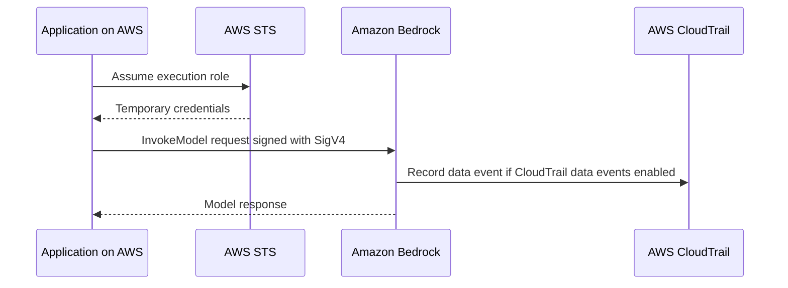
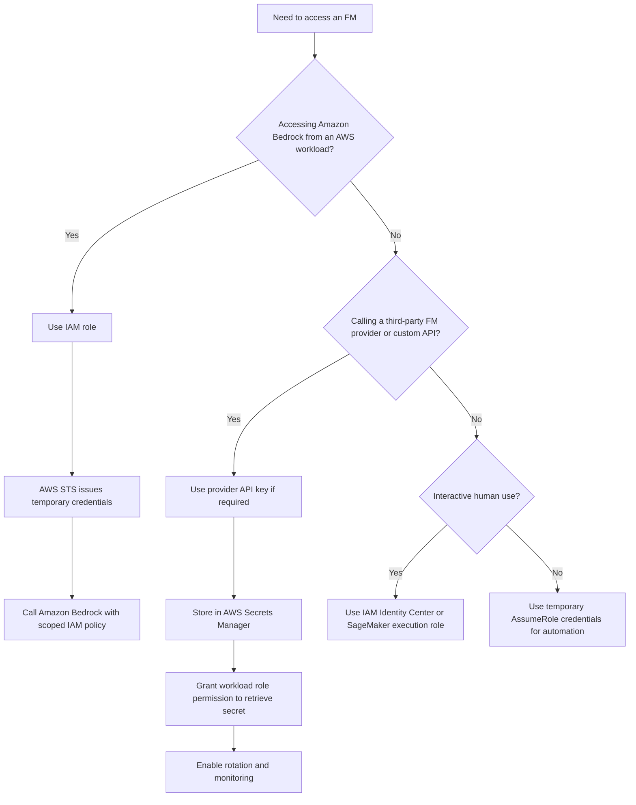

# Task 4.3: Operating, Monitoring, and Securing ML and AI Solutions - Secure ML and AI workloads and model endpoints

## Skill 4.3.8: Select the appropriate credential type to access FMs (for example, Amazon Bedrock API keys, IAM credentials)

### Overview

This skill tests your ability to choose how an identity or application authenticates to a foundation model (FM). On AWS, the most common FM access path is through **Amazon Bedrock**, but the exam may also ask about **third-party FM providers** that use API keys, or about custom API layers built in front of a model.

The central rule for the exam is:

> **Production workloads use temporary, scoped IAM credentials from an IAM role. Long-lived static API keys or IAM user access keys are primarily development or legacy credentials and should be avoided for production.**

---

### Key credential types at a glance

| Credential type | Typical user | Lifetime | Best use | Exam treatment |
|---|---|---|---|---|
| **IAM role with temporary credentials** | Applications running on AWS, such as Lambda, SageMaker, ECS, EC2 | Temporary, rotated automatically by AWS STS | Production access to Amazon Bedrock | Usually the correct answer for production workloads |
| **IAM Identity Center / federated identity** | Human users, analysts, data scientists | Short-lived, refreshed through SSO | Console access, SageMaker Studio, CLI development | Preferred for human access over IAM users |
| **IAM user long-term access key** | Legacy users or local scripts | Long-lived until manually rotated | CLI development only under limited circumstances | Usually a distractor for production |
| **Short-term API key or temporary session credential** | User sessions, temporary exploration | Expires with the identity session | Notebook exploration, sandbox testing | Acceptable for short-term or exploratory use if properly scoped |
| **Long-term API key** | Third-party FM providers, API Gateway APIs | Long-lived or set expiration | Development or external model ecosystems | Store in **AWS Secrets Manager**; never in code or image |
| **Amazon Cognito identity pool credentials** | End users of web/mobile applications | Temporary | Client applications that call AWS services through a secure backend | Correct for end-user identity, not backend workload credentials |

---

### Amazon Bedrock authentication: IAM-first

A common misconception is that Amazon Bedrock uses standalone "API keys." For native AWS access, **Amazon Bedrock uses AWS IAM credentials and AWS Signature Version 4**.

To invoke a model through Amazon Bedrock, the caller must have:

1. **An IAM identity** — usually an IAM role assumed by the calling AWS service.
2. **An identity-based policy** that allows the correct Bedrock action, such as:
   - `bedrock:InvokeModel`
   - `bedrock:Converse`
3. **Model access enabled** for the account or delegated identity through Amazon Bedrock model access settings.
4. **Least-privilege resource scoping** — the policy should only allow access to the specific foundation models required.

The request is then signed with the caller's temporary AWS credentials and authorized by IAM.

---

### Credential selection decision framework

Use this decision flow to match the credential type to the scenario.

---

### Production best practices

For any production application calling Amazon Bedrock:

- Use an **IAM role** attached to the compute service:
  - **Lambda:** Lambda execution role
  - **Amazon SageMaker:** SageMaker execution role
  - **Amazon ECS:** ECS task role
  - **Amazon EC2:** Instance profile
- Do not generate a long-term IAM user access key and embed it in:
  - Application code
  - Container images
  - Environment variables
  - User data scripts
- If a third-party FM requires an API key, store that key in **AWS Secrets Manager**.
- Grant the production role permission to call `secretsmanager:GetSecretValue` for that specific secret.
- Use automatic rotation when the third-party provider supports it.
- Use **CloudTrail data events** if you need to log every model invocation, such as `bedrock:InvokeModel`. These are not captured by default.

---

### Scenario-based examples

#### Scenario 1: Production Lambda function calls Amazon Bedrock

A production Lambda function needs to call Amazon Bedrock to generate product summaries. The security team forbids long-lived static credentials.

**Which credential approach should you use?**

- **Correct answer:** Use the Lambda execution role and attach a policy allowing `bedrock:InvokeModel` on the required model. AWS automatically supplies temporary credentials to the Lambda function.
- **Why:** This is the AWS best practice. It provides short-lived, automatically rotated credentials with clear CloudTrail attribution.

**Incorrect answers to avoid:**

- Generate an IAM user access key and store it in the Lambda environment variables.
- Generate an API key once and bake it into the Lambda container image.
- Store an API key in Secrets Manager but give the Lambda function broad `bedrock:*` access.

---

#### Scenario 2: Data scientist working in Amazon SageMaker Studio

A data scientist works in Amazon SageMaker Studio and needs to test foundation models interactively.

**Which credential method should be used?**

- **Correct answer:** Use the **SageMaker execution role** associated with the Studio notebook or app. Add scoped Bedrock permissions to that role.
- **Why:** SageMaker automatically assumes that execution role and supplies temporary credentials. This avoids creating IAM users and long-term access keys for each data scientist.

Alternative acceptable for human console access: **AWS IAM Identity Center** with temporary credentials.

---

#### Scenario 3: Third-party FM provider requires an API key

A machine learning team uses a third-party model provider that uses a long-lived API key. A production application on Amazon ECS must call that provider securely.

**Which solution is appropriate?**

- **Correct answer:** Store the API key in **AWS Secrets Manager**, rotate it according to the provider's policy, and allow the ECS task role to read only that secret.
- **Why:** Secrets Manager protects, rotates, and audits retrieval of long-term secrets. The ECS task still uses an IAM role to access the secret; the third-party key is not placed in code.

---

#### Scenario 4: Public web application invokes Amazon Bedrock

A serverless web application has signed-in end users and a backend Lambda function that calls Amazon Bedrock.

**Which credential approach should the backend use?**

- **Correct answer:** The backend Lambda function uses its **Lambda execution role** with `bedrock:InvokeModel` permission. End users authenticate with **Amazon Cognito**. Do not issue long-term AWS credentials or Bedrock API keys to end users.
- **Why:** End-user access should be federated through Cognito and the backend should use its own IAM role. This keeps credential handling centralized and avoids exposing AWS credentials to the browser.

---

### Common credential scenarios summary

| Scenario | Preferred credential |
|---|---|
| Production EC2/Lambda/ECS/SageMaker workload calling Bedrock | IAM role with temporary credentials |
| Human analyst using the AWS Console | IAM Identity Center or federation |
| Local CLI development | IAM Identity Center temporary credentials |
| Third-party FM provider API key | Store in AWS Secrets Manager |
| Public mobile/web app end users | Amazon Cognito identity pool credentials |
| CI/CD pipeline needing Bedrock access | IAM role assumed via OIDC federation or IAM Roles Anywhere |
| On-premises server needing Bedrock access | IAM Roles Anywhere with temporary credentials |

---

### How this skill connects to other security controls

| Control | Purpose | Relationship to credentials |
|---|---|---|
| **IAM policies and roles** | Define who can call what on which resource | Primary credential and authorization boundary |
| **AWS Secrets Manager** | Store and rotate long-lived static secrets | Holds third-party API keys, not IAM roles |
| **AWS CloudTrail** | Record API activity and principal identity | Temporarily assumed roles produce clear `principalArn` for audit |
| **Amazon VPC endpoints / PrivateLink** | Keep network path private | Does not replace IAM; both are required |
| **Amazon Bedrock Guardrails** | Filter prompt and response content | Does not decide who can call the model; access control is IAM |
| **AWS KMS** | Encrypt data and secrets | Encryption is not authentication |
| **AWS Config** | Track configuration drift | Can detect overly permissive IAM policies over time |

---

### Exam tips and traps

- **Strong exam cue:** If the question says "production workload," "least privilege," or "automatically rotated," choose an **IAM role with temporary credentials**.
- **Classic wrong answer:** "Generate a long-term API key once and store it in the application image."
- **Classic wrong answer:** "Use an IAM user access key stored in an environment variable on each host."
- **Classic wrong answer:** "Use a shared key held in a configuration file."
- **Amazon Bedrock native access uses IAM.** If an option describes an "Amazon Bedrock API key" as a static standalone credential for native Bedrock access, treat it with caution. Native Bedrock uses IAM and AWS Signature Version 4.
- **API keys are not IAM identities.** A third-party API key may be required, but it should go into Secrets Manager and be retrieved by an AWS role.
- **Do not confuse authentication with network access.** Adding a VPC endpoint does not grant IAM permission to invoke a model.
- **Do not confuse authentication with content filtering.** Bedrock Guardrails filter unsafe content but do not grant or deny principal access.
- **CloudTrail data events must be enabled** to capture model invocation calls like `bedrock:InvokeModel`. Default trails record management events.
- **If the question asks how to audit who called a model**, the answer is often **AWS CloudTrail with data events enabled**.
- **If the question asks where to store a third-party API key**, the answer is **AWS Secrets Manager**.
- **If the question asks how to grant a Lambda function access to Bedrock**, use a **Lambda execution role**, not an API key.
- **Least privilege matters:** Prefer scoped actions such as allowing only `bedrock:InvokeModel` on a specific model ARN over broad `bedrock:*`.

---

### Quick recall checklist

Use this checklist before exam day:

- I can explain why production workloads use IAM roles instead of long-term API keys.
- I know that Amazon Bedrock native access uses IAM credentials and AWS Signature Version 4.
- I can match third-party provider API keys to AWS Secrets Manager.
- I know that CloudTrail data events are required to log FM invocation calls.
- I can separate authentication from VPC networking, encryption, and guardrails.
- I know how a Lambda execution role, SageMaker execution role, ECS task role, and EC2 instance profile supply temporary credentials.
- I understand that Amazon Cognito is for end-user client credentials, not backend workload credentials.
- I recognize the exam trap of storing long-lived credentials in code, images, or environment variables.