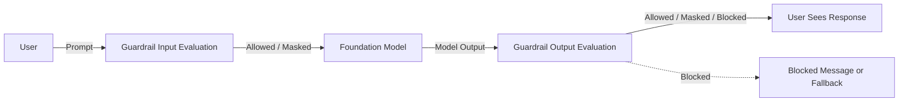

# Task 4.3: Operating, Monitoring, and Securing ML and AI Solutions - Secure ML and AI workloads and model endpoints

## Skill 4.3.9: Implement safeguards and sensitive data protection to meet application requirements and responsible AI policies (for example, by using Amazon Bedrock Guardrails)

---

## 1. Purpose of Model Safeguards

Security controls answer the question:

> "Who is allowed to call this model?"

Safeguards answer a different question:

> "What content is allowed to enter or leave this model?"

For the exam, keep these two layers separate:

| Layer | Answers | Example services |
|---|---|---|
| Access control | Who can invoke the endpoint? | IAM, VPC endpoints, resource policies |
| Network isolation | What network path can reach it? | VPC, subnets, security groups, PrivateLink |
| Audit/logging | What happened, when, and by whom? | CloudTrail, CloudWatch, AWS Config |
| Content safeguards | What prompts and responses are allowed? | Amazon Bedrock Guardrails |

Amazon Bedrock Guardrails implements the content safeguard layer. It allows you to apply responsible AI policies such as safety, privacy, truthfulness, and compliance directly to foundation model inputs and outputs.

---

## 2. Where Guardrails Fit

Guardrails can be applied to:

- Amazon Bedrock foundation model invocations
- Amazon Bedrock Agents
- Amazon Bedrock Knowledge Bases
- Retrieval-augmented generation (RAG) applications
- Applications using the `ApplyGuardrail` capability to evaluate content independently

A guardrail is configured once and can be applied across multiple applications. It evaluates both:

- **Prompts before they reach the model**
- **Responses before they reach the user**

Each policy type can be configured to **block** content or **mask** sensitive values.

---

## 3. Amazon Bedrock Guardrails Policy Types

| Guardrail Policy | What It Detects | Typical Use Case | Applies To |
|---|---|---|---|
| **Content filters** | Harmful content categories such as hate, insults, sexual content, violence, misconduct, and prompt injection/attacks | General responsible AI safety | Input and output |
| **Denied topics** | Conversation topics the application must refuse to discuss | Preventing a retail bot from giving medical or legal advice | Input and output |
| **Word filters** | Specific words, profanity, or custom terms | Blocking offensive language, competitor names, or internal project codenames | Input and output |
| **Sensitive information filters** | PII and sensitive data such as names, email addresses, phone numbers, account numbers, credit card numbers, IP addresses, AWS access keys, or custom regex patterns | Preventing customer account numbers from being returned | Input and output |
| **Contextual grounding checks** | Whether a response is supported by the retrieved source passages | Detecting hallucinations in RAG applications | Output mainly |
| **Automated Reasoning checks** | Whether a response is consistent with formally expressed policies and rules | Policy-bound answers that must follow stated business rules | Output mainly |

---

## 4. Detailed Policy Explanations

### 4.1 Content Filters

Content filters detect harmful categories. Each category has a strength setting, typically:

- None
- Low
- Medium
- High

Higher strength levels are more restrictive but may increase false positives.

Common categories include:

- Hate
- Insults
- Sexual content
- Violence
- Misconduct
- Prompt attacks

Example:  
A public-facing chatbot should be configured with high-strength content filters for violence and hate, but medium strength for insults to avoid over-blocking ordinary conversation.

---

### 4.2 Denied Topics

Denied topics are semantic topic boundaries. Unlike word filters, denied topics identify the meaning of the conversation, not just matching exact words.

Example:  
A travel booking assistant should deny topics related to:

- Medical diagnosis
- Investment recommendations
- Legal advice

Even if the user never says "diagnosis", the guardrail can detect that the conversation is moving into a prohibited topic area.

---

### 4.3 Word Filters

Word filters match specific words or phrases. They are useful for:

- Profanity
- Slurs
- Custom prohibited terms
- Competitor names
- Internal code names

Example:  
A media company may block the name of an upcoming unreleased product from appearing in a public chatbot.

---

### 4.4 Sensitive Information Filters

Sensitive information filters detect and protect PII and other sensitive values.

They can either:

- **Block** the request or response
- **Mask** the sensitive value, replacing it with a placeholder

Common built-in entity types include:

| Category | Example Entities |
|---|---|
| General | Name, email address, phone number |
| Financial | Bank account number, credit card number, credit card expiration |
| IT | IP address, AWS access key, AWS secret key |
| Custom | User-defined regular expressions, such as employee ID or policy number |

Example:  
A customer service assistant must never return a customer's full credit card number. Use a sensitive information filter with **masking** applied to the model response. The user then sees a masked value such as `XXXXXXXXXXXX1234`.

Important distinction for the exam:

- **Masking** replaces sensitive data with a placeholder.
- **Blocking** prevents the entire output from being shown.

---

### 4.5 Contextual Grounding Checks

Contextual grounding checks are designed for retrieval-augmented generation applications.

The check evaluates:

1. **Grounding**: Is the response supported by the retrieved source passages?
2. **Relevance**: Is the retrieved source material relevant to the user query?

If a model generates a response that is not grounded in the source passages, the guardrail can block the response or return a fallback answer.

Example:  
A RAG assistant for an insurance company retrieves policy documents. If the model generates a statement that the retrieved document does not support, the contextual grounding check blocks the unsupported claim.

Exam trap:  
Do not confuse **contextual grounding** with **sensitive information filtering**. Grounding checks are about factual support from source material. Sensitive information filters are about protecting PII and confidential values.

---

### 4.6 Automated Reasoning Checks

Automated Reasoning checks validate whether a model response follows formal rules or policies.

This is different from contextual grounding:

| Check | Question Answered |
|---|---|
| Contextual grounding | Is this answer supported by the retrieved passages? |
| Automated Reasoning | Is this answer consistent with the formal policy rules? |

Example:  
A benefits assistant must follow rules such as:

- Employees with fewer than 90 days of service are not eligible for certain leave types.
- Dependents over age 26 are not eligible for coverage.

An Automated Reasoning check detects when the model response violates those formal rules.

Use Automated Reasoning when the answer must comply with strict, deterministic business or regulatory policies.

---

## 5. Applying Guardrails: Block vs. Mask

| Action | Behavior | Best Used For |
|---|---|---|
| **Block** | Stops the prompt or response entirely; returns a blocked message or fallback | Harmful content, denied topics, unsupported claims, policy violations |
| **Mask** | Replaces only the sensitive value with a placeholder while allowing the rest | PII, account numbers, credit card data |

Masking is usually preferred when the application needs the conversation to continue but the sensitive value must be protected.

---

## 6. Sensitive Data Protection Across the ML Lifecycle

Guardrails are one part of sensitive data protection. The exam may ask where else protection is required.

| Stage | Protection Control |
|---|---|
| Training data | Encrypt with AWS KMS; restrict access with IAM and bucket policies |
| Model artifacts | Encrypt with KMS; allow only least-privilege roles |
| Prompts and responses | Apply Bedrock Guardrails sensitive information filters |
| Invocation logs | Store encrypted; restrict access; avoid logging raw PII |
| API activity | Use CloudTrail data events only when required; protect the log destination |
| Secrets | Store API keys or credentials in AWS Secrets Manager; rotate automatically |

Important:  
Amazon Bedrock Guardrails can mask PII in prompts and responses, but you must also configure logging carefully. If model invocation logging is enabled, avoid capturing unmasked sensitive information, or protect the logs with KMS encryption and strict IAM access.

---

## 7. Scenario-Based Examples

### Scenario 1: Protecting Customer Account Numbers

**Requirement:**  
A banking assistant must not return customer account numbers in its responses.

**Solution:**  
Create an Amazon Bedrock Guardrail with a sensitive information filter configured for account numbers. Apply the guardrail to the model response with the action set to **mask**.

Why not:

- IAM role? IAM controls who can call the model, not what the model returns.
- VPC endpoint? Private connectivity does not inspect content.
- Inspector scan? Inspector scans container images for CVEs, not model output.

---

### Scenario 2: Preventing Unsupported Answers in a RAG Application

**Requirement:**  
A legal research assistant retrieves case law and must stop returning answers the retrieved passages do not support.

**Solution:**  
Configure a **contextual grounding check** in Amazon Bedrock Guardrails. Enable grounding and relevance checks. If the model response is not supported by the retrieved passages, block the response.

Why not:

- Denied topic? A denied topic blocks subject areas, but does not validate factual support.
- Word filter? A word filter only matches exact terms.
- Sensitive information filter? This protects PII, not factual accuracy.

---

### Scenario 3: Preventing Medical Advice

**Requirement:**  
A fitness app chat assistant must not provide medical diagnosis or treatment recommendations.

**Solution:**  
Add a **denied topic** for medical advice. The guardrail blocks the user prompt before it reaches the model if the topic is detected.

Why denied topic instead of word filter?  
Users may ask about medical symptoms without using an exact blocked word. A denied topic detects the semantic meaning.

---

### Scenario 4: Enforcing Formal Business Rules

**Requirement:**  
An HR assistant must follow exact eligibility rules for employee benefits.

**Solution:**  
Use an **Automated Reasoning check** that formally defines the policy rules. If the model returns an answer inconsistent with those rules, the guardrail blocks it.

Why not contextual grounding?  
The application may not use retrieved source passages. The concern is formal policy consistency, not retrieval grounding.

---

## 8. Exam Tips and Traps

### Correct Mental Model

Use this priority order when reading an exam question about AI safety:

1. Identify whether the requirement is about **access, network, logging, or content**.
2. If content: identify whether the concern is **safety, topic, word, PII, grounding, or policy rules**.
3. Choose the matching Bedrock Guardrail policy type.

### Common Traps

| Trap | Why It Is Wrong |
|---|---|
| Choosing IAM roles to stop harmful content | IAM controls who can invoke the model, not what content is generated |
| Choosing VPC endpoints to block PII | Private connectivity encrypts or isolates network traffic, but does not inspect prompt text |
| Choosing CloudTrail to redact outputs | CloudTrail records API activity; it does not filter or block model content |
| Choosing Inspector to block sensitive responses | Inspector scans for software vulnerabilities, not runtime responses |
| Confusing denied topics with word filters | Denied topics are semantic; word filters are exact terms |
| Confusing contextual grounding with Automated Reasoning | Grounding checks support from retrieved passages; Automated Reasoning checks formal policy consistency |
| Assuming data events are enabled by default | CloudTrail records management events by default; model invocation data events must be configured separately |
| Assuming encryption alone protects against exposure in response text | KMS protects stored data, not text returned to the user |

### Exam Recall Statements

- Amazon Bedrock Guardrails can be applied to **both prompts and responses**.
- Each policy can usually **block** or **mask** content.
- Sensitive information filters support **built-in PII types and custom regex**.
- Contextual grounding checks are used in **RAG applications** to reduce hallucinations.
- Automated Reasoning checks validate **formal policy rules**.
- Guardrails protect content; they do not replace **IAM, network isolation, or logging**.

---

## 9. Summary Table

| Requirement | Correct Guardrail |
|---|---|
| Block hate speech or violence | Content filter |
| Stop a topic such as medical advice | Denied topic |
| Block a specific term or profanity | Word filter |
| Mask customer account numbers | Sensitive information filter |
| Prevent answers not supported by retrieved passages | Contextual grounding check |
| Prevent answers that violate formal policy rules | Automated Reasoning check |

---

## 10. Key Takeaways

1. Amazon Bedrock Guardrails provides a centralized, configurable content-safety layer for generative AI applications.
2. It works on model inputs and outputs, not on network access or IAM identity.
3. Choose the policy type based on the exact responsible AI or data protection requirement.
4. Masking protects sensitive values while allowing the conversation to continue; blocking stops the response entirely.
5. RAG hallucinations require contextual grounding checks; policy violations require Automated Reasoning checks.
6. Secure the entire data path: guardrails for content, KMS for storage encryption, IAM for least privilege, and CloudTrail for auditability.